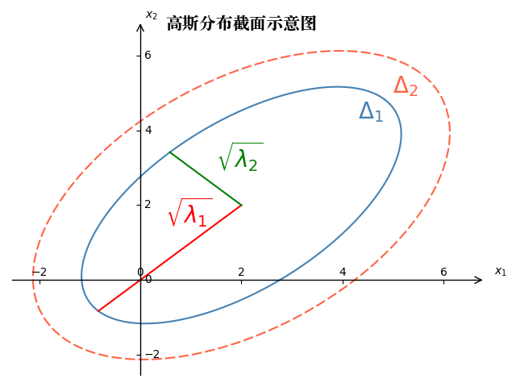
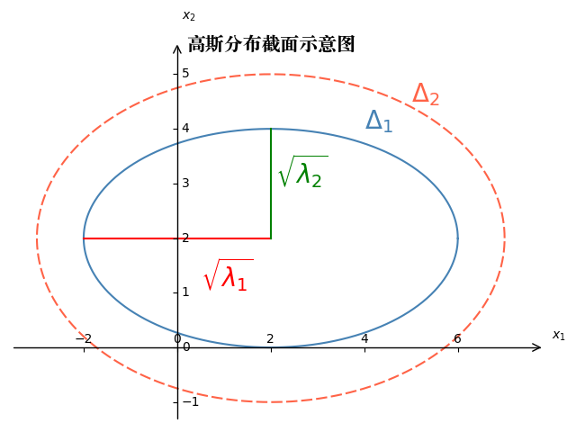
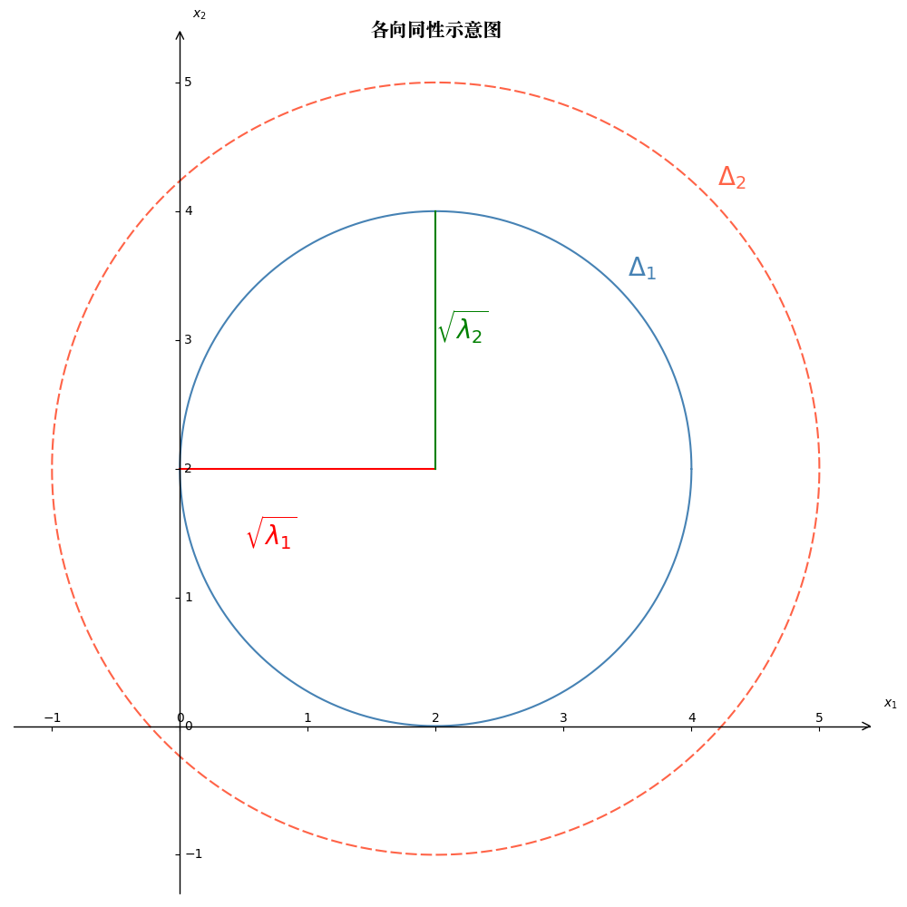

# Math Basics

## Gaussian Distribution-MLE

### 一维情况 MLE

- 高斯分布在机器学习中占有举足轻重的作用，如高斯线性模型、卡尔曼滤波、概率主成分分析(P-PCA)等。
- 对于以下数据：
$$
 X_{N\times p}=(x_{1},x_{2},\cdots,x_{N})_{N\times p}^{T}=
 \begin{pmatrix}
   x_{1}^T \\
   x_{2}^T \\
   \vdots  \\
   x_{N}^T
  \end{pmatrix}
$$
- 其中，$x_i \in R^p$ ，即每个单独的样本 $x_i$ 都是p维列向量，且分布满足 $x_i \stackrel{i.i.d}{\sim} N(\mu, \Sigma)$ ，参数写为 $\theta=(\mu, \Sigma)$

- 在 MLE 方法中，参数为 $\theta=(\mu,\Sigma)=(\mu,\sigma^{2})$，目标为最优参数$\theta_{MLE}$，其中：

$$
\begin{aligned}
\theta_{MLE} &=\mathop{argmax}\limits _{\theta}\log p(X|\theta) \\
&=\mathop{argmax}\limits _{\theta}\log \prod \limits_{i=1}^N p(x_i|\theta) \\
&=\mathop{argmax}\limits _{\theta}\sum\limits _{i=1}^{N}\log p(x_{i}|\theta)
\end{aligned}
$$
- 一般地，高斯分布的概率密度函数PDF写为：

    $$
    p(x|\mu,\Sigma)=\frac{1}{(2\pi)^{p/2}|\Sigma|^{1/2}}e^{-\frac{1}{2}(x-\mu)^{T}\Sigma^{-1}(x-\mu)}
    $$
    - 注意这里$|\Sigma|$是指协方差矩阵的行列式

- 在 MLE 中我们考虑一维 $p=1$ 的情况:

$$
\begin{aligned}
\log p(X|\theta)&=\sum\limits _{i=1}^{N}\log p(x_{i}|\theta)\\
&=\sum\limits _{i=1}^{N}\log\frac{1}{\sqrt{2\pi}\sigma}\exp(-(x_{i}-\mu)^{2}/2\sigma^{2})\\
&=\sum\limits _{i=1}^{N}\left[ \log\frac{1}{\sqrt{2\pi}} + \log\frac{1}{\sigma} + -\frac{(x_{i}-\mu)^{2}}{2\sigma^{2}}) \right]
\end{aligned}
$$

- 首先对 $\mu$ 的极值可以得到（这里可以忽略其他不相关参数） ：
$$
\begin{aligned}
\mu_{MLE} &= \mathop{argmax}\limits _{\mu}\log p(X|\theta) \\
&=\mathop{argmax}\limits _{\mu}\sum\limits _{i=1}^{N}(x_{i}-\mu)^{2}
\end{aligned}
$$
- 对其求导即可：
$$
\frac{\partial}{\partial\mu}\sum\limits _{i=1}^{N}(x_{i}-\mu)^{2}=0 \\ 
\mu_{MLE}=\frac{1}{N}\sum\limits _{i=1}^{N}x_{i}
$$
- 这个流程与考研中最大似然估计是相同的流程。
- 然后对 $\theta$ 中的另一个参数 $\sigma$ 可以得到(这里忽略其他参数)：
$$
\begin{aligned}
\sigma_{MLE}&=\mathop{argmax}\limits _{\sigma}\log p(X|\theta)\\
&=\mathop{argmin}\limits _{\sigma}\sum\limits _{i=1}^{N}[-\log\sigma-\frac{1}{2\sigma^{2}}(x_{i}-\mu)^{2}]
\end{aligned}
$$
- 于是：
$$
\frac{\partial}{\partial\sigma}\sum\limits _{i=1}^{N}[-\log\sigma-\frac{1}{2\sigma^{2}}(x_{i}-\mu)^{2}]=0 \\ 
\sigma_{MLE}^{2}=\frac{1}{N}\sum\limits _{i=1}^{N}(x_{i}-\mu)^{2}
$$
- 值得注意的是，上面的推导中，首先对 $\mu$ 求 MLE， 然后利用这个结果求 $\sigma_{MLE}$ ，因此可以预期的是对数据集求期望时 $\mathbb{E}_{\mathcal{D}}[\mu_{MLE}]$ 是无偏差的：
$$
\begin{aligned}
\mathbb{E}_{\mathcal{D}}[\mu_{MLE}]&=\mathbb{E}_{\mathcal{D}}[\frac{1}{N}\sum\limits _{i=1}^{N}x_{i}]\\
&=\frac{1}{N}\sum\limits _{i=1}^{N}\mathbb{E}_{\mathcal{D}}[x_{i}]\\
&=\mu
\end{aligned}
$$
- 但是当对 $\sigma_{MLE}$ 求 期望的时候由于使用了单个数据集的 $\mu_{MLE}$，因此对所有数据集求期望的时候我们会发现 $\sigma_{MLE}$ 是有偏的：

$$
\begin{aligned}
\mathbb{E}_{\mathcal{D}}[\sigma_{MLE}^{2}]&=\mathbb{E}_{\mathcal{D}}[\frac{1}{N}\sum\limits _{i=1}^{N}(x_{i}-\mu_{MLE})^{2}]\\
&=\mathbb{E}_{\mathcal{D}}[\frac{1}{N}\sum\limits _{i=1}^{N}(x_{i}^{2}-2x_{i}\mu_{MLE}+\mu_{MLE}^{2})\nonumber
\\&=\mathbb{E}_{\mathcal{D}}[\frac{1}{N}\sum\limits _{i=1}^{N}x_{i}^{2}-\mu_{MLE}^{2}]\\
&=\mathbb{E}_{\mathcal{D}}[\frac{1}{N}\sum\limits _{i=1}^{N}x_{i}^{2}-\mu^{2}+\mu^{2}-\mu_{MLE}^{2}]\nonumber\\
&= \mathbb{E}_{\mathcal{D}}[\frac{1}{N}\sum\limits _{i=1}^{N}x_{i}^{2}-\mu^{2}]-\mathbb{E}_{\mathcal{D}}[\mu_{MLE}^{2}-\mu^{2}]\\
&=\sigma^{2}-(\mathbb{E}_{\mathcal{D}}[\mu_{MLE}^{2}]-\mu^{2})\nonumber\\&=\sigma^{2}-(\mathbb{E}_{\mathcal{D}}[\mu_{MLE}^{2}]-\mathbb{E}_{\mathcal{D}}^{2}[\mu_{MLE}])\\
&=\sigma^{2}-Var[\mu_{MLE}]\nonumber\\&=\sigma^{2}-Var[\frac{1}{N}\sum\limits _{i=1}^{N}x_{i}]\\
&=\sigma^{2}-\frac{1}{N^{2}}\sum\limits _{i=1}^{N}Var[x_{i}]\\
&=\frac{N-1}{N}\sigma^{2}
\end{aligned}
$$
- 对于$\sigma$来说，真正的无偏估计是：
$$
\hat{\sigma}^{2}=\frac{1}{N-1}\sum\limits _{i=1}^{N}(x_{i}-\mu)^{2}
$$
- 推导如下：
$$
\begin{aligned}
\mathbb{E}_{\mathcal{D}}[\hat{\sigma}^{2}]&=\mathbb{E}_{\mathcal{D}}[\frac{N}{N-1}\sigma_{MLE}^{2}]\\
&=\sigma^{2}
\end{aligned}
$$
- 因此，计算出来的 $\sigma_{MLE}^{2}$ 比真实的 $\sigma^{2}$ 偏小，直观上说，就是方差估计小了，这就是最大似然估计引入的偏差。
- 需要区分一个概念：样本的均值不一定等于总体的均值，而样本均值的期望等于总体的均值。
    - 所以用采样样本获得的高斯分布与整体样本的真实高斯分布不仅方差有差异，而且均值也有差异！两个分布曲线的中心并不重合。
- 为什么会估小呢？
    - 以高斯型分布为例子，中间的概率大，两侧的概率小，因为样本数量有限，且在采样的时候会采到更多靠近中间的样本，使得样本的分散程度不如以前大，所以方差估计小了。

### 多维情况

- 多维高斯分布的概率密度函数(Probability Density Function, pdf)表达式为：
$$
x \sim p(x|\mu,\Sigma)=\frac{1}{(2\pi)^{p/2}|\Sigma|^{1/2}}e^{-\frac{1}{2}(x-\mu)^{T}\Sigma^{-1}(x-\mu)}
$$
    - 其中 $x,\mu\in\mathbb{R}^{p}, r.v.$(random vector, 这里指的是p维随机向量)：
$$
 x=
 \begin{pmatrix}
   x_{1} \\
   x_{2} \\
   \vdots  \\
   x_{p}
  \end{pmatrix} \ 
   \mu=
 \begin{pmatrix}
   \mu_1 \\
   \mu_2 \\
   \vdots  \\
   \mu_{p}
  \end{pmatrix}
$$

    - $\Sigma\in\mathbb{R}^{p\times p}$ ，$\Sigma$ 为协方差矩阵，一般而言也是半正定矩阵，而且是对称的，即$\sigma_{ij}=\sigma_{ji}$，指数部分为二次型。 这里我们只考虑正定矩阵（也就是特征分解出来的每一个特征值都满足$\lambda_{i}>0$）：

$$
 \Sigma=
 \begin{pmatrix}
   \sigma_{11}, \sigma_{12}, \cdots, \sigma_{1p}   \\
   \sigma_{21}, \sigma_{22}, \cdots, \sigma_{2p}\\
   \vdots  \\
   \sigma_{p1}, \sigma_{p2}, \cdots, \sigma_{pp}
  \end{pmatrix}_{p\times p} 
$$

- 首先我们处理指数上的部分，注意$(x-\mu)^{T}\Sigma^{-1}(x-\mu)$的结果是一个标量， 指数上的数字可以记为 $x$ 和 $\mu$ 两个向量之间的马氏距离。
    - 注意，$\Sigma=1$时，马氏距离等于欧式距离
- 对于对称的协方差矩阵可进行特征值分解(因为实对称矩阵必可以进行特征值分解)：
$$
\begin{aligned}
\Sigma &=U\Lambda U^{T} \\
&=(u_{1},u_{2},\cdots,u_{p})_{p\times p}diag(\lambda_{i})(u_{1},u_{2},\cdots,u_{p})_{p\times p}^{T} \\
&=(\lambda_{1}u_1, \lambda_{2}u_2, \cdots, \lambda_{p}u_p)(u_{1}^{T},u_{2}^{T},\cdots,u_{p}^{T})_{p\times p} \\
&=\sum\limits _{i=1}^{p}\lambda_{i}u_{i}u_{i}^{T}
\end{aligned}
$$ 
    - 这里$U$是正交矩阵，即$UU^T=U^TU=I$
- 于是：

    $$
    \begin{aligned}
    \Sigma^{-1} 
    &= (U\Lambda U^{T})^{-1}\\
    &= (U^T)^{-1}\Lambda^{-1} U^{-1}\\
    &= U\Lambda^{-1} U^{T}\\
    &= \sum\limits _{i=1}^{p}\frac{1}{\lambda_{i}}u_{i}u_{i}^{T}
    \end{aligned}
    $$

    $$
    \begin{aligned}
    \Delta 
    &= (x-\mu)^{T}\Sigma^{-1}(x-\mu) \\
    &=\sum\limits _{i=1}^{p}(x-\mu)^{T}u_{i}\frac{1}{\lambda_{i}}u_{i}^{T}(x-\mu) \\
    &=\sum\limits _{i=1}^{p}\frac{y_{i}^{2}}{\lambda_{i}}
    \end{aligned}
    $$
    - 其中, 令$y_i=(x-\mu)^{T}_{1\times p}u_{i, p\times 1}$，为一个实数。

- 我们注意到 $y_{i}$ 是 $x-\mu$ 在特征向量 $u_{i}$ 上的投影长度，所以本质上马氏距离是一种坐标变换。
- 特别的，当p=2时，上式变为$\Delta=\frac{y_{2}^{2}}{\lambda_{1}}+\frac{y_{2}^{2}}{\lambda_{2}}$，是一个椭圆
- 当 $\Delta$ 取不同值时，就是在三维曲面上横切了不同大小的椭圆等高线，因此上式子就是 $\Delta$ 取不同值时的同心椭圆。
- 所以，如果特征分解出来的所有$\lambda_{i}$都相同，则退化成圆。

- 下面我们看多维高斯模型在实际应用时的两个局限性

    1. 参数 $\Sigma_{p\times p},\mu$ 的自由度为 $O(p^{2})$ 对于维度很高的数据其自由度太高，因此需要简化：
        - 解决方案：高自由度的来源是 $\Sigma_{p\times p}$ 有 $\frac{p(p+1)}{2}$ 个自由参数，可以假设其是对角矩阵（即只有对角线上有值，对应独立同分布），此时绘制出的椭圆曲线不再是斜的，因为$y_i=(x-\mu)^{T}_{1\times p}x_{i, p\times 1}$，即投影后的坐标轴与原来的坐标轴平行，对应的算法有因子分析（Factor Analysis）。
            
        
        - 在各向同性假设中假设其对角线上的元素都相同，因此不再是椭圆，而是正圆。对应的算法有概率-PCA(p-PCA) 。
            
    2. 第二个问题是单个高斯分布是单峰的，对有多个峰的数据分布不能得到好的结果。
        - 解决方案：高斯混合GMM模型。

- 下面对多维高斯分布的常用定理进行介绍，便于看论文时更容易。
    - 已知一个多维高斯分布，如何求其边缘概率分布和条件概率分布？
    - 我们将参数进行分块：

    $$
 x=
 \begin{pmatrix}
   x_{1} \\
   x_{2} \\
   \vdots  \\
   x_{p}
  \end{pmatrix}= 
  \begin{pmatrix}
   x_{a,m\times 1} \\
   x_{b,n\times1} 
  \end{pmatrix}, m+n=p
  $$
  
    $$\mu=
    \begin{pmatrix}
   \mu_{a,m\times 1} \\
   \mu_{b,n\times 1} 
  \end{pmatrix}
$$

    $$\Sigma=\begin{pmatrix}\Sigma_{aa}&\Sigma_{ab}\\\Sigma_{ba}&\Sigma_{bb}\end{pmatrix}$$
    - 求$p(x_a)$和$p(x_b|x_a)$，然后可以根据对称性得到$p(x_b)$和$p(x_a|x_b)$。
    - PRML书中介绍的是配方法，这里用另一种稍微简单点的方法：
    - 首先引入一个推论（注意A是矩阵）：
    
    >    定理：已知 $x\sim\mathcal{N}(\mu,\Sigma_{p\times p}), x \in R^p, y\sim A_{q\times p}x+b, y \in R^q$，那么 $y\sim\mathcal{N}(A\mu+b, A\Sigma A^T)$。

    >   证明：$\mathbb{E}[y]=\mathbb{E}[Ax+b]=A\mathbb{E}[x]+b=A\mu+b$，$Var[y]=Var[Ax+b]=Var[Ax]=A\cdot Var[x]\cdot A^T$

    - 下面利用这个定理和矩阵分块的技巧得到 $p(x_a)$, $p(x_b)$, $p(x_a|x_b)$, $p(x_b|x_a)$ 这四个量。

    1. 对$x_a$等价代换，即$x_a=\begin{pmatrix}\mathbb{I}_{m\times m}&\mathbb{O}_{m\times n})\end{pmatrix}\begin{pmatrix}x_a\\x_b\end{pmatrix}$，代入定理中得到：
    $$
    \mathbb{E}[x_a]=\begin{pmatrix}\mathbb{I}&\mathbb{O}\end{pmatrix}\begin{pmatrix}\mu_a\\\mu_b\end{pmatrix}=\mu_a\\
    Var[x_a]=\begin{pmatrix}\mathbb{I}&\mathbb{O}\end{pmatrix}\begin{pmatrix}\Sigma_{aa}&\Sigma_{ab}\\\Sigma_{ba}&\Sigma_{bb}\end{pmatrix}\begin{pmatrix}\mathbb{I}\\\mathbb{O}\end{pmatrix}=\Sigma_{aa}
    $$
        - 所以 $x_a\sim\mathcal{N}(\mu_a,\Sigma_{aa})$。

        - 同样的，$x_b\sim\mathcal{N}(\mu_b,\Sigma_{bb})$。

    1. 对于两个条件概率，我们构造三个量（不知道是哪位神仙想出来的），目的是将边缘概率分布和条件概率分布联系在一起：
    $$
    x_{b\cdot a}=x_b-\Sigma_{ba}\Sigma_{aa}^{-1}x_a\\
    \mu_{b\cdot a}=\mu_b-\Sigma_{ba}\Sigma_{aa}^{-1}\mu_a\\
    \Sigma_{bb\cdot a}=\Sigma_{bb}-\Sigma_{ba}\Sigma_{aa}^{-1}\Sigma_{ab}
    $$
     - 特别的，最后一个式子叫做 $\Sigma_{bb}$ 的 Schur Complementary，中文“苏尔补”。将加减式子转为矩阵相乘的形式，目的是分离出$x_a$和$x_b$：
    $$
    x_{b\cdot a}=\begin{pmatrix}-\Sigma_{ba}\Sigma_{aa}^{-1}&\mathbb{I}_{n\times n}\end{pmatrix}\begin{pmatrix}x_a\\x_b\end{pmatrix}
    $$
        - 所以（注意$\Sigma_{aa}$为对称矩阵）：
    $$
    \begin{aligned}
    \mathbb{E}[x_{b\cdot a}]&=\begin{pmatrix}-\Sigma_{ba}\Sigma_{aa}^{-1}&\mathbb{I}_{n\times n}\end{pmatrix}\begin{pmatrix}\mu_a\\\mu_b\end{pmatrix}\\
    &=\mu_b-\Sigma_{ba}\Sigma_{aa}^{-1}\mu_a \\
    &=\mu_{b\cdot a}
    \end{aligned} \\
    \begin{aligned}
    Var[x_{b\cdot a}]&=\begin{pmatrix}-\Sigma_{ba}\Sigma_{aa}^{-1}&\mathbb{I}_{n\times n}\end{pmatrix}\begin{pmatrix}\Sigma_{aa}&\Sigma_{ab}\\\Sigma_{ba}&\Sigma_{bb}\end{pmatrix}\begin{pmatrix}-\Sigma_{aa}^{-1}\Sigma_{ba}^T\\\mathbb{I}_{n\times n}\end{pmatrix} \\
    &=\begin{pmatrix} -\Sigma_{ba}\Sigma_{aa}^{-1}\Sigma_{aa}+\Sigma_{ba} & -\Sigma_{ba}\Sigma_{aa}^{-1}\Sigma_{ab}+\Sigma_{bb}\end{pmatrix}\begin{pmatrix}-\Sigma_{aa}^{-1}\Sigma_{ba}^T\\\mathbb{I}_{n\times n}\end{pmatrix}\\
    &= -\Sigma_{ba}\Sigma_{aa}^{-1}\Sigma_{ab}+\Sigma_{bb} \\
    &=\Sigma_{bb\cdot a}
    \end{aligned} 
    $$
        - 所以 $x_{b\cdot a}\sim\mathcal{N}(\mu_{b\cdot a},\Sigma_{bb\cdot a})$。
    3. 利用这三个量可以得到 $x_b=x_{b\cdot a}+\Sigma_{ba}\Sigma_{aa}^{-1}x_a$，注意$\Sigma_{ba}\Sigma_{aa}^{-1}x_a$是一个常量，可以看成$Ax+B$中的B，这是因为是对$x_b$求均值和方差，因此不含$b$符号的项都视为常数（认为$x_{b\cdot a}$与$x_{a}$相互独立）。所以：
        $$
    \mathbb{E}[x_b|x_a]=\mu_{b\cdot a}+\Sigma_{ba}\Sigma_{aa}^{-1}x_a
        $$

        $$
    Var[x_b|x_a]=\Sigma_{bb\cdot a}
        $$
        - 所以 $x_{b}|x_{a}\sim\mathcal{N}(\mu_{b\cdot a}+\Sigma_{ba}\Sigma_{aa}^{-1}x_a,\Sigma_{bb\cdot a})$。
        - 附：这里证明一下$x_{b\cdot a}$与$x_{a}$相互独立:
            - 首先证明一个定理：

            > 定理：若$x\sim N(\mu, \Sigma)$，则:$Mx\perp Nx \Longleftrightarrow M\Sigma N^T=0$
            > 证明：
            $\because x\sim N(\mu, \Sigma)$
            $\therefore Mx\sim N(M\mu, M\Sigma M^T)$
            $\ \  Nx\sim N(N\mu, N\Sigma N^T)$
            $\therefore \\ \begin{aligned}Cov(Mx, Nx) &= \mathbb{E}[(Mx-M\mu)(Nx-N\mu)^T] \\ &= \mathbb{E}[M(x-\mu)(x-\mu)^TN^T] \\ &= M\mathbb{E}[(x-\mu)(x-\mu)^T]N^T \\ &= M\Sigma N^T \end{aligned}$
            $\because Mx\perp Nx且均为高斯$
            $\therefore Cov(Mx, Nx)=M\Sigma N^T=0$
            
            - 然后证明$x_{b\cdot a}$与$x_{a}$相互独立：
            $$
            x_{b\cdot a}=\begin{pmatrix}-\Sigma_{ba}\Sigma_{aa}^{-1}&\mathbb{I}_{n\times n}\end{pmatrix}\begin{pmatrix}x_a\\x_b\end{pmatrix}=MX
            $$
            
            $$
            x_{a}=\begin{pmatrix} \mathbb{I}_{m\times m} &\mathbb{0}_{n\times n}\end{pmatrix}\begin{pmatrix}x_a\\x_b\end{pmatrix}=NX
            $$
            
            $$
            \begin{aligned}
            M\Sigma N^T&=\begin{pmatrix}-\Sigma_{ba}\Sigma_{aa}^{-1}&\mathbb{I}_{n\times n}\end{pmatrix}\begin{pmatrix}\Sigma_{aa}&\Sigma_{ab}\\\Sigma_{ba}&\Sigma_{bb}\end{pmatrix}\begin{pmatrix} \mathbb{I}_{m\times m} \\ \mathbb{0}_{n\times n}\end{pmatrix} \\
            &= \begin{pmatrix}\mathbb{0}_{m\times m}&-\Sigma_{ba}\Sigma_{aa}^{-1}\Sigma_{ab}+\Sigma_{bb}\end{pmatrix}\begin{pmatrix} \mathbb{I}_{m\times m} \\ \mathbb{0}_{n\times n}\end{pmatrix} \\
            &= 0
            \end{aligned}
            $$
            
            $$\therefore x_{b\cdot a}\perp x_{a}$$
            - 因此在求方差和均值时可以把$x_a$的项视为常数！
    4. 同样：
        $$
        x_{a\cdot b}=x_a-\Sigma_{ab}\Sigma_{bb}^{-1}x_b\\
        \mu_{a\cdot b}=\mu_a-\Sigma_{ab}\Sigma_{bb}^{-1}\mu_b\\
        \Sigma_{aa\cdot b}=\Sigma_{aa}-\Sigma_{ab}\Sigma_{bb}^{-1}\Sigma_{ba}
        $$
        所以：
        $$
        \mathbb{E}[x_a|x_b]=\mu_{a\cdot b}+\Sigma_{ab}\Sigma_{bb}^{-1}x_b
        $$
    
        $$
        Var[x_a|x_b]=\Sigma_{aa\cdot b}
        $$

    - 下面利用上边四个量，求解线性高斯模型(Linear Gaussian Model)：
        - 已知：$p(x)=\mathcal{N}(\mu,\Lambda^{-1}),p(y|x)=\mathcal{N}(Ax+b,L^{-1})$，求解：$p(y),p(x|y)$。
            - 其中，$\Lambda^{-1}$是精度矩阵(Precision Matrix)，即协方差矩阵的逆
        - 可以考虑到贝叶斯公式$p(x|y)=\frac{p(y|x)p(x)}{p(y)}$，这里采用构造方法求解，PRML中使用配方法求解，较为繁琐。
            1. 求解$p(y)$：
                - 令: 
                $$y=Ax+b+\epsilon,\epsilon\sim\mathcal{N}(0,L^{-1}), \epsilon \perp x$$
                
                $$\therefore \mathbb{E}[y]=\mathbb{E}[Ax+b+\epsilon]=A\mu+b$$
                
                $$Var[y]=A \Lambda^{-1}A^T+L^{-1}$$
                
                $$\therefore p(y)\sim\mathcal{N}(A\mu+b,L^{-1}+A\Lambda^{-1}A^T)$$
            2. 求解$p(x|y)$：
                - 引入 $z=\begin{pmatrix}x\\y\end{pmatrix}$，根据前面的结论：
                $$\mu_z=\begin{pmatrix}\mu\\A\mu+b\end{pmatrix}$$
                
                $$\Sigma_z=\begin{pmatrix}\Lambda^{-1}&\Delta\\ \Delta & A \Lambda^{-1}A^T+L^{-1}\end{pmatrix}$$
                
                $$\Delta=Cov[x,y]=\mathbb{E}[(x-\mathbb{E}[x])(y-\mathbb{E}[y])^T]$$
                - 对于这个协方差可以直接计算：
               $$
               \begin{aligned}
               Cov(x,y)&=\mathbb{E}[(x-\mu)(Ax-A\mu+\epsilon)^T]\\
               &= \mathbb{E}[(x-\mu)(Ax-A\mu)^T+(x-\mu)\epsilon^T]\\
               &=\mathbb{E}[(x-\mu)(x-\mu)^TA^T]\\
               &=Var[x]A^T\\
               &=\Lambda^{-1}A^T
               \end{aligned}
               $$
               - 注意到协方差矩阵的对称性，所以 $p(z)=\mathcal{N}(\begin{bmatrix}\mu\\A\mu+b\end{bmatrix},\begin{bmatrix}\Lambda^{-1}&\Lambda^{-1}A^T\\A\Lambda^{-1}&L^{-1}+A\Lambda^{-1}A^T\end{bmatrix})$
                   - 其中:
                   $$\Sigma_{xx}=\Lambda^{-1}$$
                   
                   $$\Sigma_{yy}=L^{-1}+A\Lambda^{-1}A^T$$
                   
                   $$\Sigma_{xy}=\Lambda^{-1}A^T$$
                   
                   $$\Sigma_{yx}=A\Lambda^{-1}$$
               - 构造的z与之前x的分块相类似，根据之前的公式，$x_a$对应这里的x，$x_b$对应这里的y
               $$
                \mathbb{E}[x_a|x_b]=\mu_{a\cdot b}+\Sigma_{ab}\Sigma_{bb}^{-1}x_b
                $$
    
                $$
                Var[x_a|x_b]=\Sigma_{aa\cdot b}
                $$

               - 一一对应带入后，我们可以得到：
               $$
               \mathbb{E}[x|y]=\mu+\Lambda^{-1}A^T(L^{-1}+A\Lambda^{-1}A^T)^{-1}(y-A\mu-b)
               $$
            
               $$
               Var[x|y]=\Lambda^{-1}-\Lambda^{-1}A^T(L^{-1}+A\Lambda^{-1}A^T)^{-1}A\Lambda^{-1}
               $$
                - 叹为观止！这种构造太牛了
