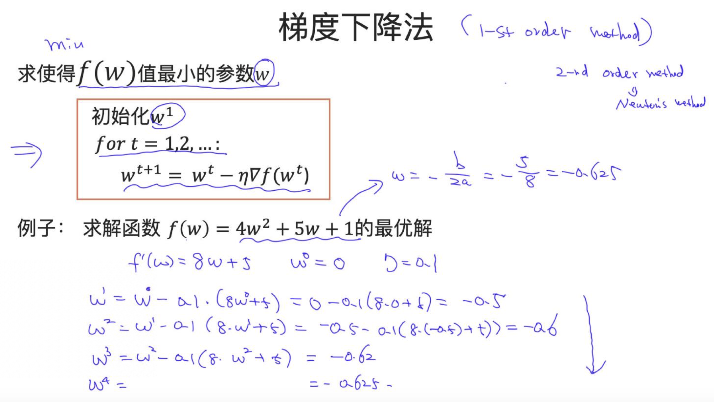

# WEEK0
- 这些知识和技巧可以用于面试中

1. 算法复杂度相关
    - 时间复杂度
    - 空间复杂度
    - 对于很多非凸函数，其算法的复杂度很高（如指数形式的复杂度），因此需要优化
    - 典型例子：斐波那契数列的时间复杂度和空间复杂度
    $$f(n)=f(n-1)+f(n-2)$$
        - 时间复杂度：
            - 可以画出如下所示的树状图：
            
            - 第一层有1个节点，$1=2^0$；
            - 第二层有2个节点，$2=2^1$；
            - 第三层有4个节点，$4=2^2$；
            - 第四层有8个节点，$8=2^3$；
            - ……
            - 第n层有$2^{n-1}$个节点
            - 所以总共有$2^0+2^1+\cdots+2^{n-1}=2^n-1$
            - 所以时间复杂度为$O(2^N)$
            - $O(p^N)$: exponential complexity，即指数复杂度
                - 这类算法应用于大问题中时，目前无法在计算机上解决
            - $O(N^p)$: polynomial complexity，即多项式复杂度
                - 相对指数复杂度而言，目前能够在计算机上解决
            - 假设采用如下所示的递归方法计算，则不可避免的要重复计算很多结点，即每一层的每个结点都要计算
            
            - 动态规划算法则解决了这一问题，避免了计算过程中的重复计算，即每次算出一个结点的值就保存起来，下次在计算前先看看原来是否已经计算过该结点
        - 空间复杂度：
            - 递归在电脑中使用栈的结构来计算所需的结点，如计算$f(n)$，就需要$f(n)$入栈，然后$f(n-1)$入栈，……，一直到最后$f(1)$入栈，所以栈最大需要n个空间
            - 空间复杂度为$O(N)$
        - 主定理(Master's Theorem)
        - NP、P、NPC、NP Hard问题
            - NP问题需要通过近似手段转为P问题后去求解

2. 最大似然估计(MLE)、最大后验估计(MAP)、贝叶斯估计
    - Maximum Likelihood Estimation最大似然估计
        - 根据看到的样本反推背后的未知参数，如逻辑回归的目标函数
        - 与是否为凸优化问题无关，只是作为数学建模的目标函数，与求解优化无关
        - 最大化目标为：在 $\theta$ 给定下，观测到 $D$ 样本的概率
        - 旨在找到一个 $\theta$ ，使在该条件下得到 $D$ 样本的概率最大
        $$\max{P(D|\theta)}$$
        
        - 例子：
            - 这里 $\theta$ 就是硬币出现正面的概率
            - 第一行根据 $D$ 的分布直接计算 $\theta$ 就是最典型的MLE,这个过程本质上是用到了最大似然估计
            - 注意每次扔硬币之间相互独立，所以可用乘法公式展开
            - 这里的求解优化是通过求导并取零，从而可以得到极值点；如果函数不可导，则需要迭代式算法、梯度下降法、牛顿法等方法寻找极值点
            
        
    - Maximum A Posteriori最大后验估计
        - 最大化目标为：在观测到 $D$ 样本的前提下，最大化 $\theta$ 的概率。
        $$\max{P(\theta|D)}$$
        - 还是以硬币为例子，如果题中给的是正面概率值大约在0.5左右，也就是一种先验知识，则需要用的是最大后验概率
        - 为什么要用MAP？
            - 在统计学上讲，当样本量较少时，MLE得到的参数和真实的参数差异较大，因此需要引入一定的先验知识来缩小这一差异。而当样本量趋于无穷多时，先验知识的作用趋于0，不再重要，此时MLE得到的结果已经足够好了。
        - 与最大似然估计的关系：
            - 利用贝叶斯定理计算
            - 比最大似然估计多了一项先验概率，用于引导模型更好地学习和训练
        
3. 梯度下降法、随机梯度下降法       
    - 优化算法中最简单的方法
    - 目的：寻找函数的最优解
        - 两种方法
            - 一阶导数设为0，最适用于凸问题中，因为凸问题中最优点只有一个，而非凸函数中有多个局部最优点
            - 迭代式算法
                - 一阶算法：梯度下降法、Adam算法等
                - 二阶算法：牛顿法
                - 可以用泰勒展开证明
    - 典型例子：

    
    - 可视化
        - 不同的初始化，对非凸函数的优化结果有很大影响，所以NLP有些模型就以词向量作为初始化参数

    
    - 学习率的影响

    
    - 梯度下降法的复杂度分析
        - 本身是迭代式算法，且与学习率有关，所以更关注迭代多少次(number of iteration)后才会收敛
    - 梯度下降法的收敛性分析
        - 含义是：需要多少步，才能使结果与最优点的误差为$\epsilon$
    
    
4. 过拟合及正则
    - 模型的泛化能力Generalization
    - 模型复杂度与表现的关系
        - 欠拟合往往可以通过使用更复杂的模型来解决
        - 实际应用中更加看重过拟合及其解决放啊

    
    - 缓解过拟合的一种方法：正则
        - 作用：对可行解空间(feasible region)的限制，舍弃了使正则项过大（即非常容易过拟合）的部分参数空间。

    
    - 两种常见的正则项：
        - L1可以产生参数的稀疏性

    
    - 正则项的几何意义：
        - 假设$w=(w_1, w_2)$的二维空间，把所寻找的点视为视为两部分的交接点
        - L1很有可能交接点在菱形顶点上，其中一个参数为0，从而具有稀疏性
        - L2则仅有很小的概率交接在坐标轴的点上
        - 一般用L2，因为L1抑制过拟合的效果不如L2，但在有些问题中，需要稀疏性时，则会用L1。

        
        - 

        
    
        
