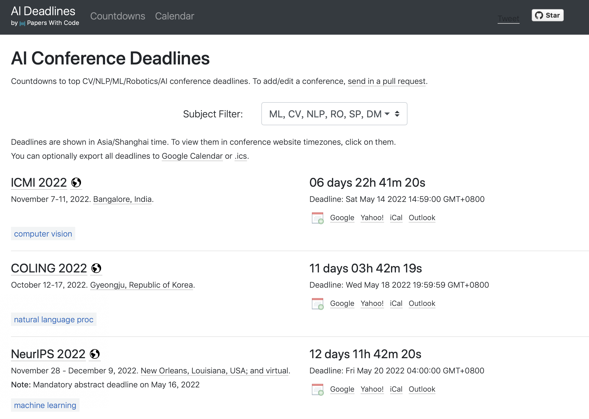

# 00课程相关

1. 顶会
    - 不同领域的顶会如下：
    - AI
        - AAAI
        - IJCAI
    - ML/DL（机器学习/深度学习）
        - ICML
        - NeurIPS
        - ICLR
        - UAI
        - AISTATS
    - DM（数据挖掘）
        - KDD
        - WSDM
        - ICDM
        - SDM
    - NLP
        - ACL
        - COLING
        - NAACL
        - EMNLP
    - CV
        - CVPR
        - ICCV
    - 发论文deadline：
        - https://aideadlin.es/?sub=ML,CV,NLP,RO,SP,DM
    
    
        
2. 课程模块：
    - ML基础：凸优化
        - 如何判断一个优化目标是不是凸函数
        - LP(线性规划), QP(二次规划), SDP等问题
        - 如何解决优化问题
        - Duality
        - 各种案例
    - 图神经网络
    - 贝叶斯
        - 小数据的处理
        - 贝叶斯模型如LDA
        - Approximate inference: MCMC，VI及各种变种
        - 贝叶斯深度学习
    - 强化学习

3. AI工程师必备的核心技能
    - 现实生活中问题
        - 发现问题，如市场资金 投放
    - 数学优化问题
    $$
\begin{cases}
\min{f(x)} \\
s.t. g(x)\leq a
\end{cases}$$
    - 通过合适的工具解决
        - 训练/优化

