# 语义分割

## 背景补充
- 下图中Time表示处理一张图片需要的时间，FPS表示1s内可以处理多少张图片

- CVPR: 国际计算机视觉与模式识别会议
    - IEEE Conference on Computer Vision and Pattern Recognition
    - IEEE 国际计算机视觉与模式识别会议
- PAMI: 
    - IEEE Transactions on Pattern Analysis and Machine Intelligence
    - IEEE 模式分析与机器智能汇刊
- 前期知识要求：

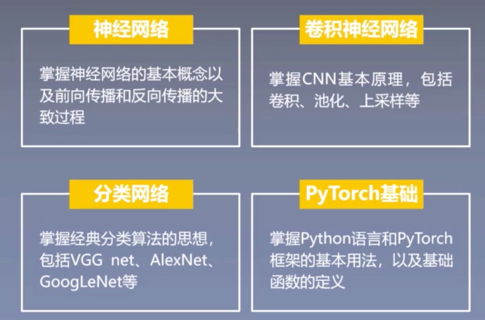

## FCN
- 论文：Fully Convolutional Networks for Semantic Segmentation（语义分割中的全卷积网络）
- Long J, Shelhamer E, Darrell T. Fully convolutional networks for semantic segmentation[C]. CVPR, 2015: 3431-3440.
- 年份：2015
- 学习目标：

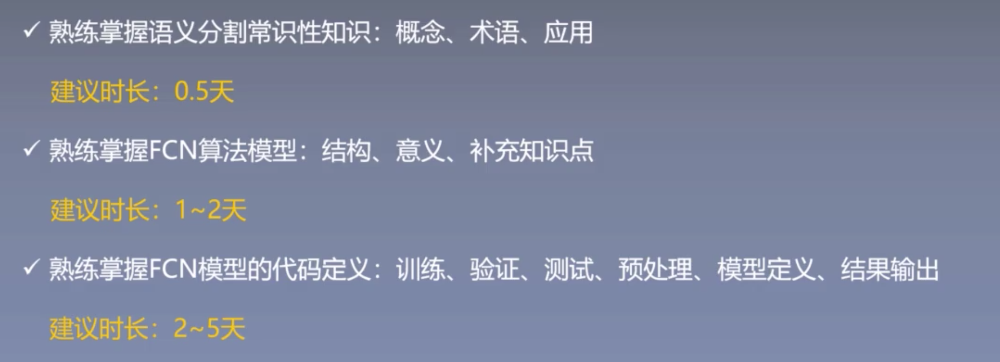
### Part 1 论文导读/背景介绍
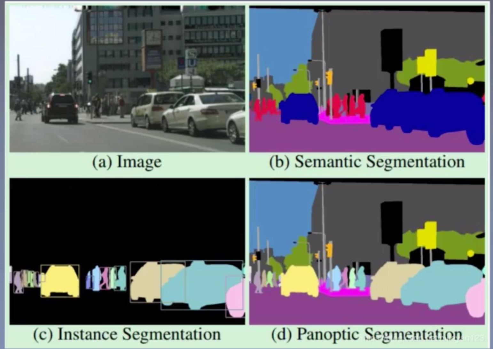
- 研究内容
    - 语义分割
        - 对应b图
        - 用不同颜色标记图像中的不同部分，作为不同的语义表达
    - 实例分割
        - 对应c图
        - 和语义分割的不同：
            1. 只分割所关注的部分，不需要把背景单独分割出来；
            2. 实力分割更加深入，会区分同一类的不同样本个体，如把车分为车A、车B、车C等，而语义分割把所有的车都视为相同的东西，只判断是不是同类；
    - 全景分割
        - 对应d图
        - 相当于语义分割和实例分割的结合，不仅关注背景，而且关注同类的不同个体区分
    - 难度：语义分割 < 实例分割 < 全景分割
- 研究现状
    - 传统方法，如：
        - Normalized cut
            - 归一化切割，属于分群的技术，分割具有相同特征的区域，利用区域的纹理或颜色等来判断，缺点是很慢很慢
        - Structured Random Forests
            - 结构化的随机森林，很好的改善了噪点的问题，缺点是容易过拟合、准确率不高、慢
        - SVM等
    - 传统方法的代表问题
        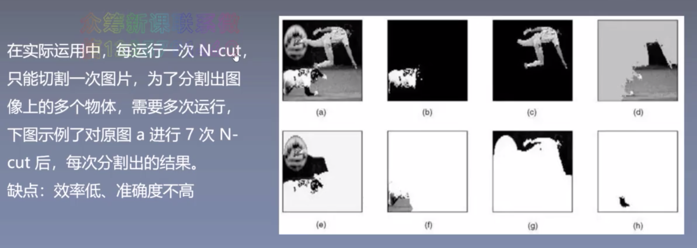
    - 深度学习卷积神经网络，如：
        - FCN
        - SegNet
        - LinkNet等
    - 深度学习方法的代表问题
        - 不匹配关系：下图中第一个是原图，第二个是标签，第三个是一个算法的结果，第四个是另一个算法的结果
            - 黄色框里是个船，第一个算法将其识别成了汽车，第二个算法将其识别成了船
            - 为什么有的算法能识别对，有的却不能呢？
            - 因为汽车和船如果只看顶部，是很相似的，但是注意到旁边是水，按照先验知识，水边的最有可能的是船，而不是车。
            - 算法中实现就需要对全局信息的容纳，也就是卷积核能看多大多远的区域，卷积核太小就会局限在物体本身的特征上，而忽略了周围环境的关系
            - 解决方法：图中的SPP等，通过金字塔模块做一个全局信息和局部信息的融合
        - 不寻常类：
            - 常见于室内场景中，因为大多数都很小，且相似度高，如图中床上的枕头和床单的颜色是差不多一样的
            - 解决方法：RGB-D算法及其对应发展，即以深度相机D作为第四方通道，增加场景信息量
            
    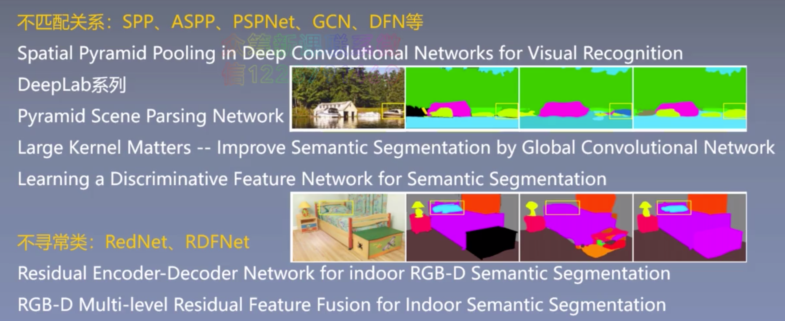
- 语义分割的实现流程
    - 与大多数卷积神经网络的流程相似

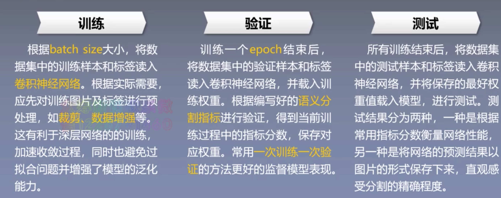
- FCN效果图
    - 效果一般，但为该领域的发展打下了基础

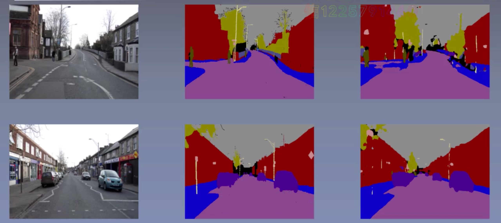
- 常用数据集

    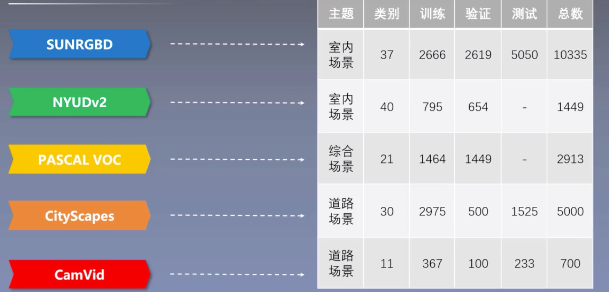
    - CamVid：比较小，图片格式，适合新手入门，其他数据集可能需要用matlab转换，或是二进制文本式的存储数据，因此需要根据不同的数据集进行相应的处理
    - CityScapes：吃透了CamVid后可以研究一下这个
    - PASCAL VOC：不建议使用，标签比较粗糙，类和类之间的界限比较模糊
    - SUNRGBD、NYUDv2这两个数据集与其他不同，属于RGB-D数据集，即有深度信息，从而可以更好地区分不寻常类
    - 注意：图片的标签一般是用灰度图，不同的灰度代表不同类别的物体，偶尔有数据集的标签是RGB彩色图，下图中左1为原RGB图，右1为标签图，中间上面的是深度图（只用来作为几何信息的辅助，加深了原图的边界和轮廓，便于更好地分割），中间下面的图与其他三张无关系，只是上了色的分割结果示意图
    - FCN是单流网络，即输入只有一张图片，使用了NYUDv2数据集的原始图片和标签，但没有使用深度图，只有双流网络才能用深度图，其他网络根据自己网络的需要使用数据集中可用的部分即可。
    - 那么双流网络如何利用普通的数据集呢？原数据集中不含深度图，可以利用Sobel算子的方法计算图片的梯度，来得到图片的边缘信息，从而可以作为类似深度图的辅助信息，加入到双流网络中，来给整个模型增加泛化能力
    - 一个小项目：将FCN改变成双流网络，并用Sobel算子的结果作为辅助信息
    - FCN官方数据集: https://github.com/shelhamer/fcn.berkeleyvision.org

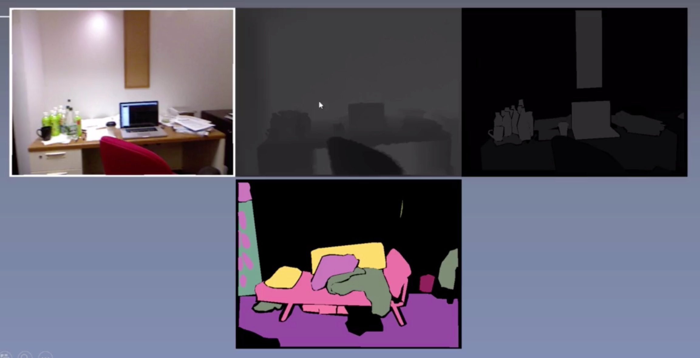
- 语义分割常用指标：实践的时候再仔细学
    - 其中，最重要的是MIoU指标，很多时候都不看PA和MPA

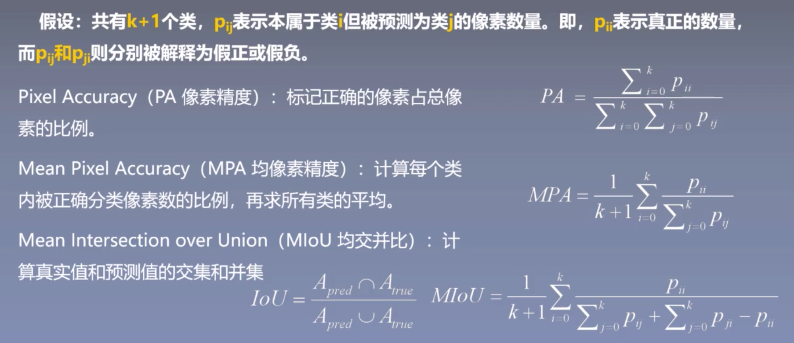

- FCN研究成果
    - 全连接层转化为卷积层
        - 经典的分类网络，如VGG是卷积池化、卷积池化、……、最后用全连接层分成所需要的类别数量，从而输出每一类的概率值，全卷积网络的意思就是去掉最后的全连接层，变为卷积层，作为输出
    - 通过反卷积进行上采样
        - 上采样的目的是把图片进行放大
        - 以前是通过线性插值、双线性插值等传统方法进行上采样，但FCN提出了一个反卷积（就是卷积的反向过程）
    - 迁移学习的微调方法
        - 利用之前的分类算法，改良结构和调整权重，从而得到最终的结果
        - 很重要，学会的话，很多模型就不用从零训练了
    - 跳跃连接的结构
        - 在之后的分割算法中非常常用，因为可以很好地改善语义分割存在的一些问题
    - 端到端、像素到像素
        - 语义分割属于像素级的分类任务，即需要对图片中的每一个像素点进行分类
    - MIoU提高了20%，推理时间也大幅度缩短
        - 实际自己搭模型时，提高1%都是很难的呜呜

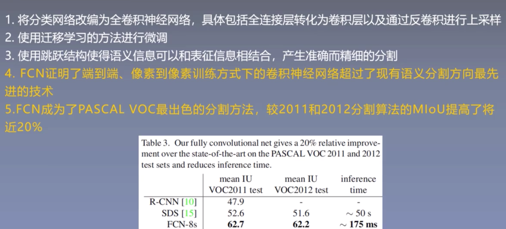
- 历史意义
    - 是深度学习语义分割的开山之作
    - 端到端训练为后续语义分割算法的发展铺平了道路

- 研究意义
    - 潘同学发表的那篇论文就是医疗的图像分割
    - 城市空地规划的项目也是这个方向

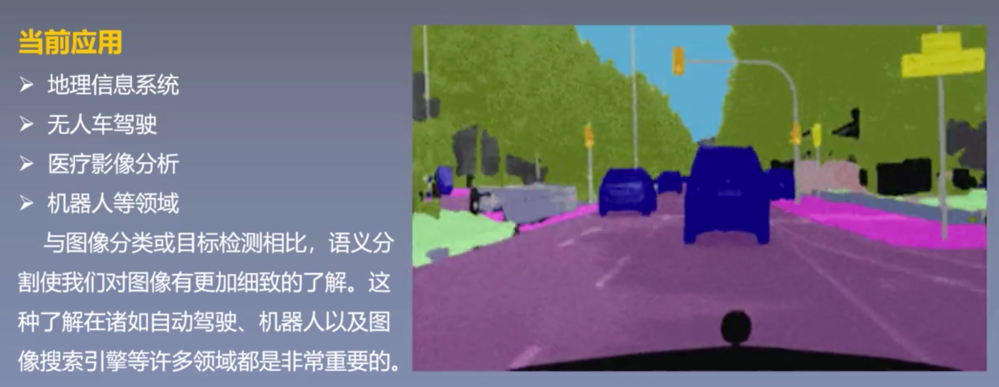

    
### Part 2 论文总览/摘要精读
- 论文结构
    - 摘要
    - 引言
    - 相关工作
        - 通过相关工作，可以很好地了解某一方向的发展情况（有什么问题和挑战，为了解决某个问题而提出某种机制或方法）
    - 先验知识
    - 细节
    - 结果
    - 结论
    - 参考文献
        - 不能忽略，比如相关工作中指出存在什么问题或提出什么解决方法，那就要看这个问题或解决方法出自哪几篇论文，在参考文献中找出对应的论文并仔细阅读
        - 这个日复一日的积累是很重要的，因为在写自己的论文时，首先要明确自己研究的方向存在的主要问题是什么，目前有哪些解决方法，它们的优点和缺点是什么等，从而引出自己的方法

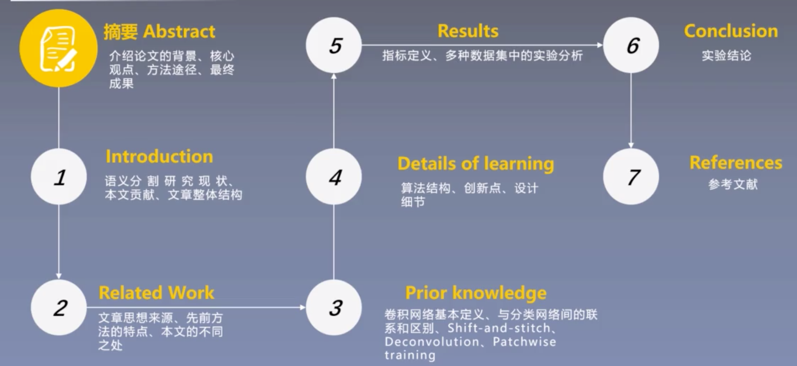
- 摘要：

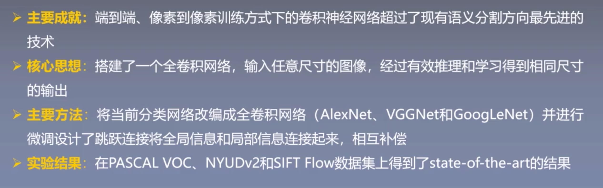
- 
### Part 3 补充知识点

### Part 4 模型结构/实验分析

### Part 5 论文总结

### Part 6 代码实现分析