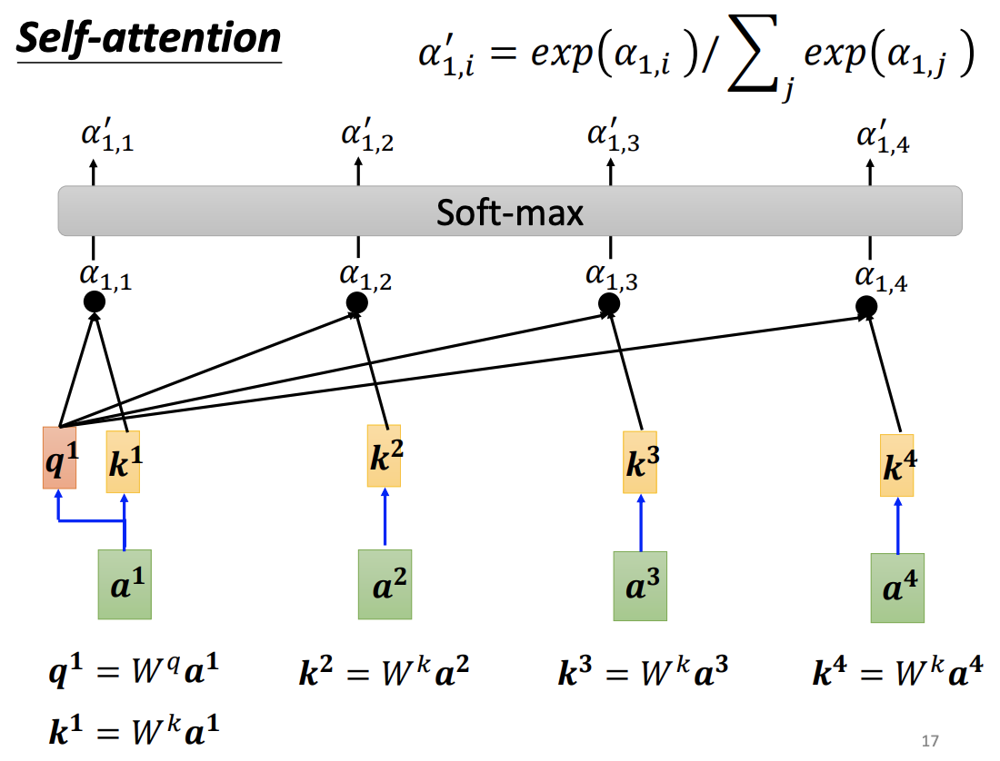

# 02：注意力机制的深刻理解
## 1. 什么是注意力机制？
- 视觉注意力机制是人类视觉所特有的大脑信号处理机制。人类视觉通过快速扫描全局图像，获得需要重点关注的目标区域，也就是一般所说的注意力焦点，而后对这一区域投入更多注意力资源，以获取更多所需要关注目标的细节信息，而抑制其他无用信息。
- 下图形象化展示了人类在看到一副图像时是如何高效分配有限的注意力资源的，其中红色区域表明视觉系统更关注的目标，很明显对于图1所示的场景，人们会把注意力更多投入到人的脸部，文本的标题以及文章首句等位置。

## 2. 注意力机制的公式理解？
- ``Attention is All You Need``一文中提出的点积形式的注意力机制如下：

    $$Attention(Q, K, V)=softmax(\frac{QK^T}{\sqrt{d_k}})V$$
    
    $$softmax(z_i)=\frac{e^{z_i}}{\sum_{c=1}^n{e^{z_c}}}$$
    - 其中：
        - $Q$ 为query，对应查询项
        - $K$ 为key，对应键
        - $V$ 为value，对应值
        - $Q$ 和 $K$ 就是多个查询和多个键组成的向量
- 从数学的角度来理解：一个矩阵乘以另一个矩阵的转置，本质上是矩阵内部的向量之间的点积，物理含义是一个向量a的长度乘以另一个向量b在a方向上的投影大小，因此这个点积的结果越大，表示相似性越高

- 可以利用淘宝来理解：

    
    - 具体来说如下：

        
    - 因此 $QK^T$ 是为了计算查询项和键之间的相似关系，为了准确表示这种相似性，使用 $softmax$ 将其归一化，转换为0到1之间的概率值
    - 分母设置为 $\sqrt{d_k}$ ，原论文中的描述是 $d_k$ 很大时，点积的结果会很大，使得softmax处于梯度非常小的区域中，而梯度变小，会使得训练速度变慢，因此要避免这一问题。也就是 $QK^T$ 的结果与 $d_k$ 有关，因此需要除以 $\sqrt{d_k}$ ，达到分子与 $d_k$ 解耦，保持稳定的目的。

    
    - 因此，可以说，注意力机制的核心就是加权求和（对不同的 $v$ 加上权重，并求和）。

## 3. 注意力机制的例子？
- 在自然语言处理中的简单例子：

    
    - Embedding：将输入的词转换为词向量，类似于特征嵌入网络得到的特征向量
    - $q$、$k$、$v$ 是通过Embedding词向量转化得到的三个子向量，转换过程如下：
        - 它们是通过3个不同的权值矩阵由嵌入向量乘以三个不同的权值矩阵得到，内部的参数通过训练得到，其中三个矩阵的尺寸也是相同的。
        - 如下图：权值矩阵 $W^Q$ 的大小为 $4\times 3$，词向量 $X$ 的大小为 $1\times 4$，因此，$X\times W^Q = q$，得到的查询项 $q$ 大小就是 $1\times 3$。

        
        - 求 $q$、$k$、$v$ 的过程相当于是对原来向量做一个线性变换（乘以一个矩阵），可以提升模型的拟合能力
    - 因此每一个样本会有一个查询项、键和值。从直观上来说，样本自己的 $q\times k^T$要比 $q$ 与其他样本的 $k$ 相乘的结果大，因为自己和自己的相似度应该是很高的。
    - 注意：最后预测的结果是把 $q$ 和各种 $k$ 相乘的结果加起来
- 李宏毅老师给出的例子：
    - 注意，最下面的一行 $a^1$ 等都是特征向量/词向量。

    
    
    - 采用矩阵运算的方法（学一下这种从单独变量向矩阵推导的方法）：

    
    
    
    
    - 注意：上图中不同样本的 $q$ 和 $k$ 在矩阵中都是列向量，因此结果是 $K^T\times Q$，论文中原公式是行向量，因此结果是 $Q\times K^T$。

## 4. 代码解读
- 源代码中``__init__``传入的参数temperature就是指 $\sqrt{d_k}$

- 取名为temperature是因为，这种softmax函数和知识蒸馏中用到的广义softmax函数很类似，都是增加了自变量的分母项

    
- ``torch.matmal``是矩阵乘法
    