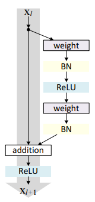

# AI01：Resnet
## 1. 残差网络：
- 核心：

    $$x_{l+1}=h(x_{l})+\mathscr{F}(x_l, W_l)$$

- 结构如下图所示：
    - 左边是上一层的直接映射，右边是残差部分
    - 在卷积网络中，$x_l$ 可能和 $x_{l+1}$ 的Feature Map数量不一样，这时就需要 $1\times 1$ 卷积进行升维或者降维
        - 具体表现为 $h(x_l)=W^{'}_lx_l$，其中 $W^{'}_l$ 就是 $1\times 1$ 卷积操作，不过对实验结果的提升有限，因此一般在升维或降维时才使用。
        - 为什么 $1\times 1$ 卷积可以升维或者降维，而且不损失信息呢？
            - 因为图片中特征的分布相对分散，使用多个卷积核得到的Feature Map中，只有少部分提取到了所需要的信息，即特征图/特征向量是稀疏的，因此升维或降维不怎么损失信息
    - 图中的``weight``就是对应代码中的``Conv2D``
    - 图中的``BN``就是对应代码中的``BatchNormalization``
    - 图中的``ReLU``就是对应代码中的``Activation('relu')``

    
- 意义
    - 下一层的信息不仅包含了上一层的全部信息，而且还有上一层经过提取和处理得到的更为重要的信息，因此在向后传播的过程中，信息的损失不是很严重
    - 很多比较深的网络效果反而变差的原因，就是向后传播的过程中，信息损失的太多了
- 一般这种版本的称为``res_block_v1``
    - 代码中的``input_filter``和``output_filter``就是输入输出的维度，如果需要改变维度，就将上一层进行卷积，如果不需要，则直接相加即可。最后再通过一个Relu激活函数即可。

```python
def res_block_v1(x, input_filter, output_filter):
    res_x = Conv2D(kernel_size=(3,3), filters=output_filter, strides=1, padding='same')(x)
    res_x = BatchNormalization()(res_x)
    res_x = Activation('relu')(res_x)
    res_x = Conv2D(kernel_size=(3,3), filters=output_filter, strides=1, padding='same')(res_x)
    res_x = BatchNormalization()(res_x)
    if input_filter == output_filter:
        identity = x
    else: #需要升维或者降维
        identity = Conv2D(kernel_size=(1,1), filters=output_filter, strides=1, padding='same')(x)
    x = keras.layers.add([identity, res_x])
    output = Activation('relu')(x)
    return output
```
- 残差网络就是由残差块堆叠组成的


