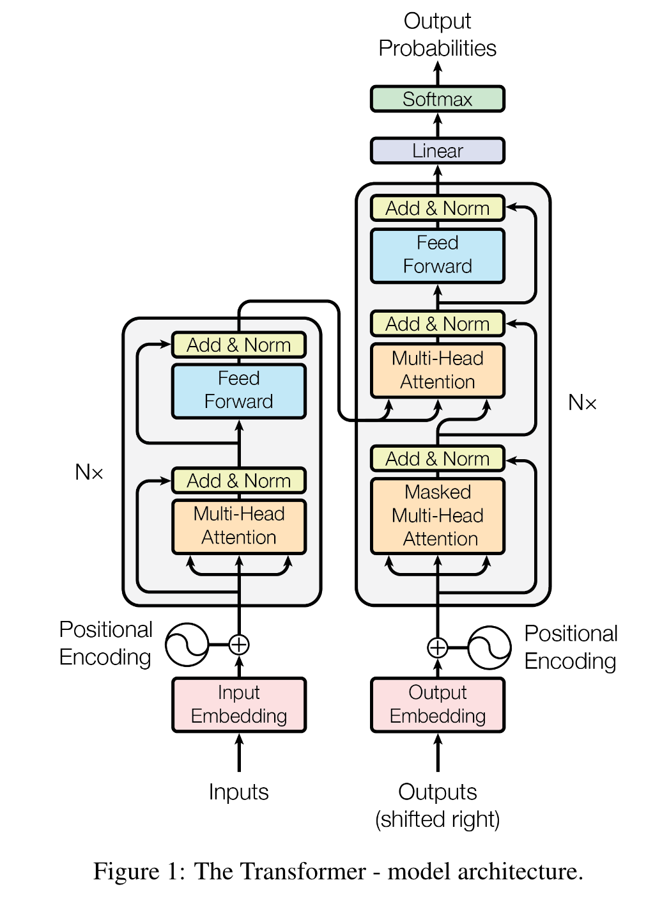
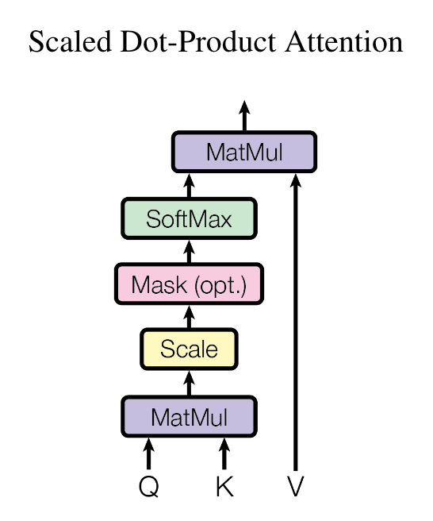
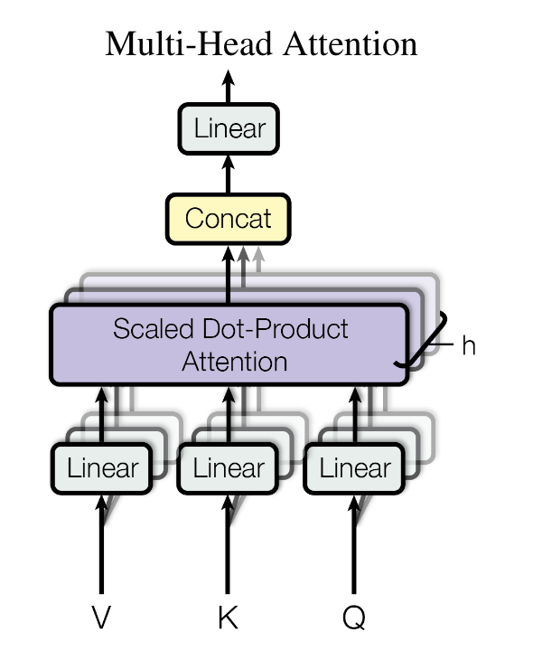

# Attention Is All You Need

- # 写在前面的部分：
    
    - 近三年深度学习领域最重要的文章
    - 是MLP、CNN、RNN以外的第三种模型结构
    - 每个作者都打了星号，在论文中称为同样贡献
    - 发表在NeurIPS上，该会议要求论文比较简短，模版给的是8页左右
    - 文章中出现的图一定要简洁、清晰、概括，能够让人一目了然
        
- # 概要：
    
    - 序列转录模型(sequence transduction models)：即给一个序列，生成一个序列，如机器翻译
    - 传统的CNN和RNN在encoder和decoder之间使用注意力机制
    - BLEU：机器翻译中常用的衡量标准
    - 说明Transformer最初是在机器翻译领域提出的
    - 如果公开代码，一般放在概要的最后一句，本文放在了结论部分，公开代码的工作一般影响力更高

- # 结论：
    
    - 第一个完全使用注意力机制的序列转录模型
    - 把编码器-解码器的架构更改为多头的自注意力机制

- # 导言：
    
    - 结构：
        - 第一段讲当前主流的方法
        - 第二段讲RNN的基本原理和缺陷
        - 第三段讲注意力机制在RNN中的应用
    - 内容：
        
        - RNN：顺序处理，当前词的隐藏状态是由前一个词的隐藏状态和当前词本身共同决定
        - RNN的缺点是难以并行，计算性能很差，且历史信息的保留依赖于内存大小，batch有限，所能保存的历史信息有限
        - 在本文之前，注意力机制已经成功在编码器-解码器架构中使用了

- # 背景：
    
    - 第一段：
        
        - 降低顺序计算的主流方法是，使用卷积神经网络来替换循环神经网络，但是卷积神经网络难以处理很长的序列，如果两个像素点相隔比较远，需要一层一层的的卷积才能将两者关联起来，而在Transformer中一次能看到所有的像素。卷积神经网络的好处在于，有多个卷积输出通道，每个通道可以认为是识别不一样的模式，Transformer为了也达到这样多通道输出的效果，提出了多头注意力机制
    - 第二段：
        
        - 自注意力机制已经在一些工作中被使用
    - 第三段：
        
        - 端到端的记忆网络使用循环注意力机制，取得了很好的结果
    - 第四段：
        
        - Transformer只是用了注意力机制，而未使用RNN或CNN
            
- # 模型架构：
    
    - 第一段：
        
        - 目前主流模型采用编码器-解码器的架构，然后解释一下什么事编码器，解码器，即把文本单词转成向量表示。
        - 需要注意的是输入长为n，输出长为m，即输入的文本和输出的文本长度是可以相同，也可以不同的。
        - 对于编码器，往往能看到整个句子，从而一起处理，而对于解码器，只能一个一个生成
        - auto-regressive (自回归)： 就是比较特殊的解码器，即先生成第一个输出$y_1$，然后根据表示向量z和第一个输出$y_1$，来得到第二个输出$y_2$，依此类推。也就是过去时刻的输出，作为当前时刻的输入。
    - 第二段：
        
        - Transformer使用自注意力和点对全联接层的堆叠形式来实现编码器和解码器。主体采用的还是编码器和解码器的架构，只是内部组成和连接方式与之前不同。
        - 图中Outputs是解码器在之前时刻的一些输出，作为解码器当前时刻的输入，因此标了shifted right。
        - 图中Embedding就是把词变成向量
        - 图中的Nx表示有N个这样的结构堆叠在一起
        - 图中左右相连的部分，就是指编码器的输出作为解码器的输入
        - 解码器部分与编码器类似，但是多了一个Masked Multi-Head Attention
    - 结构图：
    
        
    - 3.1 编码器和解码器部分
        
        - 编码器：
            
            - 6个层叠的块组成，里面有两个子层部分，分别是多头自注意力机制和点对全联接前馈网络（后者本质是MLP），对于每一个子层，采用残差连接和层归一化，可以概括为：
            $$LayerNorm(x + Sublayer(x))$$
            - 由于残差连接要求输入和输出是一样大小，所以全部输出维度设为512，与CNN不同，CNN中通常是空间维度往下降，但是通道个数逐渐增加
            - 因此，之后基于transformer的工作大多调节两个参数，一个是层数N，另一个是是每一层输出维度d
            - 这里需要区分一下batch norm和layer norm，以及为什么这种变长的应用中不使用batch norm的原因
                
                - batch norm：核心是对样本的每个特征进行归一化（按列处理）。即在训练时，将mini-batch中的所有样本变成均值为0和方差为1；在预测时，将全局的均值和方差计算出来，进行批归一化，然后再进行预测。因此，在求批归一化前需要shuffle，使得每一个小batch的均值和方差充分接近于全部的均值和方差。batch norm也可以通过参数化的方法，将样本处理为指定均值和方差的形式。
                - layer norm：核心是将每个样本的所有特征进行归一化，使得每个样本自己的特征均值为0，方差为1。
                - 考虑二维情况下：如果一个矩阵，每一行是一个样本，每一列是一个特征，则layer norm可以看成先将矩阵求转置，然后进行batch norm，最后再将结果求转置。
                - 对于RNN等中使用的样本，一般是三维的序列，理解方法：一段话看成一个batch，其中的每个句子看成一个样本，每个样本又有着对应的向量，因此是三维。
                - 使用layer norm的原因是，每个sequence可能长度不相等，使得对应的向量长度也不相等，batch norm时很多位置上样本的特征是0
                - 样本长度变化较大时，batch norm计算出来的方差和均值有很大的抖动，并且由于测试时使用新样本，如果新样本很长，会使得之前计算的全局均值和方差失效。而layer norm只需要计算当前序列样本的均值方差，也不需要全局均值和方差。从具体实验上来说，layer norm的效果要优于batch norm。
                    
        - 解码器
            
            - 与编码器相比，多了一个子层，这是因为，注意力机制会看到全局信息，而在训练时，t时刻解码器不应该看到t时刻之后的输入（输入会有t时刻之后的部分，是因为编码器的输出经过解码器之后，会得到第一批的解码输出，但这个效果不好，因此需要将第一批结果重新输入解码器中，是包含t时刻之后的部分），因此使用带掩码的注意力机制。
    - 3.2注意力机制
        
        - 注意力机制是将一个查询值和所有样本的键值对映射成一个输出。
        - 输出是一系列值的加权和，因此输出的维度和value的维度是一样的，权重是查询值和键求相似度得来的。
        - 这里相似度用compatibility function来表示，不同的注意力机制在这一步有不同的相似函数算法。
        - 3.2.1 缩放后的点积形注意力机制
            
            - Q、K、V都是矩阵形式，其中Q是n行$d_k$列的形式，K是m行$d_k$列的形式，V是m行$d_v$列的形式。即查询值的个数n与键值的个数m可以不相同。
            - Q和K转置相乘后，维度是n行m列的形式（并对每一行做softmax处理），因此可以与V相乘后得到n行$d_v$列的形式，每一行就对应查询样本的处理结果。
            - 在本文之前，常见的注意力机制有两种：加型注意力机制（用于处理query和key不等长的情况）、点积型注意力机制。由于矩阵乘法很高效。本文基本选择后者，只是增加了分母，避免相似函数计算的结果进入softmax的饱和区，也就是输出过于靠近1和0，有效防止梯度消失。
            - 这种在softmax中引入分母的做法，类似于知识蒸馏中的温度系数，因此程序中用temperature来表示分母
            - Mask的作用是，对于t时刻的查询值$q_t$，应该只看$k_1$到$k_{t-1}$这一部分，因此通过Mask将t时刻之后的值变成非常大的负数，如$-1e^{10}$，进入softmax之后变成0。不能直接置0，因为softmax会将其变成$\frac{1}{2}$
            - 结构图：
            
                
        - 3.2.2 多头注意力机制
            
            - 与其只做一次注意力机制，不如先降query、key、value经过h次不同的线性映射（一般来说是降维度），将h个结果并行计算注意力机制，然后再投影，得到最终结果。
            - 从之前的512维度，降低至64维度，因此需要做8次不同的投影
            - 实现的时候也可以通过一次矩阵乘法，看代码的时候注意一下，猜测是把不同的W进行行拼接
            - 结构图：
            
                
        - 3.2.3 注意力机制如何用在transformer中
            
            - 编码器中第一个子层
                
                - 假设batchsize为1，句子长度为n，则编码器的输入就是n个长度为d的向量，复制3次后作为Multi-Head的输入。
                - 同样一个向量，既作为key、value，也作为query，因此称为self-attention，属于最简单的点积注意力机制。
                - 在前面推导的点积注意力机制中，将原向量复制三次，经过1次线性变换（前后维度不变，也可以称为投影），得到query、value、key。
                - 在多头注意力机制中，将原向量复制三次，然后经过进一步的h次投影，得到query、value、key。
            - 解码器中第一个子层
                
                - 与编码器第一个子层一样，只是多了个mask，将t时刻以后的输入部分对应权重设为0
            - 解码器中第二个子层
                
                - 注意这里不再是自注意力机制了，key和value来源于编码器的输出，query来源于解码器第一个子层的输出，前者是n个长度为d的向量，后者是m个长度为d的向量
            - 假设是做英文翻译中文，编码器输出的是”Hello world!”的向量，解码器第一层的输入是“你好”的向量，解码器第二层使用”好”向量作为query，与编码器输出的”Hello”向量相似度最高，输出的概率值越大，因此”Hello”被翻译成”好”的概率很大。
    - 3.3 前馈点对网络
        
        - 本质是一个MLP
        - Point-wise的含义是对每一个词使用一次相同的MLP
        - 具体来说，将向量x经过一个线性层的线性变换后，经过Relu激活函数（即max），然后再通过另一个线性层
        - x是之前注意力层的输出，因此维度是512，第一个线性层将其投影为2048，等于把维度扩大四倍，第二个线性层又将其投影回512，因此是一个单隐藏层的MLP
        - Pytorch的输入是3d维度时，默认是在最后一个维度做计算
        - 注意力机制的作用就是把序列中的信息提取出来，然后做一次汇聚，得到一个点，然后再通过MLP独立地处理这每一个点，加工成所需要的语义空间中的向量。因此，MLP的作用是把输入经过注意力机制汇聚后的向量，重新投射输出所对应的向量空间中，因为输入和输出并不是同一个向量空间！
    - 3.4 Embedding and Softmax
        
        - 将人类语言中的词转为长度为d的向量
        - 一共有三个地方需要Embedding，即两个输入部分和softmax之前的部分，三者享有相同权重
        - 在Embedding中，给权重乘以$\\sqrt{d}$是因为，Embedding会使得向量的L2 Norm接近于1，特别是维度大的时候，学到的一些权重会变得很小。然后再通过Positional Encoding来固定L2 Norm，使其不随维度的大小改变。
    - 3.5 Positional Encoding
        
        - attention本身是没有时序信息的，也就是说给一句话，把字的顺序任意打乱，注意力机制得到的结果都是一样的，而RNN的方式本身是在输入中增加了时序信息的，因此transformer也要采用类似的处理。
        - 文中给出了两个sin和cos的函数，用于将文字的位置信息变成长度为d的向量，称为positional encoding（类似于计算机中用32bit来表示一个整数的方式），然后再与Embedding的输出相加，即将时序信息加入了输入当中
    - 可以看到positional encoding输出向量里元素的范围是正负1之间，因此Embedding层乘以$\\sqrt{d}$的一个目的就是使Embedding的输出处于正负1之间

- # 为什么要用自注意力机制
    
    - 解释了表1，也就是从计算复杂度、顺序计算的操作次数、信息从一个字的位置到另一个字的位置最远要走多长才能传递到。
    - n行d列的矩阵，乘以d列n行的矩阵，时间复杂度是$O(n^2d)$，理解方法，两个长度为d的向量做内积，复杂度是$O(d)$，前一个矩阵有n个行向量，后一个矩阵有n个列向量，因此要计算$O(n^2)$次向量内积
    - 卷积是利用长为k的窗口来查看信息，d是使用卷积输入输出的通道数
    - self-attention(restricted)是指做注意力时，query只和最近的r个邻居做运算，使得时间复杂度降低
    - 看上去self-attention的效果很好，但实际上attention对模型的假设做了更少，导致需要更多的数据和更大的模型才能训练出来和RNN、CNN相同的效果，因此基于transformer的模型都比较大，训练成本很高
- # 实验
    
    - byte-pair encoding：以英文单词为例子，如果把单词列出来，那么词典会很庞大，且单词的时态不断发生变化，bpe就是把词根提取出来，使得字典中的token相对较少，且英语、德语共用，因此之前使用的embedding权重是共享的。
    - 使用8个P100GPU训练，之后谷歌的论文大多使用TPU
    - 使用Adam优化器，学习率与向量维度有关，向量维度越大，学习率要越低一些，并使用warmup和0.5次方的衰减，这是因为Adam对学习率不是很敏感
    - 正则部分
        - 残差dropout：把10%的部分设置为0，对于子层的输出、子层的输入和归一化，大量使用dropout
        - label smoothing：出现于inception v3中，原理是我们用标签1来表示正确的值，0来表示不正确的值，但是我们知道softmax很难逼近于0和1，因此可以把正确的标签里0增大一点，1减小一点（如降到0.9）。本文是直接将1降低0.1，即0.9为正确标签，0设置为0.1除以字典大小，因此对于正确的那个词，只需要softmax的输出达到0.9即可。这样做会损失perplexity，也就是造成模型的不确定度增加，但是相应指标会提高
        
- # 论文中提到的其他工作：
    
    - Recurrent neural networks：RNN
    - long short-term memory：LSTM
    - gated recurrent ：GRU
    - recurrent language models
    - encoder-decoder architectures
    - position embedding：引入时序信息

- # 评价：
    
    - 写作很简洁，但是没有用太多的写作技巧，不是很建议，最好还是讲好故事
    - transformer基本上可以用于所有的任务，因此NLP方向最新的一些点可以应用到CV上，可以利用预训练模型来降低训练的难度
    - 人的认知是多模态的，Transformer能够把这些不同的数据融合起来，因为使用同样的架构抽取信息，使得不同数据的信息抽取到一个同样的语义空间中，从而进行多模态学习
    - 虽然Transformer目前取得了较好的实验结果，但是对它的理解还在比较初级的阶段
    - 最新的研究表明，Transformer不仅要有attention，还要有残差连接、MLP部分，否则效果很差
    - Attention没有时序信息，为什么比RNN更好呢？目前研究人员认为其使用了更广泛的归纳偏置，使得其能处理更一般化的信息。代价在于模型假设更加一般，所以对数据里面抓取信息的能力变差了，所以需要更多的数据和更大的模型才能训练出想要的效果。
    - Transformer给了研究者一个新的鼓励，就是除了CNN和RNN之外，还有其他的模型结构。

- # 英文表达积累：
    
    - based solely on: 仅基于
    - dispense with … entirely：完全舍弃了……
    - “a model architecture eschewing recurrence and instead relying entirely on an attention mechanism” ([pdf](zotero://open-pdf/library/items/U3DFXGP2?page=2)) ：学一下这种表达，eschew表示舍弃
    - be superior in quality：性能上更好
    - being more parallelizable：并行度更好
    - requiring significantly less time to train：减小训练时间
    - training costs：训练成本
    - state of the art：最先进的结果，也写作SOTA
    - extend the Transformer to problems involving input and output modalities other than text：进一步延伸到有关输入输出形式的其他任务上
    - A have been firmly established as state of the art approaches in B：用于表达A已经在B领域稳定成为最先进的方法
    - inherently sequential nature：内在的顺序性本质
    - precludes parallelization：表达“无法并行计算”
    - The fundamental constraint of sequential computation, however, remains：表达“瓶颈依然存在”
    - allowing modeling of dependencies without regard to their distance in the input or output sequences：学一下这种表达，“根据相关性来建模，而不关注位置信息”
    - allows for significantly more parallelization：能够并行计算
    - albeit at the cost of reduced effective resolution due to averaging attention-weighted positions：学一下表达，albeit是虽然、尽管的意思
    - counteract with ：使用……来抵消某种影响
    - textual entailment：文字蕴含，是NLP的一个方向
    - To the best of our knowledge ：就我们所知
    - Most competitive ：用于表达“主流的”、“前沿的”