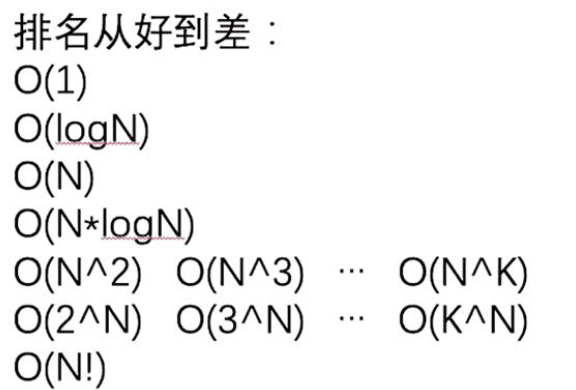

# DS01：复杂度、对数器、二分法
## 1. 常数时间操作：
- 数值运算：如a+b、a/b、a<b（包括逻辑运算运算）
- 寻址操作：如访问数组元素a[100000]
    - 注意：Linked List不是常数时间操作，因为其在内存中不是连续的区域，只能从头开始不断跳转


## 2. 复杂度：假设数据量为N
- 时间复杂度：
    - 分析方法：<font color=red>把算法流程分解到常数时间操作</font>
    - 如选择排序：
        - 第一步是0～N-1个数查看+比较，并进行1次交换，共N+1次常数运算
        - 第二步是1～N-1个数查看+比较，并进行1次交换，共N次常数运算
        - 第三步是2～N-1个数查看+比较，并进行1次交换，共N-1次常数运算
        - ……以此类推，是等差数列的形式$（N+1+N+N-1+……=aN^2+bN+c）$
        - 因此时间复杂度为$O(n^2)$
    - 小陷阱：下图中的时间复杂度是$O(n^2)$，而不是$O(n)$，因为链表get不是常数时间
		
    - 冒泡排序：$O(n^2)$，且与数组本身的状况无关，原本有序或者无序都要比较;
    - 插入排序：分别是0-0、0-1、0-i、……、0-N-1，每次看第i号位置的数字是否比前面的i-1个数都大，如果比前面的小，就往前移动;
        - 时间复杂度比较难估计：最低$O(n)$，即本来就是从小到大，最大$O(n^2)$，即本来就是从大到小
			- 实际中只关注最差复杂度
		- 编程实现：	
    		- 数组为空、或者数组长度小于2，则不用排序
			- 0～0上有序已经满足，故只需要满足0~i上有序
			- i的范围是1～N-1，作为外侧循环
			- 内侧循环j是从i-1到0，从后往前循环，<font color=red>可以把大小比较放在for循环内，因为只要不满足大小关系，就可以直接结束内循环了，避免使用break</font>
			- 注意：核心是比较a[j]和a[j+1]，即相邻位置上的大小
    - 注意：
        1. 算法的过程，与具体的语言无关；
        2. 想分析一个算法流程的时间复杂度前提，是对该算法非常熟悉；
        3. 一定要确保在拆分算法流程时，拆分出来的所有行为都是常数时间的操作，这意味着你写算法时，对自己用过的每一个系统api，都非常熟悉，否则会影响你对时间复杂度的估算；
- 空间复杂度：
    - 有限的变量属于常数空间复杂度；
    - 注意这里分析的是额外空间复杂度，与输入部分和输出部分所占的空间无关，如输入是一个数组，返回是一个数组，那额外空间不考虑这两部分
    - 如果用到辅助数组、或者哈希表等，则属于$O(n)$的空间复杂度
    - 对于相同的时间复杂度，需要比较常数时间的大小，如插入排序要比冒泡排序更好
    - 分析方法：大样本的随机数据，如每次对长度为100万的数组排序，看时间比较
    - 这是因为常数时间差别很大，如加法不如异或快，除法不如加法快
	 

## 3. 什么是算法的最优解？
- <font color=red>先保证时间复杂度最低</font>
- <font color=red>然后保证空间复杂度最低</font>
- 不太看重常数时间，仁者见仁智者见智，不属于算法最优解的讨论范畴
- 常见的复杂度：
	
    - <font color=red>递归算法通常出现$O(k^N)$</font>
- 学习脉络
    - 知道怎么算的算法：不管数据怎么样，流程规定的很精确
    - <font color=red>知道怎么试的算法：面试中占比很大</font>

## 4. 对数器
- 为啥要学对数器？	

- 对于一个题目，你往往会想到一个很差的方法，和一个你认为最优的方法，由于是两套思路，可以通过大量的随机测试，同时在两个方法下跑，看结果是否一致 ，从而在小数据量的案例中看出来是哪里出错了，一般是边界条件的问题
- 常用于比赛中	
- 对于排序，可以利用其他排序方法，或者系统自带的sort方法作为对数器comparator
- generateRandomArray用于产生随机长度和数值的数组
- copyArray用于复制数组，得到A和B，使其在内存中的位置不同
- 用想测试的方法跑A，用对数器跑B，然后判断A和B是否相同
- 实现方法
	- 使用自己语言中的随机数发生器
	- 计算机上某一范围的随机数是有限个，因为精度限制
	- 先调一个随机值，再调一个随机值，然后相减，从而创造出正负的可能
- 出错的时候如何修复bug呢？
    - 将出错时的测试用例打印出来即可
    - 数组太长不好改的时候，把测试中maxSize改小即可		
## 5. 二分法
- 时间复杂度: $O(log_2(N))$
- 经常见到的类型是在一个有序数组上展开二分搜索，但有序并不是所有问题求解时采用二分的必要条件，只要能正确构建左右两侧的淘汰逻辑，就可以用二分法
- 二分法的应用：
    - (1)在一个有序数组中，找某个数是否存在
    - (2)在一个有序数组中，找>=某个数最左侧的位置
    - (3)在一个有序数组中，找<=某个数最右侧的位置
    - (4)局部最小值问题
    - 对于(2)(3)，都要二分到最后一个数据，终止条件：左边界等于右边界，并用一个变量记住上次找到的位置
- <font color=red>编程时，mid不用(L+R)/2，是为了防止溢出：</font>
    - <font color=red>举个例子L为19亿，R为20亿，而L+R会超出整数范围，导致不安全，因此可以改用mid=L+(R-L)/2</font>
    - <font color=red>然后N/2等价于N>>1，即除2等价于右移一位，所以mid=L+(R-L)>>1</font>
    - <font color=red>同时还避免了奇偶数整除的问题</font>
- 退出循环时只有一个数，需要检验一下
- L<R和L<=R都可以，根据自己的选择修改相应代码
- 在一个无序数组中，任意相邻的数不相等，以下三种均为局部最小：
    - [0]<=[1]
    - [N-2]>=[N-1]
    - [i]<=[i+1]且[i]<=[i-1]
- 要求返回任意一个局部最小的位置即可，因此也能用二分法
- 解法：先看0位置，再看N-1位置，如果两个都不满足，看mid位置是否满足，如果不满足，则找比mid小的一边，此时这一侧必存在局部最小
- <font color=red>所以，二分法一定不能定式思维，可用于无序数组中！</font>
- <font color=red>主要是看数据是否有特殊性、问题是否有特殊性，以及是否可以排除一大部分数据，这种都可以用二分法</font>


## 附

### 冒泡排序代码模板

---

过程：
在arr[0～N-1]范围上：
arr[0]和arr[1]，谁大谁来到1位置；arr[1]和arr[2]，谁大谁来到2位置…arr[N-2]和arr[N-1]，谁大谁来到N-1位置  

在arr[0～N-2]范围上，重复上面的过程，但最后一步是arr[N-3]和arr[N-2]，谁大谁来到N-2位置  
在arr[0～N-3]范围上，重复上面的过程，但最后一步是arr[N-4]和arr[N-3]，谁大谁来到N-3位置  
…  
最后在arr[0～1]范围上，重复上面的过程，但最后一步是arr[0]和arr[1]，谁大谁来到1位置  


估算：  
很明显，如果arr长度为N，每一步常数操作的数量，依然如等差数列一般  
所以，总的常数操作数量 = $a*(N^2) + b*N + c$ (a、b、c都是常数)  

所以冒泡排序的时间复杂度为O($N^2$)。  

---


```java
public static void bubbleSort(int[] arr) {
    if (arr == null || arr.length < 2) {
        return;
    }
    // 0 ~ N-1
    // 0 ~ N-2
    // 0 ~ N-3
    for (int e = arr.length - 1; e > 0; e--) { // 0 ~ e
        for (int i = 0; i < e; i++) {
            if (arr[i] > arr[i + 1]) {
                swap(arr, i, i + 1);
            }
        }
    }
}

```
### 选择排序代码模板


---

过程：
arr[0～N-1]范围上，找到最小值所在的位置，然后把最小值交换到0位置。
arr[1～N-1]范围上，找到最小值所在的位置，然后把最小值交换到1位置。
arr[2～N-1]范围上，找到最小值所在的位置，然后把最小值交换到2位置。
…
arr[N-1～N-1]范围上，找到最小值位置，然后把最小值交换到N-1位置。

估算：
很明显，如果arr长度为N，每一步常数操作的数量，如等差数列一般
所以，总的常数操作数量 = a*(N^2) + b*N + c (a、b、c都是常数)

所以选择排序的时间复杂度为O(N^2)。

---

```java
public static void selectionSort(int[] arr) {
    if (arr == null || arr.length < 2) {
        return;
    }
    // 0 ~ N-1
    // 1 ~ N-1
    // 2 ~ N-1
    for (int i = 0; i < arr.length - 1; i++) { // i ~ N-1
        // 最小值在哪个位置上  i～n-1
        int minIndex = i;
        for (int j = i + 1; j < arr.length; j++) { // i ~ N-1 上找最小值的下标 
            minIndex = arr[j] < arr[minIndex] ? j : minIndex;
        }
        if (minIndex != i) {
            swap(arr, i, minIndex);
        }
    }
}
```
### 插入排序代码模板

---

过程：  
想让arr[0~0]上有序，这个范围只有一个数，当然是有序的。  
想让arr[0~1]上有序，所以从arr[1]开始往前看，如果arr[1]<arr[0]，就交换。否则什么也不做。  
…
想让arr[0~i]上有序，所以从arr[i]开始往前看，arr[i]这个数不停向左移动，一直移动到左边的数字不再比自己大，停止移动。  
最后一步，想让arr[0~N-1]上有序， arr[N-1]这个数不停向左移动，一直移动到左边的数字不再比自己大，停止移动。  

估算时发现这个算法流程的复杂程度，会因为数据状况的不同而不同。  

你发现了吗？  

如果某个算法流程的复杂程度会根据数据状况的不同而不同，那么你必须要按照最差情况来估计。  

很明显，在最差情况下，如果arr长度为N，插入排序的每一步常数操作的数量，还是如等差数列一般  

所以，总的常数操作数量 = a*(N^2) + b*N + c (a、b、c都是常数)  

所以插入排序排序的时间复杂度为O(N^2)。  


---
```java
public static void insertionSort(int[] arr) {
    if (arr == null || arr.length < 2) {
        return;
    }
    // 0~0 有序的
    // 0~i 想有序
    for (int i = 1; i < arr.length; i++) { // 0 ~ i 做到有序
        for (int j = i - 1; j >= 0 && arr[j] > arr[j + 1]; j--) {
            swap(arr, j, j + 1);
        }
    }
}
```

### 对数器代码模板
如何设计对数器?

对数器的目的是定出合适的样本大小，足以呈现所有边界条件即可。所以长度不需要很长。功能测试为主。这样去设计对数器。


#### 数组相关

#### 随机数组生成

```java
public static int[] generateRandomArray(int maxSize, int maxValue) {
    // Math.random()   [0,1)  
    // Math.random() * N  [0,N)
    // (int)(Math.random() * N)  [0, N-1]
    int[] arr = new int[(int) ((maxSize + 1) * Math.random())];
    for (int i = 0; i < arr.length; i++) {
        // [-? , +?]
        arr[i] = (int) ((maxValue + 1) * Math.random()) - (int) (maxValue * Math.random());
    }
    return arr;
}

```

#### 数组拷贝
```java
public static int[] copyArray(int[] arr) {
    if (arr == null) {
        return null;
    }
    int[] res = new int[arr.length];
    for (int i = 0; i < arr.length; i++) {
        res[i] = arr[i];
    }
    return res;
}

```

#### 相等比较

```java
public static boolean isEqual(int[] arr1, int[] arr2) {
    if ((arr1 == null && arr2 != null) || (arr1 != null && arr2 == null)) {
        return false;
    }
    if (arr1 == null && arr2 == null) {
        return true;
    }
    if (arr1.length != arr2.length) {
        return false;
    }
    for (int i = 0; i < arr1.length; i++) {
        if (arr1[i] != arr2[i]) {
            return false;
        }
    }
    return true;
}
```


#### 打印

```java
public static void printArray(int[] arr) {
    if (arr == null) {
        return;
    }
    for (int i = 0; i < arr.length; i++) {
        System.out.print(arr[i] + " ");
    }
    System.out.println();
}
```


#### 一个完整的例子

```java
// 返回一个数组arr，arr长度[0,maxLen-1],arr中的每个值[0,maxValue-1]
public static int[] lenRandomValueRandom(int maxLen, int maxValue) {
    int len = (int) (Math.random() * maxLen);
    int[] ans = new int[len];
    for (int i = 0; i < len; i++) {
        ans[i] = (int) (Math.random() * maxValue);
    }
    return ans;
}

public static int[] copyArray(int[] arr) {
    int[] ans = new int[arr.length];
    for (int i = 0; i < arr.length; i++) {
        ans[i] = arr[i];
    }
    return ans;
}

// arr1和arr2一定等长
public static boolean isSorted(int[] arr) {
    if (arr.length < 2) {
        return true;
    }
    int max = arr[0];
    for (int i = 1; i < arr.length; i++) {
        if (max > arr[i]) {
            return false;
        }
        max = Math.max(max, arr[i]);
    }
    return true;
}

public static void main(String[] args) {
    int maxLen = 5;
    int maxValue = 1000;
    int testTime = 10000;
    for (int i = 0; i < testTime; i++) {
        int[] arr1 = lenRandomValueRandom(maxLen, maxValue);
        int[] tmp = copyArray(arr1);
        selectionSort(arr1);
        if (!isSorted(arr1)) {
            for (int j = 0; j < tmp.length; j++) {
                System.out.print(tmp[j] + " ");
            }
            System.out.println();
            System.out.println("选择排序错了！");
            break;
        }
    }
}
```

用一个错误的例子来debug比用眼睛瞪着代码看更容易找到问题

## 链表

```java
public static Node generateRandomLinkedList(int len, int value) {
    int size = (int) (Math.random() * (len + 1));
    if (size == 0) {
        return null;
    }
    size--;
    Node head = new Node((int) (Math.random() * (value + 1)));
    Node pre = head;
    while (size != 0) {
        Node cur = new Node((int) (Math.random() * (value + 1)));
        pre.next = cur;
        pre = cur;
        size--;
    }
    return head;
}


// 要求无环，有环别用这个函数
public static boolean checkLinkedListEqual(Node head1, Node head2) {
    while (head1 != null && head2 != null) {
        if (head1.value != head2.value) {
            return false;
        }
        head1 = head1.next;
        head2 = head2.next;
    }
    return head1 == null && head2 == null;
}
```

[[随机生成双向链表]]
