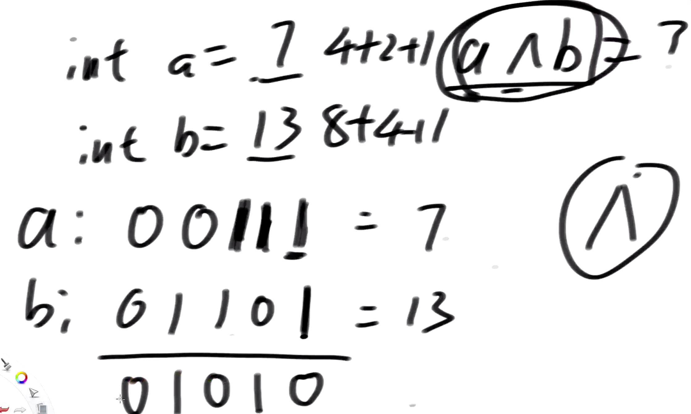
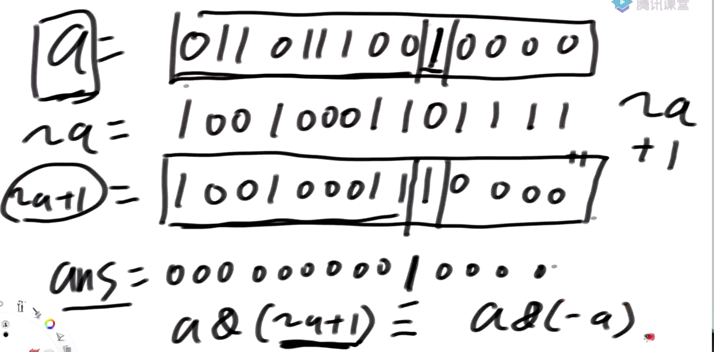

# DS02：异或运算
## 1. 什么是异或运算？
- 本质为按位处理的二进制运算，用符号$\wedge$表示
- 相同为0，不同为1
- 如a=7，二进制即00111，b=13，二进制即01101，异或的结果为01010，十进制为10
- 直观理解：无进位相加，即每一个二进制位上的数字相加，但不需要进位，如1+1=0、1+0=1、0+0=0


    

- 特殊性质：
    - $0\wedge N = N$，即任何数和0异或都是其本身
    - $N\wedge N = 0$，即任何数和自己异或都是0
    - 同时满足交换律和结合律

    
---
## 2. 题目一：
- 如何不用额外变量交换两个数？
    - 交换两个数a和b的基本流程：
        - 第一步：$a = a \wedge b$
        - 第二步：$b = a \wedge b$
        - 第三步：$a = a \wedge b$
    - 证明：
        - 假设: $a=X$，$b=Y$
        - 第一步的结果：$a=X \wedge Y$, $b=Y$
        - 第二步的结果：
        $$
        a=X \wedge Y \\ 
        b=X \wedge Y \wedge Y=X \wedge 0 = X
        $$
        - 第三步的结果:
        $$a=X \wedge Y \wedge X = Y \\ b=X$$
    - 异或运算的时间复杂度很低（位运算的效率很高），所以可以提高效率


```java
	/* 
	注意：当且仅当arr[i]和arr[j]在内存中是不同的区域，才能用异或
	实现交换，即如果i==j，会使该区域变成0！！！！ 
	*/
	public static void swap (int[] arr, int i, int j) {
	// 可以在这里加上i==j的条件判断
		arr[i]  = arr[i] ^ arr[j];
		arr[j]  = arr[i] ^ arr[j];
		arr[i]  = arr[i] ^ arr[j];
	}
```
---
## 3. 题目二：
- 一个数组中有一种数出现了奇数次，其他数出现了偶数次，怎么找到并打印这种数？
    - 假设数组为[a, b, a, c, d....]
    - 常规思路：用哈希表做词频统计然后判断
    - 注意到异或有一个神奇的性质，就是：
        - 偶数个相同变量进行奇数次异或的结果为0: $N\wedge \cdots \wedge N = 0$，如$N\wedge N = 0$
        - 奇数个相同变量进行偶数次异或的结果为其本身: $N\wedge \cdots \wedge N = N$，如$N\wedge N \wedge N = N$
    - 因此利用异或的方法，设一个变量eor，按照顺序对数组中的每个数顺次求异或即可
        - 第一步: $eor = 0$
        - 第二步: $eor = eor \wedge a$
        - 第三步: $eor = eor \wedge b$
        - 依此类推即可 

```java
// arr中，只有一种数，出现奇数次
	public static void printOddTimesNum1(int[] arr) {
		int eor = 0;
		for (int i = 0; i < arr.length; i++) {
			eor ^= arr[i];
		}
		System.out.println(eor);
	}
```

## 4. 题目三：
- 怎么把一个int类型的数，提取出最右侧的1？
    - 例如a=01101110010000
    - 结果b=00000000010000
    - 注：pdf中看起来有问题，因为0和1占的空间不同，所以显示不对齐
    - 可以用$a \& (-a)$实现，不论a原本为正数还是负数
        - 这是因为a的相反数$-a$在二进制上可以表示为先取反再加1，即$~a+1$

        
    
    - 如上图所示，当a的二进制表示取反再加1后，最右侧的1左边全部与原来相反，而右边全部与原来相同，进行与运算后只有1个1，从而可以定位出最右侧1的位置
        - 数学上可以理解为，最右侧1的右侧全是0，因此取反再加1后会出现1个进位，从而与原来保持了相同
- 拓展：如何用以上思路统计某个数的二进制表述下1的个数？
    - 每次找出最右边的1，然后消除掉，直到整个数的二进制都没有1

```java
	public static int bit1counts(int N) {
		int count = 0;
		while(N != 0) {
			int rightOne = N & ((~N) + 1);
			count++;
			N ^= rightOne;
			// N -= rightOne
		}
```

## 5. 题目四：
-  <font color=red>一个数组中有两种数出现了奇数次，其他数出现了偶数次，怎么找到并打印这两种数？</font>
    - 延续前面的思路，先用eor顺次异或，得到$eor= a\wedge b$
    - 然后根据eor的每一位反推a和b，eor为1的部分，说明对应a和b的位置上一定不相同，即一个为1一个为0
    - 因此可以找出eor最右侧不为0的1，对应位置记作index，假设a的index位置上是0，b的index位置上是1，则数组整体可以分成index位置上是0的数(包含a和出现了偶数次的其他数)和index位置上是1的数(包含b和出现了偶数次的其他数)
    - 再设一个变量eor',只对index位置上是1的所有数进行异或，从而可以把b提取出来，最后利用$a= eor\wedge eor'=eor\wedge b$得到a
    
    
```java
// arr中，有两种数，出现奇数次
	public static void printOddTimesNum2(int[] arr) {
		int eor = 0;
		for (int i = 0; i < arr.length; i++) {
			eor ^= arr[i];
		}
		// a 和 b是两种数
		// eor != 0
		// eor最右侧的1，提取出来
		// eor :     00110010110111000
		// rightOne :00000000000001000
		int rightOne = eor & (-eor); // 提取出最右的1
		int onlyOne = 0; // eor'
		for (int i = 0 ; i < arr.length;i++) {
			//  arr[1] =  111100011110000
			// rightOne=  000000000010000
			// 判断某个位置上是不是1的方法：按位求与，即两个都是1的时候结果才为1
			if ((arr[i] & rightOne) != 0) {
				onlyOne ^= arr[i];
			}
		}
		System.out.println(onlyOne + " " + (eor ^ onlyOne));
	}
```

## 6. 题目五：
- 一个数组中如果有一种数出现了K次，其他数出现了M次，且M>1，K<M，找到出现了K次的数，否则返回-1，要求额外的空间复杂度为O(1)，时间复杂度O(N)
    - 如提供arr[2，3，3，2，2]，K=2, M=3
    - 对于一个数，如a=8，可以转换为二进制数组（一般是32位）
    - 因此选择的额外变量为32位的数组t，每次把位置上位1的数进行累加，如8是0000 1000，遇到3次8后就记为0000 3000，最后得到所有数字二进制里的1在各自位置上进行累加的结果
    - 假设上面的例子:
        - 2-> 0 0 1 0
        - 3-> 0 0 1 1
        - 则得到的t=[0, 0, 5, 2]
        - 2%M=2，所以该位置上的2次1对应K=2的数
        - 5%M=2，所以该位置上的5次1中有2次对应K=2的数
        - 只需要依次求t[i]%M，若不为0，则说明K=3的数在i位置上是1，若为0，则则说明K=3的数在i位置上是0
        - 所以K=2的数为0011，转为十进制就是3
    - 本题的特殊性在于K<M，因此K不可能是M的整数倍
    - 判断某个数num第i位是不是1的方法：判断 (num >> i)&1 是否为0即可
        - 统计对应位置的1个数可以用 t[i]+=(num >> i)&1
        - 在组装答案时，可以用ans|=(1<<i)，即将1左移i位后与原来的ans进行或运算即可
    - 对数器的部分采用哈希表来实现
    - 完整代码如下：

```java
package class02;

import java.util.HashMap;
import java.util.HashSet;

public class Code03_KM {

	public static int test(int[] arr, int k, int m) {
		HashMap<Integer, Integer> map = new HashMap<>();
		for (int num : arr) {
			if (map.containsKey(num)) {
				map.put(num, map.get(num) + 1);
			} else {
				map.put(num, 1);
			}
		}
		for (int num : map.keySet()) {
			if (map.get(num) == k) {
				return num;
			}
		}
		return -1;
	}

	public static HashMap<Integer, Integer> map = new HashMap<>();

	// 请保证arr中，只有一种数出现了K次，其他数都出现了M次
	public static int onlyKTimes(int[] arr, int k, int m) {
		if (map.size() == 0) {
			mapCreater(map);
		}
		int[] t = new int[32];
		// t[0] 0位置的1出现了几个
		// t[i] i位置的1出现了几个
		for (int num : arr) {
			while (num != 0) {
				int rightOne = num & (-num);
				t[map.get(rightOne)]++;
				num ^= rightOne;
			}
		}
		int ans = 0;
		for (int i = 0; i < 32; i++) {
			if (t[i] % m != 0) {
				if (t[i] % m == k) {
					ans |= (1 << i);
				} else {
					return -1;
				}
			}
		}
		if (ans == 0) {
			int count = 0;
			for (int num : arr) {
				if (num == 0) {
					count++;
				}
			}
			if (count != k) {
				return -1;
			}
		}
		return ans;
	}

	public static void mapCreater(HashMap<Integer, Integer> map) {
		int value = 1;
		for (int i = 0; i < 32; i++) {
			map.put(value, i);
			value <<= 1;
		}
	}

	public static int[] randomArray(int maxKinds, int range, int k, int m) {
		int ktimeNum = randomNumber(range);
		// 真命天子出现的次数
		int times = Math.random() < 0.5 ? k : ((int) (Math.random() * (m - 1)) + 1);
		// 2
		int numKinds = (int) (Math.random() * maxKinds) + 2;
		// k * 1 + (numKinds - 1) * m
		int[] arr = new int[times + (numKinds - 1) * m];
		int index = 0;
		for (; index < times; index++) {
			arr[index] = ktimeNum;
		}
		numKinds--;
		HashSet<Integer> set = new HashSet<>();
		set.add(ktimeNum);
		while (numKinds != 0) {
			int curNum = 0;
			do {
				curNum = randomNumber(range);
			} while (set.contains(curNum));
			set.add(curNum);
			numKinds--;
			for (int i = 0; i < m; i++) {
				arr[index++] = curNum;
			}
		}
		// arr 填好了
		for (int i = 0; i < arr.length; i++) {
			// i 位置的数，我想随机和j位置的数做交换
			int j = (int) (Math.random() * arr.length);// 0 ~ N-1
			int tmp = arr[i];
			arr[i] = arr[j];
			arr[j] = tmp;
		}
		return arr;
	}

	// [-range, +range]
	public static int randomNumber(int range) {
		return ((int) (Math.random() * range) + 1) - ((int) (Math.random() * range) + 1);
	}

	public static void main(String[] args) {
		int kinds = 5;
		int range = 30;
		int testTime = 100000;
		int max = 9;
		System.out.println("测试开始");
		for (int i = 0; i < testTime; i++) {
			int a = (int) (Math.random() * max) + 1; // a 1 ~ 9
			int b = (int) (Math.random() * max) + 1; // b 1 ~ 9
			int k = Math.min(a, b);
			int m = Math.max(a, b);
			// k < m
			if (k == m) {
				m++;
			}
			int[] arr = randomArray(kinds, range, k, m);
			int ans1 = test(arr, k, m);
			int ans2 = onlyKTimes(arr, k, m);
			if (ans1 != ans2) {
				System.out.println(ans1);
				System.out.println(ans2);
				System.out.println("出错了！");
			}
		}
		System.out.println("测试结束");

	}

}

```
 