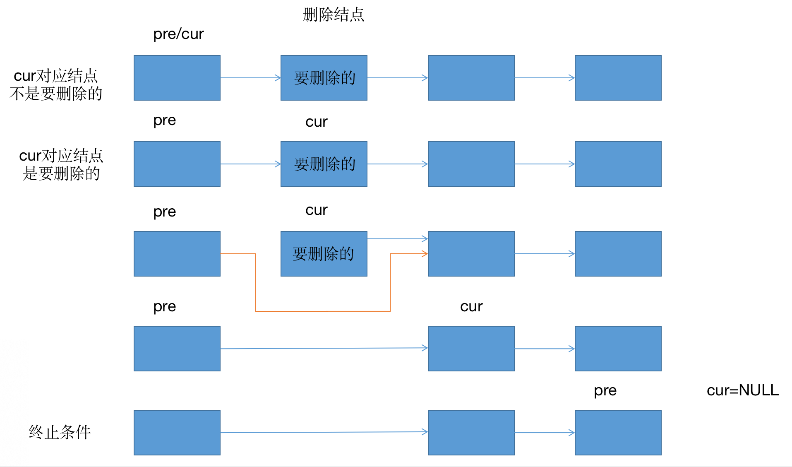

# DS03：一些基础的数据结构
## 1. 单向链表：
- 单向链表结点结构

```java
public class Node{
    public T value;
    public Node next;
    
    public Node(T data){
        value = data;
    }
} 
```
- 双向链表结点结构

```java
public class DoubleNode{
    public T value;
    public DoubleNode las;
    public DoubleNode next;
    
    public Node(T data){
        value = data;
    }
} 
```
- 考察coding的能力
    - 单链表和双链表如何反转？
        - 传入参数：原来链表的头指针
        - 返回参数：反转链表的头指针
        - 需要两个指针变量，流程如下：

        
        
        - 实现

        ```java
        	//  head
	//   a    ->   b    ->  c  ->  null
	//   c    ->   b    ->  a  ->  null
	public static Node reverseLinkedList(Node head) {
		Node pre = null;
		Node next = null;
		while (head != null) {
			next = head.next;
			head.next = pre;
			pre = head;
			head = next;
		}
		return pre;
	}
	public static DoubleNode reverseDoubleList(DoubleNode head) {
		DoubleNode pre = null;
		DoubleNode next = null;
		while (head != null) {
			next = head.next;
			head.next = pre;
			head.last = next;
			pre = head;
			head = next;
		}
		return pre;
	}
        ```
        - 对数器：使用容器的方法反转，也就是把链表转成数组，然后反向遍历即可
        - 输入：随机生成一个随机长度的整数型链表即可
        - 再写一个比较两个链表是否相同的函数即可
    - 把给定值都删除
        - 假设链表为: 2->3->1->3->2->4->NULL
        - H = f(H, V)，其中H为头结点，V为要删除的值
        - 可能存在的坑：
            - 删除的可能是头结点，也有可能整个链表都被删掉了，所以要返回新的头结点
        - 基本原理：
            - 第一步：向后遍历链表，找出最终的头结点
            - 第二步：删除指定结点（这里最好把删掉的结点free掉，避免占用空间）

            
        - 实现：

        ```java
    public static Node removeValue(Node head, int num) {
    		// head来到第一个不需要删的位置
    		while (head != null) {
    			if (head.value != num) {
    				break;
    			}
    			head = head.next;
    		}
    		// 1 ) head == null
    		// 2 ) head != null
    		Node pre = head;
    		Node cur = head;
    		while (cur != null) {
    			if (cur.value == num) {
    				pre.next = cur.next;
    			} else {
    				pre = cur;
    			}
    			cur = cur.next;
    		}
    		return head;
	}
        ```
        - 对数器：先转为数组，然后用另一个数组依次保存不是num的节点

## 2. 栈和队列：
- 栈：数据先进后出，犹如弹匣
- 队列：数据先进先出，好似排队
- 实现方法：
    - 双向链表实现
    - 数组实现
        - 用数组实现栈和队列是一面中的常见面试题，特别是用数组实现队列(Google一面的第1题)，不太好写
- 双链表实现队列：
    - 利用好双链表的头指针、尾指针

    
    - 双链表还可以实现双端队列:
        - 单队列是指第一次插入的数据可以作为头指针，之后插入数据后移动尾指针，出队列是移动头指针
        - <font color=red>双端队列</font>是与队列类似的有序集合。它有一前、一后两端，元素在其中保持自己的位置。
        - 与队列不同的是，双端队列对在哪一端添加和移除元素没有任何限制。新元素既可以被添加到前端，也可以被添加到后端。同理，已有的元素也能从任意一端进行移除。
        - <font color=red>某种意义上，双端队列是栈和队列的结合</font>。

        ```java
    public static class DoubleEndsQueue<T> {
    		public Node<T> head;
    		public Node<T> tail;
    
    		public void addFromHead(T value) {
    			Node<T> cur = new Node<T>(value);
    			if (head == null) {
    				head = cur;
    				tail = cur;
    			} else {
    				cur.next = head;
    				head.last = cur;
    				head = cur;
    			}
    		}
    
    		public void addFromBottom(T value) {
    			Node<T> cur = new Node<T>(value);
    			if (head == null) {
    				head = cur;
    				tail = cur;
    			} else {
    				cur.last = tail;
    				tail.next = cur;
    				tail = cur;
    			}
    		}
    
    		public T popFromHead() {
    			if (head == null) {
    				return null;
    			}
    			Node<T> cur = head;
    			if (head == tail) {
    				head = null;
    				tail = null;
    			} else {
    				head = head.next;
    				cur.next = null;
    				head.last = null;
    			}
    			return cur.value;
    		}
    
    		public T popFromBottom() {
    			if (head == null) {
    				return null;
    			}
    			Node<T> cur = tail;
    			if (head == tail) {
    				head = null;
    				tail = null;
    			} else {
    				tail = tail.last;
    				tail.next = null;
    				cur.last = null;
    			}
    			return cur.value;
    		}
    
    		public boolean isEmpty() {
    			return head == null;
    		}
	}
        ```
- 双链表实现栈


    
- 数组实现栈
    - 这里为了简化，用固定大小的数组arr和一个临时变量index，其中index表示栈顶位置，如果压栈，则先++index，再存入arr[index]，而如果出栈，则先返回arr[index]，然后--index。
    - 注意出栈后数组中该位置的数字不用手动抹去，因为有index的缘故，新进来的数会自动覆盖之前出栈的数
    - 根据index与数组大小的关系，可以判断栈是否满了

    
    
- 数组实现队列
    - Google常考题
    - 难点在于出队列时出的是队首元素在数组中的位置动态变化，队列是否填满不好判断，本质是循环数组

    
    - 第一种方法：使用两个临时变量begin和end，从begin处出队列，从end处入队列，只要$begin \neq end$，则说明队列没有满。（<font color=red>直观上觉得这种方法很好，但实际上这种方法会导致begin和end互相追赶，又麻烦又容易绕进去</font>）
    - 最优方法：设置begin=0，end=0，size=0
        - 利用size直接判断队列是否满，即能否加数据(size与数组大小)和能否取数据(size是否为0)
        - 入队：把数字放在end的位置，然后只把end按照下面的规则更新，++size
        - 出队：取出begin处的数字，然后按照下面的规则只更新begin，--size      
        - 好处在于，begin和end更新规则一致，即小于最大总数减1时，在原有基础上+1，如果大于等于最大总数减1，则更新为0。<font color=red>这一语句是最核心的部分。</font>
        $$i < limit - 1 ? i + 1 : 0$$
        - 直观理解：

        
        - 代码实现：

        ```java
    public static class MyQueue {
    		private int[] arr;
    		private int pushi;// end
    		private int polli;// begin
    		private int size;
    		private final int limit;
    
    		public MyQueue(int limit) {
    			arr = new int[limit];
    			pushi = 0;
    			polli = 0;
    			size = 0;
    			this.limit = limit;
    		}
    
    		public void push(int value) {
    			if (size == limit) {
    				throw new RuntimeException("队列满了，不能再加了");
    			}
    			size++;
    			arr[pushi] = value;
    			pushi = nextIndex(pushi);
    		}
    
    		public int pop() {
    			if (size == 0) {
    				throw new RuntimeException("队列空了，不能再拿了");
    			}
    			size--;
    			int ans = arr[polli];
    			polli = nextIndex(polli);
    			return ans;
    		}
    
    		public boolean isEmpty() {
    			return size == 0;
    		}
    
    		// 如果现在的下标是i，返回下一个位置
    		private int nextIndex(int i) {
    			return i < limit - 1 ? i + 1 : 0;
    		}
	}
        ```
- 既然每种语言都有队列、栈等结构和api，为什么还要手写？
    1. 算法问题无关语言
    2. 语言提供的api功能是有限的，很多时候都需要改写
    3. 任何软件工具最底层都是基本的算法和数据结构，这是绕不过去的
    4. 面试会考
- 栈和队列的常见面试题
    - 一、实现一个特殊的栈，在基本功能的基础上，再实现返回栈中最小元素的功能
        - 要求：
            - pop、push、getMin操作的时间复杂度都是O(1)
                - 说明肯定不是通过排序算法找到最小值，因为排序遍历的复杂度不可能是O(1)
            - 设计的栈类型可以使用现成的栈结构
        - 解法：
            - 准备两个栈，一个是数据栈，另一个是最小栈
            - 最小栈是指，每次入栈时，判断栈顶元素与新元素的大小，如果新元素小于栈顶元素，则将新元素入栈，如果新元素大于等于栈顶元素，则重复压入栈顶元素，使得数据栈和最小栈同步增长，因此弹出时，数据栈和最小栈也要同步弹出。
                - 另一种实现方法是，对于最小栈，当前元素小于等于栈顶元素时，压入栈，否则不操作。出栈的时候检查一下出战元素大小是否等于最小栈的栈顶元素，如果等于，则两个栈都要弹出，如果不等于，则只弹出数据栈的栈顶元素即可。
            - 同步增长和缩小的好处在于，当入栈和出栈混合时，每次都能取出当前栈中的最小值
            - 返回最小值就是返回最小栈的栈顶
        - 示意图：

        
    - 二、如何只用栈结构实现队列结构？如何只用队列结构实现栈结构？即两种结构的相互转换
        - 非常爱考，如leetcode232 225，<font color=red>再如面试官会问用栈实现图的广度遍历（经典方式是用队列，需要用栈实现队列，然后进行广度遍历），或用队列实现图的深度遍历（经典方式是用栈，需要用队列实现栈，然后进行广度遍历）</font>。
        - 第一种：提供栈，是一个黑盒子结构，不关心内部实现，在此条件下实现队列。
            - 思路：使用两个栈，一个是push栈，另一个是pop栈，输入的时候只输入到push栈中，输出时先把push栈的元素导入到pop栈中，然后再输出pop栈。

            
            - 这里使用系统的栈api即可
            - 需要注意的4点：
                1. 从push栈到pop栈有一个导数据的过程，一旦开始导数据，就必须要一次性导完。
                2. 如果pop栈没有全部出栈，即还有剩余元素，则此时不能进行push栈到pop栈的数据导入。只有pop栈是空的时候才能将push栈的数据导入pop栈中。
                3. 用户每次加入数据后，除了先压入push栈，还要根据2的判断，从push栈导入pop栈。
                4. 用户要读取数据时，只要push栈和pop栈中有一个不为空，则先检查能否从push栈导入数据到pop栈，再将pop栈中全部元素出栈即可。
            - 注意：pushToPop方法要写为private，即只能内部调用！

            ```java
            public static class TwoStacksQueue {
        		public Stack<Integer> stackPush;
        		public Stack<Integer> stackPop;
        		public TwoStacksQueue() {
        			stackPush = new Stack<Integer>();
        			stackPop = new Stack<Integer>();
        		}
        		// push栈向pop栈倒入数据
        		private void pushToPop() {
        			if (stackPop.empty()) {
        				while (!stackPush.empty()) {
        					stackPop.push(stackPush.pop());
        				}
        			}
        		}
        		public void add(int pushInt) {
        			stackPush.push(pushInt);
        			pushToPop();
        		}
        		public int poll() {
        			if (stackPop.empty() && stackPush.empty()) {
        				throw new RuntimeException("Queue is empty!");
        			}
        			pushToPop();
        			return stackPop.pop();
        		}
        		public int peek() {
        			if (stackPop.empty() && stackPush.empty()) {
        				throw new RuntimeException("Queue is empty!");
        			}
        			pushToPop();
        			return stackPop.peek();
        		}
	}
            ```
        - 第二种：提供队列，是一个黑盒子结构，不关心内部实现，在此条件下实现栈。
            - 同样的，使用两个队列queue和help，互相导元素
            - 这里使用LinkedList的api来实现队列
            - 时间效率比较低，但是没办法，这是题目要求所导致的限制。
            - 为了简化代码书写，可以固定类似于第一种的程序，即每次从A队列向B队列导入数据，然后再交换AB队列，使得每次只需要从A向B导入，这样每次导入新数据和向另一个队列导入数据的队列就是固定的queue。
            - 通过while(queue.size()>1)来控制queue向help的导入过程。

            
            - 代码实现：
                - 说明，offer()和poll()分别是java中入队和出队的两个函数

            ```java
            public static class TwoQueueStack<T> {
        		public Queue<T> queue;
        		public Queue<T> help;
        		public TwoQueueStack() {
        			queue = new LinkedList<>();
        			help = new LinkedList<>();
        		}
        		public void push(T value) {
        			queue.offer(value);
        		}
        		public T poll() {
        			while (queue.size() > 1) {
        				help.offer(queue.poll());
        			}
        			T ans = queue.poll();
        			// 这里是交换queue和help两个队列
        			Queue<T> tmp = queue;
        			queue = help;
        			help = tmp;
        			return ans;
        		}
        		public T peek() {
        			while (queue.size() > 1) {
        				help.offer(queue.poll());
        			}
        			T ans = queue.poll();
        			// 看完之后还要放回去！
        			help.offer(ans);
        			Queue<T> tmp = queue;
        			queue = help;
        			help = tmp;
        			return ans;
        		}
        		public boolean isEmpty() {
        			return queue.isEmpty();
        		}
	}
            ```
            
## 3. 递归：
- 任何递归的代码都可改成非递归的代码
    - 因为递归的本质是使用了系统栈来存储过程中的数值以及所有的临时变量。

    
    
- 递归函数最好写一个主函数来调用子函数
- 注意求中点的技巧：<font color=red>mid = L + ((R - L) >> 1)</font>;
- 例如：使用递归的方法找出数组中的最大值
    - 将数组左边界记为L，右边界记为R，中间记为Mid
    - 找出arr[L-R]的最大值，即先找出arr[L, Mid]和arr[Mid+1, R]各自的最大值，最后从两者中找出最大的即可
    
```java
	// 求arr中的最大值
	public static int getMax(int[] arr) {
		return process(arr, 0, arr.length - 1);
	}
	// arr[L..R]范围上求最大值  L ... R   N
	public static int process(int[] arr, int L, int R) {
		// arr[L..R]范围上只有一个数，直接返回，base case
		if (L == R) { 
			return arr[L];
		}
		// L...R 不只一个数
		// mid = (L + R) / 2
		int mid = L + ((R - L) >> 1); // 中点   	1
		int leftMax = process(arr, L, mid);
		int rightMax = process(arr, mid + 1, R);
		return Math.max(leftMax, rightMax);
	}
```

- 因此可以自己写一个栈，避免存放过多不相关的临时变量
- 以后递归问题全部写为如下所示的树状图形式：


- 递归的本质是把大的问题化为多个小的同类型问题
- 递归的时间复杂度分析：
    - 主定理：
        - 形如$T(N)=a\times T(\frac{N}{b})+O(N^d)$（其中a、b、d都是常数，不一定是整数）的递归函数，可以直接通过主定理公式来确定时间复杂度：
            - 如果 $\log_b{a}<d$，复杂度为$O(N^d)$ 
            - 如果 $\log_b{a}>d$，复杂度为$O(N^{\log_b{a}})$ 
            - 如果 $\log_b{a}==d$，复杂度为$O(N^{d}\times \log_2{N})$ 
    - 注意，只有分解出来的各个子问题均一致时才能用主定理，否则只能用数学推导，如 $T(N)=T(\frac{N}{3})+T(\frac{2N}{3})$ 就不能用主定理。
    - 上面的递归代码可以写为：
    $$T(N)=2T(\frac{N}{2})+O(1)$$
        - 其中，$O(1)$是指比较左边和右边各种最大值的大小（分析后缀时间复杂度时只用看递归整体即可，不用展开），如果在调用完左边和右边后，打印了整个数组，则后缀的时间复杂度项变为$O(N)$
        - a=2, b=2, d=0，$\log_b{a}=1>d$，所以时间复杂度为$O(N)$
    - 再如：
    $$T(N)=2T(\frac{2N}{3})+O(1)$$
        - 则该算法的时间复杂度为$O(N^{\log_{\frac{2}{3}}{2}})$
    - 同理，归并排序$T(N)=2T(\frac{N}{2})+O(N)$的时间复杂度是 $O(N\log{N})$

## 4. 哈希表和有序表：
- 本节课不涉及底层代码，只关注使用方法和技巧
- 哈希表
    - 不论内部数据量有多大，哈希表的增删改查都是常数时间，只是该常数时间稍微偏大一些
    - 占用内存：
        - $Hashmap<Node, Node>$，其中Node是自定义的结构，这种非基础类型在哈希表中存储时，哈希表不会拷贝整个Node里的内容，只会存Node的内存地址，大小为8字节
    - 既有key又有value的，是HashMap
    - 只有key的，是HashSet
    - 两者的性能是一样的
    - 分析：
        - $HashMap<String, String> map$
        - java中String是非基础类型，但是对于哈希表来说是是基础类型，是按值传递的，而非基础类型，是按照内存地址传递（也叫引用传递）的
        - java中的值传递和引用传递（a和b只是引用）：
    
        
        
        
        - 但在哈希表中，只要是基础类型，都是按照值传递的，即取出a的值作为key，取出b的值来查询是否含有该值
    
        
        - 对于自己定义的数据类型，哈希表是按照引用传递的！
    
        
        - 搞清楚哈希表什么时候是值传递，什么时候是引用传递非常重。
- 有序表
    - 在java中是treeMap，是用红黑树实现的，只是一个接口名，背后的实现原理是红黑树、AVL树、SB树、跳表等数据结构，增删改查的时间复杂度均为 $O(\log{N})$
    - 比哈希表强大之处在于，对于基础类型，会将key按大小顺序排序，如Integer按照大小顺序、String按照字典序：
        - 能找出所有key中最小的key，如``treeMap.firstKey()``函数
        - 能找出所有key中最大的key，如``treeMap.lastKey()``函数
        - 能找出小于等于某个值且最接近该值的key，如找出<=4且最接近4的key可以用``treeMap.floorKey(4)``
        - 能找出大于等于某个值且最接近该值的key，如找出>=4且最接近4的key可以用``treeMap.ceilingKey(4)``
    - 比哈希表的缺陷之处是，时间复杂度为$O(\log{N})$，而哈希表则是$O(1)$
    - 如果是自己实现的非基础类型数据结构，必须要有比较顺序的自定义比较器，或者实现compare接口，否则无法插入有序表中
        - 如``TreeMap<Node, Node> myMap = new TreeMap<>(comparator)``
        - 其中，comparator就是自定义的比较器
        - 自定义的比较器有啥用？如果题目需要用到排序的结构，就需要根据自己定义的结构设计比较器。
    - 和哈希表一样，非基础类型按照引用传递，占用的内存空间非常小
    - 之后会讲怎么用红黑树等实现哈希表、有序表，以及怎么修改有序表以实现特定的功能，属于超难的题，但面试中并不少见

    

## 附-编程任务：
- task1: 单向链表反转+对数器
    - 好像还不会用c++的链表，自己的解法中不要用linklist等直接封装好的数据结构，而对数器解法中则可以使用
- task2: 双向链表反转+对数器
- task3: 链表中删除指定值
- task4: 双向链表实现队列
- task5: 双向链表实现栈
- task6: 双向链表实现双端队列（比较难）
- task7: 数组实现栈
- task8: 数组实现队列
- task9: 面试题一（栈中最小元素）
- task10: 面试题二（用栈实现队列）
- task11: 面试题二（用队列实现栈）
- task12: 数组中的最大值（递归法）
- task13: 掌握哈希表、哈希集合、有序表的使用（C++）