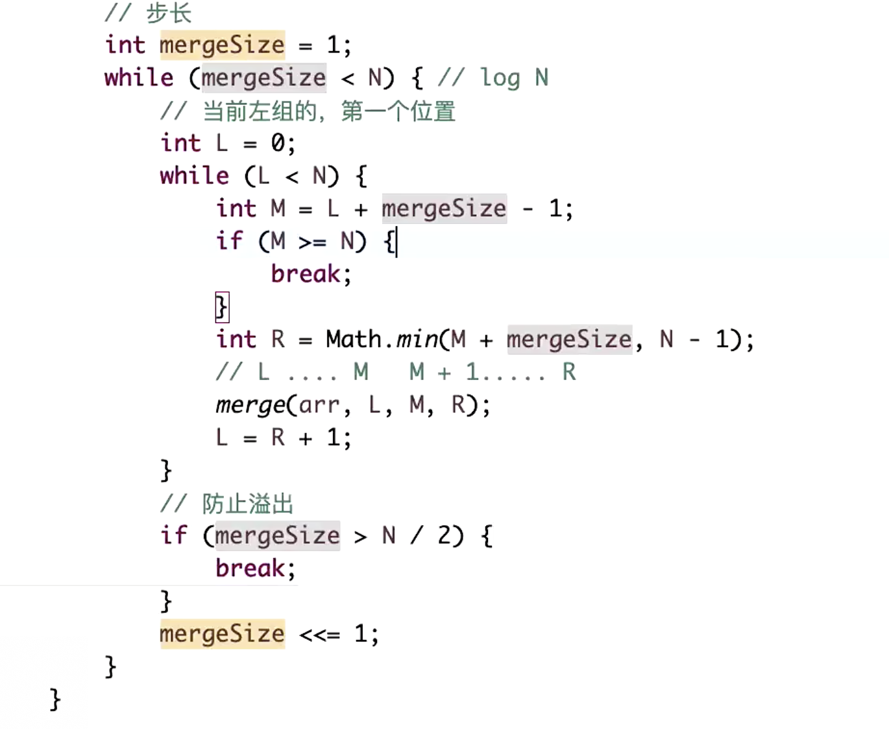
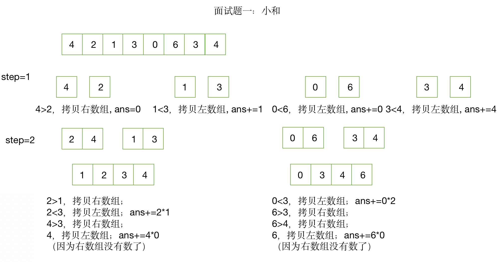
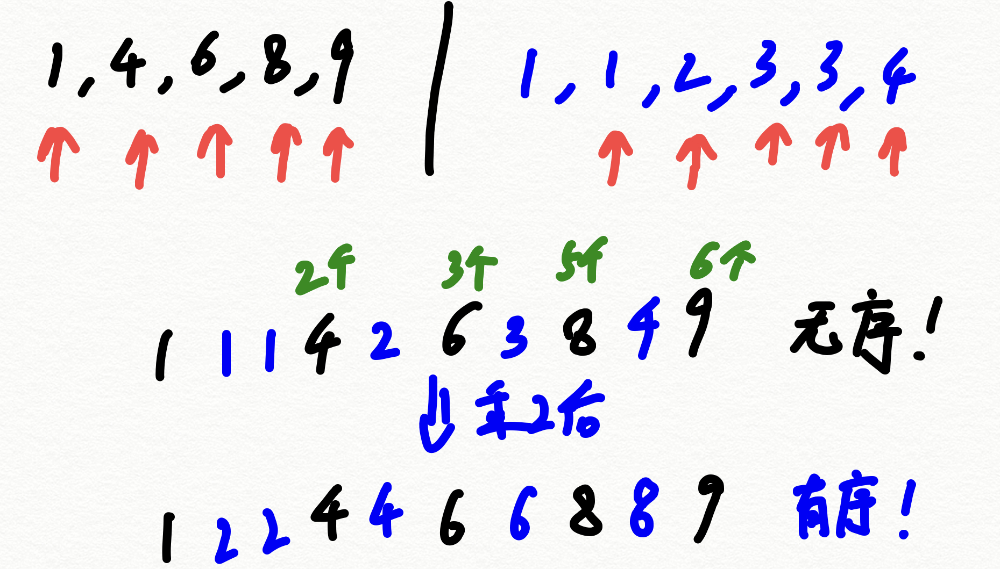
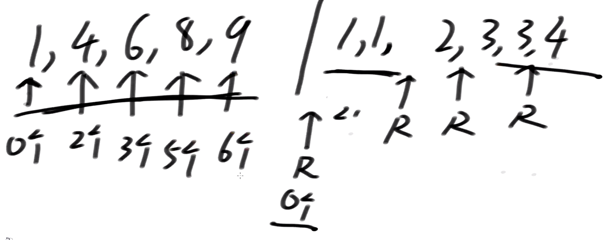

# DS04：归并排序及其相关面试题
## 1. 归并排序：
- 基本流程：
    - 给定数组arr，左边界L，右边界R
    - 第一步：求中点M
    - 第二步：对arr[L, M]进行排序
    - 第三步：对arr[M+1, R]进行排序
    - 第四步：合并两个数组，使其整体有序
- 主定理分析：$T(N)=2T(\frac{N}{2})+O(N)$
    - $O(N)$是因为指针要遍历左右两个数组的全部数字
- 时间复杂度：$O(N\log{N})$
    - 大部分排序算法是 $O(N^2)$，是因为浪费了很多比较结果
- 实现方法：
    - 递归法
        - help是用于保存合并中结果的辅助数组
        - 合并时先p1<=M且p2<=R，并比较两个数的大小（大小相同时默认选左边），然后将p1未遍历完的数据加入其中，再将p2未遍历完的数据加入其中（虽然写了两个p1和p2的while循环，但是只会执行其中一个），最后把help的数据存回原数组中

    ```java
    // 递归方法实现
	public static void mergeSort1(int[] arr) {
		if (arr == null || arr.length < 2) {
			return;
		}
		process(arr, 0, arr.length - 1);
	}

	// 请把arr[L..R]排有序
	// l...r N
	// T(N) = 2 * T(N / 2) + O(N)
	// O(N * logN)
	public static void process(int[] arr, int L, int R) {
		if (L == R) { // base case
			return;
		}
		int mid = L + ((R - L) >> 1);
		process(arr, L, mid);
		process(arr, mid + 1, R);
		merge(arr, L, mid, R);
	}

	public static void merge(int[] arr, int L, int M, int R) {
		int[] help = new int[R - L + 1];
		int i = 0;
		int p1 = L;
		int p2 = M + 1;
		while (p1 <= M && p2 <= R) {
			help[i++] = arr[p1] <= arr[p2] ? arr[p1++] : arr[p2++];
		}
		// 要么p1越界了，要么p2越界了
		while (p1 <= M) {
			help[i++] = arr[p1++];
		}
		while (p2 <= R) {
			help[i++] = arr[p2++];
		}
		for (i = 0; i < help.length; i++) {
			arr[L + i] = help[i];
		}
	}
    ```
    - 非迭代法
        - 假设数组为``arr[2, 1, 3, 5, 6, 4]``
        - 设定步长，初始为1:
            - 直接归并2和1，得到1和2
            - 直接归并3和5，得到3和5
            - 直接归并6和4，得到4和6
            - 数组变为``arr[1, 2, 3, 5, 4, 6]``
            - <font color=red>注意：步长是指归并的子数组长度</font>
        - 步长乘以2，即为2:
            - 直接归并1、2和3、5，得到1、2、3、5
            - 4、6不变，因为右边没有数组的其他元素
        - 步长再乘以2，即为4:
            - 直接归并1、2、3、5和6、4，得到1、2、3、4、5、6
            - 也就是说左右数组可以不等长
        - 步长再乘以2，即为8
            - 超出数组长度，算法停止
        - 分析：
            - 步长一共调整 $\log{N}$ 次，每次调整后需要进行 $O(N)$ 次比较，所以时间复杂度是 $O(N\log{N})$
            - 每次先确定L和M（M=L+步长-1），然后确定R（R=M+步长，R=N-1两者中的最小值），最后确定下一个L=R+1，依此类推。
        - 代码：

        ```java
    // 非递归方法实现
	public static void mergeSort2(int[] arr) {
    		if (arr == null || arr.length < 2) {
    			return;
    		}
    		int N = arr.length;
    		// 步长
    		int mergeSize = 1;
    		while (mergeSize < N) { // log N
    			// L是当前左组的，第一个位置
    			int L = 0;
    			while (L < N) {
    			   // 相当于M>=N-1，也就是完全没有右数组时，
    			   //直接结束
    			   //L + mergeSize - 1 >= N-1可化为下面的式子
    				if (mergeSize >= N - L) {
    					break;
    				}
    				int M = L + mergeSize - 1;
    				int R = M + Math.min(mergeSize, N - M - 1);
    				merge(arr, L, M, R);
    				L = R + 1;
    			}
    			// 防止溢出
    			// 如数组长度N非常接近最大的整数，则步长会不断增大，
    			//也会非常接近最大的整数（此时，步长大于N/2），
    			//则下一条 mergeSize*2 会导致整数溢出，变成负数
    			if (mergeSize > N / 2) {
    				break;
    			}
    			mergeSize <<= 1;
    		}
	}
        ```
        - <font color=red>视频课里的写法：（与上面的代码不同，但背后的原理一样的）</font>

        
   
## 2. 面试题一小和问题：
- 问题描述：
    - 对于数组中每个数及其位置，将该位置之前且比该位置上的数小的所有数求和，得到一个新数列，最后输出新数列的全部数字之和。
    - 如``arr=[6, 3, 2, 1, 6, 7]``，则新数组为``t=[0, 0, 0, 0, 6, 18]``，最后输出为24
    - 如果采用最普通的解法，需要 $O(N^2)$ 的时间复杂度，这里要求时间复杂度为 $O(N\log{N})$ 
    - 还是采用归并排序的思想
        - 拷贝左数组时，ans+=拷贝的数*(右组末尾位置 - 右组指针位置 + 1，即右组中有多少个数比当前左数组的数字大)
        - 拷贝右数组时，ans不变
        - 左右数组中的数字一样时，优先拷贝右数组，注意此时右边数组如果还有比该数大的，不改变ans，因为左数组中该数还在。目的是：相等时，找出右边比该数大的数字对应下标。

        
    - 数学原理：
        - 对于有序数组中的一个数X，如果右边有Y个数比X大，则最终求和的式子中必有Y个X
        - 本质是问题的转化：<font color=red>原来是找左边比某数小的数总和，转变成找右边有几个数比它大</font>
        - 以后遇到比大小的问题，想想能不能分解成左边、右边和合并三块，如果可以，就用归并
    - 代码实现：
        - 左边排序的小和+右边排序的小和+合并时的小和

        ```java
        public static int smallSum(int[] arr) {
    		if (arr == null || arr.length < 2) {
    			return 0;
    		}
    		return process(arr, 0, arr.length - 1);
    	}
    	// arr[L..R]既要排好序，也要求小和返回
    	// 所有merge时，产生的小和，累加
    	// 左 排序   merge
    	// 右 排序  merge
    	// merge
    	public static int process(int[] arr, int l, int r) {
    		if (l == r) {
    			return 0;
    		}
    		// l < r
    		int mid = l + ((r - l) >> 1);
    		return 
    				process(arr, l, mid) 
    				+ 
    				process(arr, mid + 1, r) 
    				+ 
    				merge(arr, l, mid, r);
    	}
    	public static int merge(int[] arr, int L, int m, int r) {
    		int[] help = new int[r - L + 1];
    		int i = 0;
    		int p1 = L;
    		int p2 = m + 1;
    		int res = 0;
    		while (p1 <= m && p2 <= r) {
    		   // 只在归并排序的基础上加了这一句
    			res += arr[p1] < arr[p2] ? (r - p2 + 1) * arr[p1] : 0;
    			// 和之前相比只是去掉了等于，只会影响稳定性，不影响结果
    			help[i++] = arr[p1] < arr[p2] ? arr[p1++] : arr[p2++];
    		}
    		while (p1 <= m) {
    			help[i++] = arr[p1++];
    		}
    		while (p2 <= r) {
    			help[i++] = arr[p2++];
    		}
    		for (i = 0; i < help.length; i++) {
    			arr[L + i] = help[i];
    		}
    		return res;
    	}
        ```
        
## 3. 面试题二逆序对问题：
- 在一个数组中，假设一个左边的数和一个右边的数构成降序关系，则称为逆序对，找出一个数组中的全部逆序对
- 解法：
    - 由于使用的归并排序默认是从小到大，这里找的是右数组有几个数比左数组的当前数大，所以可以从右到左merge
    - 左边大，则拷贝左数组，ans+= 右组指针位置 - 右组开头位置 + 1，即右组中有多少个数比当前左数组的数字小
    - 右边大，则拷贝右数组，ans不变
    - 左右数组中的数字一样时，优先拷贝右数组，因为不确定右数组前面有多少个数比它小，不改变ans
- 代码：
    ```java
	public static int reverPairNumber(int[] arr) {
		if (arr == null || arr.length < 2) {
			return 0;
		}
		return process(arr, 0, arr.length - 1);
	}
    
	// arr[L..R]既要排好序，也要求逆序对数量返回
	// 所有merge时，产生的逆序对数量，累加，返回
	// 左 排序 merge并产生逆序对数量
	// 右 排序 merge并产生逆序对数量
	public static int process(int[] arr, int l, int r) {
		if (l == r) {
			return 0;
		}
		// l < r
		int mid = l + ((r - l) >> 1);
		return process(arr, l, mid) + process(arr, mid + 1, r) + merge(arr, l, mid, r);
	}
    
	public static int merge(int[] arr, int L, int m, int r) {
		int[] help = new int[r - L + 1];
		int i = help.length - 1;
		int p1 = m;
		int p2 = r;
		int res = 0;
		while (p1 >= L && p2 > m) {
		  // 右数组的起点是m+1, 这里做了化简，即p2-(m+1)+1=p2-m
			res += arr[p1] > arr[p2] ? (p2 - m) : 0;
			help[i--] = arr[p1] > arr[p2] ? arr[p1--] : arr[p2--];
		}
		while (p1 >= L) {
			help[i--] = arr[p1--];
		}
		while (p2 > m) {
			help[i--] = arr[p2--];
		}
		for (i = 0; i < help.length; i++) {
			arr[L + i] = help[i];
		}
		return res;
	}
    ```

## 4. 面试题三2倍大小问题：
- 在一个数组中，某个数a的右边，有多少个数b满足2*b<a:
- 总思路还是：左数组的2倍大小个数 + 右数组的2倍大小个数 + 合并的2倍大小个数
- 我的思路：
    - 右边数组的大，则选右边，ans不变
    - 左边数组的大，则选左边，ans += 右组指针位置 - 右组开头位置 + 1
    - 两者相等时，选右边，ans不变
    - 注意：这样的方法不行，乘以2改变了数据大小，因为合并后数组不是有序的了

    
- 正确解法：
    - 从左到右合并
    - 左指针选中一个数后，右指针不断向后移动，直到右指针的下一个乘以2大于等于左指针的数，则右指针移动的次数就是所要求的个数
    - 实现方法就是右指针index从 m+1 开始，先比较arr[index]*2与左数组的数的大小关系，如果小于，则index++

    
    - 扫描完个数后，再重新从头合并即可
    - 核心思想：利用并保持数组的有序性，从而避免重复遍历，当比较大小的操作影响到数组的有序性时，拆分成两个 $O(N)$ 的循环即可。
- 代码实现：

```java
public static int biggerTwice(int[] arr) {
	if (arr == null || arr.length < 2) {
		return 0;
	}
	return process(arr, 0, arr.length - 1);
}

public static int process(int[] arr, int l, int r) {
	if (l == r) {
		return 0;
	}
	// l < r
	int mid = l + ((r - l) >> 1);
	return process(arr, l, mid) + process(arr, mid + 1, r) + merge(arr, l, mid, r);
}

public static int merge(int[] arr, int L, int m, int r) {
	// [L....M]   [M+1....R]
	
	int ans = 0;
	// 目前囊括进来的数，是从[M+1, windowR)，注意是左闭右开
	// 单独的这一块是O(N)复杂度
	// windowR用来记录右指针扫描到哪个数了
	int windowR = m + 1;
	for (int i = L; i <= m; i++) {
	   // 这里是先比大小，再向右移动右指针
	   // 一定要把windowR <= r写在前面，因为最后windowR=r+1，如果先看arr[windowR]，会产生越界错误
		while (windowR <= r && arr[i] > (arr[windowR] * 2)) {
			windowR++;
		}
		ans += windowR - m - 1;
	}
	
	// 单独的这一块也是O(N)复杂度，前后代码合在一起还是O(N)
	int[] help = new int[r - L + 1];
	int i = 0;
	int p1 = L;
	int p2 = m + 1;
	while (p1 <= m && p2 <= r) {
		help[i++] = arr[p1] <= arr[p2] ? arr[p1++] : arr[p2++];
	}
	while (p1 <= m) {
		help[i++] = arr[p1++];
	}
	while (p2 <= r) {
		help[i++] = arr[p2++];
	}
	for (i = 0; i < help.length; i++) {
		arr[L + i] = help[i];
	}
	return ans;
}
```

#### 核心：归并排序可以将信息有序化，同时便于处理比大小等操作
- 要求：面试中会手写
- 适用于找数组中某个数的左边或右边、满足某一大小条件的数字个数问题


## 附-编程任务：
- task1: 归并排序递归实现
- task2: 归并排序非递归实现
- task3: 面试题1.小和问题递归实现
- task4: 面试题1.小和问题非递归实现
- task5: 面试题2.逆序对问题递归实现


