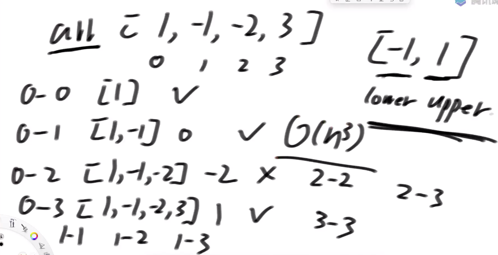
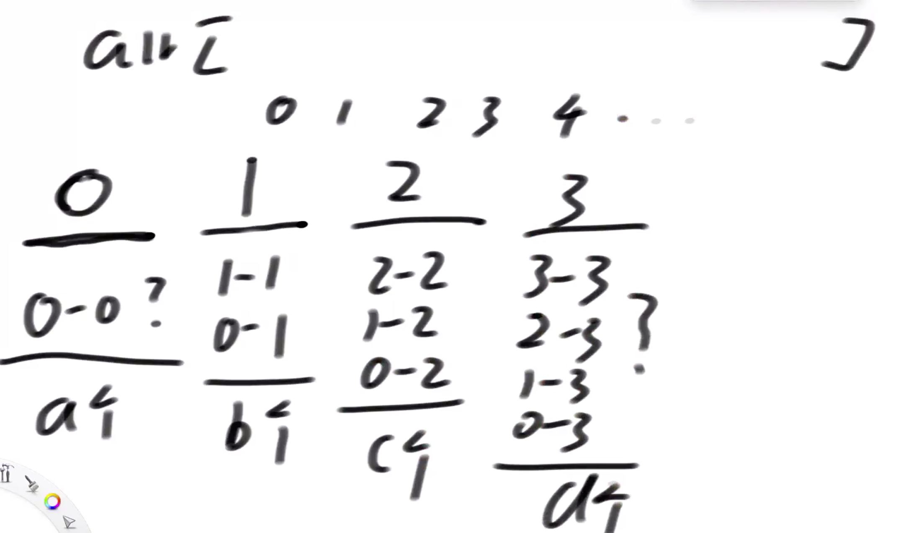
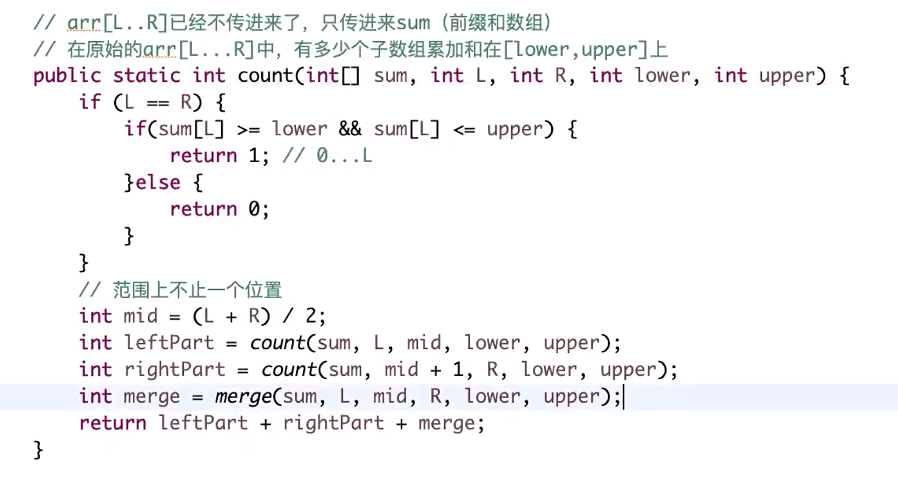
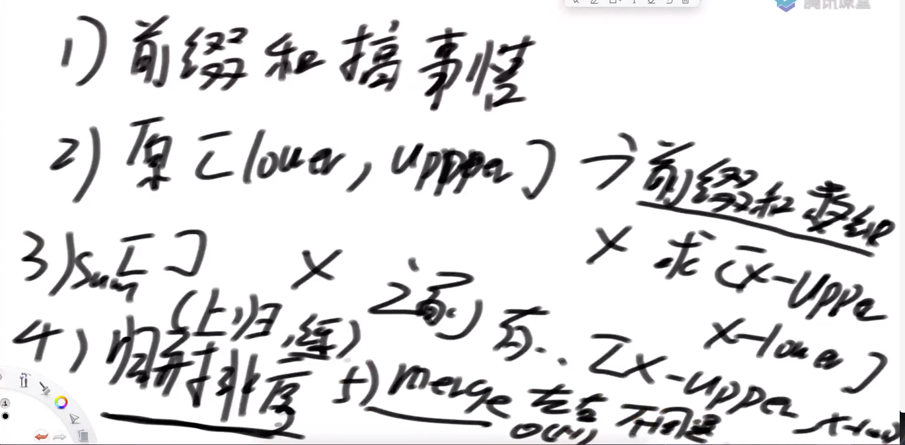
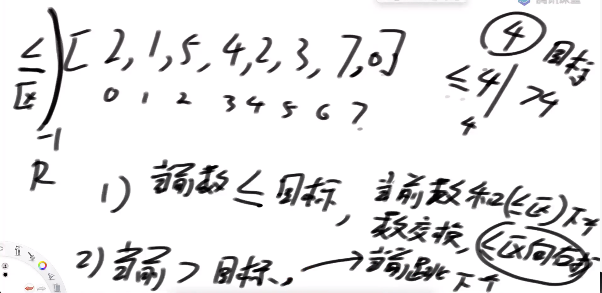
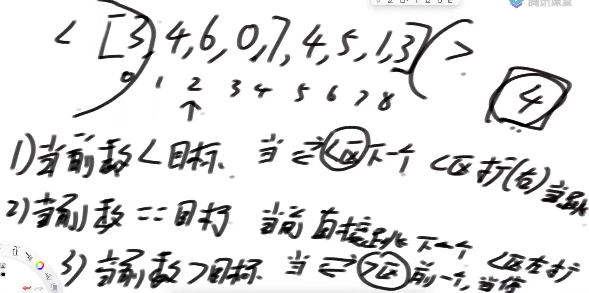

# DS05：归并排序附加题、随机快速排序
## 1. 归并排序补充题目（难）：
- 题目描述：
    - 给定一个数组arr，两个整数lower和upper，返回arr中有多少子数组的累加和在[lower, upper]范围内
- 题目分析：
    - 问题可以分解为左半边的子数组、右半边的子数组和横跨中间的子数组
- 前置知识
    - 对于一个随机无序数组，其元素为正数、负数或0，经常会用到一个累加和函数``getSum[arr, i, j]``，用于求解arr数组中i到j位置上所有元素之和。
    - 从数学的角度来说：``sum[arr, i, j]=sum[arr, 0, j]-sum[arr, 0, i-1],i>0``，即中间范围的累加和可以转化为两个前缀和相减。
    - 因此可以准备一个与原数组等长的前缀和数组``preSum[i]=sum[arr, 0, i]``，计算前缀和数组中每一个元素的方法是：
    
        ```
        preSum[0]=arr[0]
        preSum[1]=preSum[0]+arr[1]
        …… ……
        preSum[i]=preSum[i-1]+arr[i]
        ```
        - 因此，只需要遍历一次arr，即可生成preSum数组，从而可以快速得到累加和函数``getSum[arr, i, j]``的结果。
    - 普通解法：枚举法
        - 时间复杂度：$O(N^3)$，这是因为子数组的个数为 $N^2$ 数量级，再由于每次求和都要遍历，因此还要乘以 $N$ 。如果使用前缀数组，则可以降低为 $O(N^2)$ ，引入归并排序的方法后，时间复杂度可以变为 $O(N*logN)$ 。

        
    - 归并解法：
        - 转换思路：如果先求出固定结尾且满足要求的子数组个数，只需要不断移动结尾，并对各个子数组个数求和即可
            - 下图中的0、1等是指子数组必须以原数组的0、1等位置作为结尾

            
        - 数学等价：
            - $lower \leq sum[arr, i, j] \leq upper$等价于以下两种情况：
            $$lower \leq sum[arr, 0, j]-sum[arr, 0, i-1] \leq upper, i>0$$
            
            $$lower \leq sum[arr, 0, j] \leq upper, i=0$$
            - i>0时，由于结尾固定，即j固定，sum[arr, 0, j]固定，则等价于：

            $$sum[arr, 0, i-1] \in [sum[arr, 0, j]-upper, sum[arr, 0, j]-lower], i \in [1, j]$$
            - i=0时，由于利用到前缀和数组，可以直接用preSum[j]
            - 从而转化为设0到i-1的整体累加和为X，找有多少个i使得X在一定大小范围内。
        - 因此问题转化为：
            - 先求arr数组的前缀和数组preSum
            - 然后对于preSum数组中的元素j，看0-j范围内的preSum数组元素，有多少个在如下范围内：（不再使用arr数组）
            $$[ preSum[j]-upper, preSum[j]-lower ]$$
            - 如果用遍历法，目前的时间复杂度是 $O(N^2)$ 。
            - 注意数组元素有正有负，所以前缀数组无序
        - 问题是典型的数组元素和其左侧元素的大小关系，所以可以带入归并排序的视角：
            - 前提：左数组、右数组、题目范围
            - 将问题转化为：在合并过程中，对于每一个右组的元素X，看左组中有多少个元素落在X-upper到X-lower范围中
            - 递归入口：arr[L, R]，但只需要传入preSum数组、L、R、lower、upper
            - 递归出口：L==R
                - 因为L到R是前缀数组的下标遍历范围，递归到最后时，L==R，就只需要研究preSum[L]是否在大小范围内即可，对应于i=0的情况，而i>0的数学转换则放到合并时进行

            ```
            sum[arr, L, R]=sum[arr, 0, R]-sum[arr, 0, L-1]
            ```
            - 合并时：
                - 对于右数组的元素X，左数组中有几个在[X-upper, X-lower]范围中
                - 注意指针不可回退
                - 由于右数组有序，从小到大，所以X-upper和X-lower也是依次递增或不变的。如果左数组的数比X-upper小，则直接向右滑动，其他情况保持不动
                - 左数组使用两个指针L和R，R滑动的过程中的数不能比X-lower大（可以等于），L滑动的过程中的数不能比X-upper小（可以等于）
                - 计算和合并分开，关键点在于指针不能回退，一定要利用好有序性

            
        - 本方法的核心：

        
        - 代码实现：

        ```java
    public static int countRangeSum(int[] nums, int lower, int upper) {
    		if (nums == null || nums.length == 0) {
    			return 0;
    		}
    		long[] sum = new long[nums.length];
    		sum[0] = nums[0];
    		for (int i = 1; i < nums.length; i++) {
    			sum[i] = sum[i - 1] + nums[i];
    		}
    		return process(sum, 0, sum.length - 1, lower, upper);
    	}
    	public static int process(long[] sum, int L, int R, int lower, int upper) {
    		if (L == R) {
    			return sum[L] >= lower && sum[L] <= upper ? 1 : 0;
    		}
    		int M = L + ((R - L) >> 1);
    		return process(sum, L, M, lower, upper) + process(sum, M + 1, R, lower, upper)
    				+ merge(sum, L, M, R, lower, upper);
    	}
    	public static int merge(long[] arr, int L, int M, int R, int lower, int upper) {
    		int ans = 0;
    		int windowL = L;
    		int windowR = L;
    		// [windowL, windowR)
    		for (int i = M + 1; i <= R; i++) {
    			long min = arr[i] - upper;
    			long max = arr[i] - lower;
    			while (windowR <= M && arr[windowR] <= max) {
    				windowR++;
    			}
    			while (windowL <= M && arr[windowL] < min) {
    				windowL++;
    			}
    			ans += windowR - windowL;
    		}
    		long[] help = new long[R - L + 1];
    		int i = 0;
    		int p1 = L;
    		int p2 = M + 1;
    		while (p1 <= M && p2 <= R) {
    			help[i++] = arr[p1] <= arr[p2] ? arr[p1++] : arr[p2++];
    		}
    		while (p1 <= M) {
    			help[i++] = arr[p1++];
    		}
    		while (p2 <= R) {
    			help[i++] = arr[p2++];
    		}
    		for (i = 0; i < help.length; i++) {
    			arr[L + i] = help[i];
    		}
    		return ans;
	}
        ```
        - 注：本题还有一种解法，使用到有序表，应该会在后续课程中讲到，本质是利用有序表的 $O(\log{N})$ 来找出在X-upper到X-lower范围中的数，感觉是用对应函数，如``treeMap.lowerkey()/.upperkey()``，如果不能使用系统的有序表api的话，则需要自己实现有序表，并改写出这个查找范围内元素的功能
        
## 2. 快速排序：
- 荷兰国旗问题：
    - 给定一个数X和一个数组arr，要求把数组划分为小于等于x、大于x的两部分
    - 注意：划分出来的几个不要求各自有序！只要满足与X的大小关系即可
    - 要求不能用辅助数组，时间复杂度 $O(N)$，空间复杂度 $O(1)$
    - 思路：
        - 从左往右遍历，设置一个小于等于区
        - 当前数小于等于X时，当前数和小于等于区的下一个数交换，同时小于等于区向右扩大，并遍历下一个元素
        - 当前数大于X时，不变，只需要继续遍历下一个元素即可
        - 返回小于等于区的最后一个位置即可

    
- 荷兰国旗问题（升级版）：
    - 给定一个数X和一个数组arr，要求把数组划分为小于x、大于x和等于x的三部分
    - 要求不能用辅助数组，时间复杂度 $O(N)$，空间复杂度 $O(1)$
    - 设置一个小于区和一个大于区
    - 当前数小于目标数时，当前数与小于区的下一个数交换，小于区向右扩，当前数遍历到下一个
    - 当前数等于目标数时，当前数直接遍历到下一个
    - 当前数大于目标数时，当前数与大于区的前一个数交换，且保持当前遍历的位置不变，因为交换后该位置上的数字变了，注意当前遍历的位置与大于区的左边界相同时，停止一切操作
    - 划分函数partition:
        - 以数组的最后一个元素arr[N-1]为目标数字，对arr[0, N-2]上划分为<X、=X、>X三部分，最后再将arr[N-1]与>X区域的最左边元素交换位置即可
        - 返回两个元素组成的数组，分别是=X区的起始位置和结束为止

        
    - 代码实现：

    ```java
	// arr[L...R] 玩荷兰国旗问题的划分，以arr[R]做划分值
	// <arr[R] ==arr[R] > arr[R]
	public static int[] netherlandsFlag(int[] arr, int L, int R) {
		if (L > R) { // L...R L>R
			return new int[] { -1, -1 };
		}
	   // 只有一个元素时
		if (L == R) {
			return new int[] { L, R };
		}
		int less = L - 1; // < 区 右边界
		int more = R; // > 区 左边界，使得arr[R]刚开始不参与交换
		int index = L;
		while (index < more) { // 当前位置，不能和 >区的左边界撞上
		  // 当前数等于划分值，直接下一个
			if (arr[index] == arr[R]) {
				index++;
			} else if (arr[index] < arr[R]) {
			// 当前数小于划分值：
			//当前数与小于区的下一个做交换
			//小于区向右扩
			//当前位置向下一个移动
//				swap(arr, less + 1, index);
//				less++;
//				index++;		
			// 传入的是index和less+1，执行完后index+1
				swap(arr, index++, ++less);
			} else { // >
				swap(arr, index, --more);
			}
		}
		swap(arr, more, R); // <[R]   =[R]   >[R]
		return new int[] { less + 1, more };
	}
	
    ```
        
- 快速排序：
    - 1.0版本：
        - 选择arr[N-1]作为目标值，划分成小于等于区、大于区
        - 对小于等于区和大于区依次使用各自的最后一个元素作为目标值进行更进一步的划分，原来的分界线处元素保持不动
        - 依次递归下去后，即可得到全部有序的数组
        - 时间复杂度：$O(N^2)$，空间复杂度是 $O(N)$，因为最差情况是，原来的数组arr本身是从小到大排序的
    - 2.0版本：
        - 选择arr[N-1]作为目标值，划分成小于区、大于区、等于区
        - 对小于区和大于区依次使用各自区域的最后一个元素作为目标值进行更进一步的划分，原来的等于区保持不动
        - 依次递归下去后，即可得到全部有序的数组
        - 比1.0版本好在，每一步让更多的数字有序，即等于区包含多个数，而不再是一个用来分界的数
        - 时间复杂度：$O(N^2)$，空间复杂度是 $O(N)$，因为最差情况是，原来的数组arr本身是从小到大排序的
    - 3.0版本：随机快速排序
        - 从数组中随机选择一个元素，与数组的最后一个元素交换位置，然后再以数组的最后一个元素作为目标值进行划分
        - 因此只比2.0版本多一行代码，即随机选择并交换
        - 之前时间复杂度很差的原因是，划分目标值太偏了，如果划分目标值能选在最中间，则表达式近似可以写为：

        $$T(N) = 2*T(\frac{N}{2})+O(N)$$
            - 这样的话，时间复杂度会变成 $O(N*logN) $，空间复杂度变为 $O(logN)$
        - 所以，划分目标值选的越好，时间越接近$O(N*logN)$，选的越不好，时间越接近$O(N^2)$
    - 数学上可以证明（各种情况下的时间复杂度乘以概率值并求和），快速排序3.0时间复杂度收敛到 $O(N*logN)$，空间复杂度是 $O(logN)$，因为使用了递归，需要记录划分的位置信息，即使是非递归方法，也需要用栈来记录信息
- 快速排序3.0非递归版本：
    - 使用栈来代替递归的过程

```java
	// 荷兰国旗问题
	public static int[] netherlandsFlag(int[] arr, int L, int R) {
		if (L > R) {
			return new int[] { -1, -1 };
		}
		if (L == R) {
			return new int[] { L, R };
		}
		int less = L - 1;
		int more = R;
		int index = L;
		while (index < more) {
			if (arr[index] == arr[R]) {
				index++;
			} else if (arr[index] < arr[R]) {
				swap(arr, index++, ++less);
			} else {
				swap(arr, index, --more);
			}
		}
		swap(arr, more, R);
		return new int[] { less + 1, more };
	}

	public static void swap(int[] arr, int i, int j) {
		int tmp = arr[i];
		arr[i] = arr[j];
		arr[j] = tmp;
	}

	// 快排递归版本
	public static void quickSort1(int[] arr) {
		if (arr == null || arr.length < 2) {
			return;
		}
		process(arr, 0, arr.length - 1);
	}

	public static void process(int[] arr, int L, int R) {
		if (L >= R) {
			return;
		}
		swap(arr, L + (int) (Math.random() * (R - L + 1)), R);
		int[] equalArea = netherlandsFlag(arr, L, R);
		process(arr, L, equalArea[0] - 1);
		process(arr, equalArea[1] + 1, R);
	}

	// 快排非递归版本需要的辅助类
	// 要处理的是什么范围上的排序
	public static class Op {
		public int l;
		public int r;

		public Op(int left, int right) {
			l = left;
			r = right;
		}
	}

	// 快排3.0 非递归版本
	public static void quickSort2(int[] arr) {
		if (arr == null || arr.length < 2) {
			return;
		}
		int N = arr.length;
		// 第一步：随机选择并交换
		swap(arr, (int) (Math.random() * N), N - 1);
		// 第二步：获得划分区域
		int[] equalArea = netherlandsFlag(arr, 0, N - 1);
		int el = equalArea[0];
		int er = equalArea[1];
		// 第三步：把左右数组的下标范围压栈
		Stack<Op> stack = new Stack<>();
		stack.push(new Op(0, el - 1));
		stack.push(new Op(er + 1, N - 1));
		while (!stack.isEmpty()) {
		   // 第四步：出栈，处理子任务，并压新的栈
			Op op = stack.pop(); // op.l  ... op.r
			// 判断是否满足终止条件，即 op.l == op.r
			if (op.l < op.r) {
				swap(arr, op.l + (int) (Math.random() * (op.r - op.l + 1)), op.r);
				equalArea = netherlandsFlag(arr, op.l, op.r);
				el = equalArea[0];
				er = equalArea[1];
				stack.push(new Op(op.l, el - 1));
				stack.push(new Op(er + 1, op.r));
			}
		}
	}
```
    
## 附-编程任务：
- task1: 子数组累加和范围问题
- task2: 荷兰国旗问题
- task3: 荷兰国旗问题（升级版）
- task4: 快速排序1.0
- task5: 快速排序2.0
- task6: 快速排序3.0
- task7: 快速排序3.0（非递归实现）

