# DS06：堆和堆排序
## 1. 比较器：
- 比较器的实质是重载比较运算符
- 比较器可以很好地应用在特殊标准的排序中
- 比较器可以很好地应用在根据特殊标准排序的结构上
- 写代码变得异常容易，且可以用于范式编程
- 具体介绍：
    - 第一步：怎么用比较器？
        - 在系统数据结构的api中可以传入自定义的比较器，时间复杂度为 $O(N*\log{N})$

        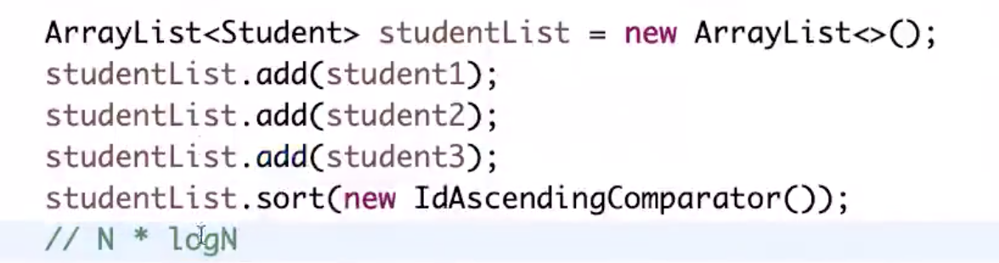
    - 第二步：怎么自定义比较器？
        - 这里以年龄升序排列为例子，在java中要继承系统的比较类，在c++中同理，具体方法见：
        https://www.imangodoc.com/138505.html
        - 在java中如下所示：

        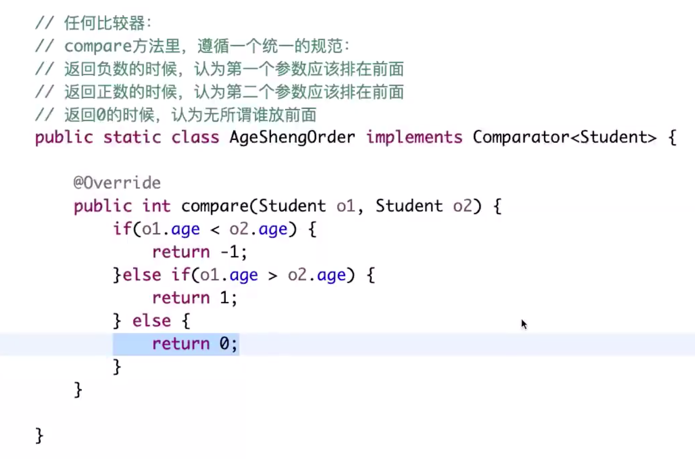
        - 可以进一步简写为如下形式：

        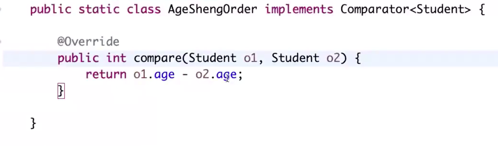
    - 第三步：怎么定义复合排序？如根据id从小到大，如果id一样，则按照年龄从大到小
        - 用三目运算符即可

        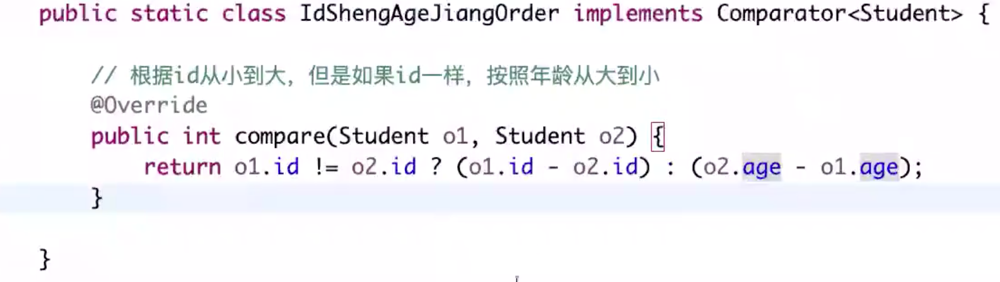
- 比较器的使用范围：
    - 可以应用于数组、链表等本身无序的数据结构。
        - java中ArrayList是可以动态修改的数组，LinkedList则是链表，如果存入这些api中的数据是自定义类型，一定要在``.sort()``中传入自定义的比较器，否则会报错：

        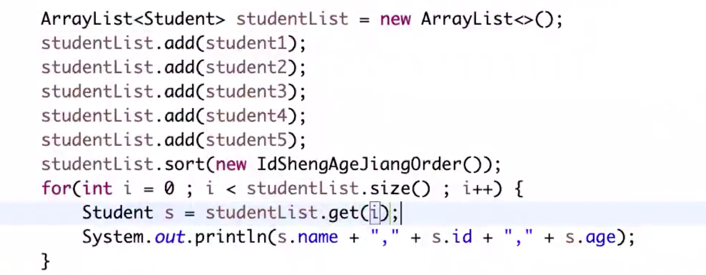
    - 可以应用于有序表等本身有序的数据结构
        - 有序表，如java中TreeMap，如果直接传入自定义的数据类型，需要在预定义有序数据结构时就提供自定义的比较器，否则报错。

            
            - 也可以用如下所示的Lambda表达式来实现简单的排序规则，<font color=red>不过需要注意输出与前一种不同，这是因为TreeMap中只会保存不同的对象，程序中插入的student虽然对象本身不同，但有一些id相同，由于设置的Lambda比较器中只考虑了id这一个性质，所以TreeMap会认为id相同的对象是同一个对象，只保存第一个放入的对象</font>，如下图中顺序插入ABCDE，其中AB的id相同，CDE的id相同，所以只保存第一个插入的，即A和C，然后再进行排序

           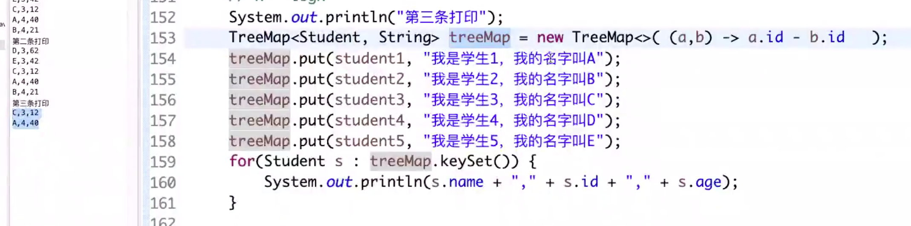 
           - 如果想用Lambda表达式，只用id来排序，且相同id的student要保留，则可以用hashcode()：

           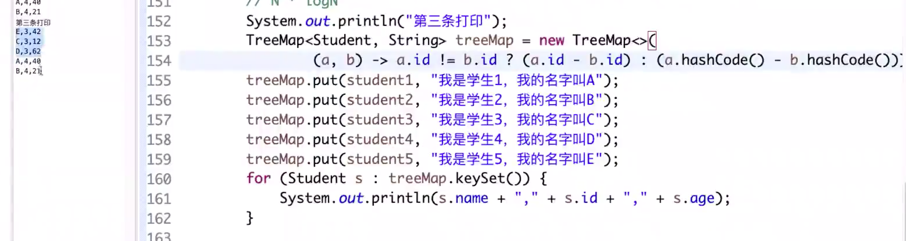 
        - 堆，也就是优先级队列，如java中PriorityQueue
- 案例：

```java
public class Code01_Comparator {

	public static class Student {
		public String name;
		public int id;
		public int age;

		public Student(String name, int id, int age) {
			this.name = name;
			this.id = id;
			this.age = age;
		}
	}

	// 任何比较器：
	// compare方法里，遵循一个统一的规范：
	// 返回负数的时候，认为第一个参数应该排在前面
	// 返回正数的时候，认为第二个参数应该排在前面
	// 返回0的时候，认为无所谓谁放前面
	public static class IdShengAgeJiangOrder implements Comparator<Student> {

		// 根据id从小到大，但是如果id一样，按照年龄从大到小
		@Override
		public int compare(Student o1, Student o2) {
			return o1.id != o2.id ? (o1.id - o2.id) : (o2.age - o1.age);
		}

	}

	public static class IdAscendingComparator implements Comparator<Student> {

		// 返回负数的时候，第一个参数排在前面
		// 返回正数的时候，第二个参数排在前面
		// 返回0的时候，谁在前面无所谓
		@Override
		public int compare(Student o1, Student o2) {
			return o1.id - o2.id;
		}

	}

	public static class IdDescendingComparator implements Comparator<Student> {

		@Override
		public int compare(Student o1, Student o2) {
			return o2.id - o1.id;
		}

	}

	// 先按照id排序，id小的，放前面；
	// id一样，age大的，前面；
	public static class IdInAgeDe implements Comparator<Student> {

		@Override
		public int compare(Student o1, Student o2) {
			return o1.id != o2.id ? o1.id - o2.id : (o2.age - o1.age);
		}

	}

	public static void printStudents(Student[] students) {
		for (Student student : students) {
			System.out.println("Name : " + student.name + ", Id : " + student.id + ", Age : " + student.age);
		}
	}

	public static void printArray(Integer[] arr) {
		if (arr == null) {
			return;
		}
		for (int i = 0; i < arr.length; i++) {
			System.out.print(arr[i] + " ");
		}
		System.out.println();
	}

	public static class MyComp implements Comparator<Integer> {

		@Override
		public int compare(Integer o1, Integer o2) {
			return o2 - o1;
		}

	}

	public static class AComp implements Comparator<Integer> {

		// 如果返回负数，认为第一个参数应该拍在前面
		// 如果返回正数，认为第二个参数应该拍在前面
		// 如果返回0，认为谁放前面都行
		@Override
		public int compare(Integer arg0, Integer arg1) {

			return arg1 - arg0;

//			return 0;
		}

	}

	public static void main(String[] args) {

		Integer[] arr = { 5, 4, 3, 2, 7, 9, 1, 0 };

		Arrays.sort(arr, new AComp());

		for (int i = 0; i < arr.length; i++) {
			System.out.println(arr[i]);
		}

		System.out.println("===========================");

		Student student1 = new Student("A", 4, 40);
		Student student2 = new Student("B", 4, 21);
		Student student3 = new Student("C", 3, 12);
		Student student4 = new Student("D", 3, 62);
		Student student5 = new Student("E", 3, 42);
		// D E C A B

		Student[] students = new Student[] { student1, student2, student3, student4, student5 };
		System.out.println("第一条打印");

		Arrays.sort(students, new IdShengAgeJiangOrder());
		for (int i = 0; i < students.length; i++) {
			Student s = students[i];
			System.out.println(s.name + "," + s.id + "," + s.age);
		}

		System.out.println("第二条打印");
		ArrayList<Student> studentList = new ArrayList<>();
		studentList.add(student1);
		studentList.add(student2);
		studentList.add(student3);
		studentList.add(student4);
		studentList.add(student5);
		studentList.sort(new IdShengAgeJiangOrder());
		for (int i = 0; i < studentList.size(); i++) {
			Student s = studentList.get(i);
			System.out.println(s.name + "," + s.id + "," + s.age);
		}
		// N * logN
		System.out.println("第三条打印");
		student1 = new Student("A", 4, 40);
		student2 = new Student("B", 4, 21);
		student3 = new Student("C", 4, 12);
		student4 = new Student("D", 4, 62);
		student5 = new Student("E", 4, 42);
		TreeMap<Student, String> treeMap = new TreeMap<>((a, b) -> (a.id - b.id));
		treeMap.put(student1, "我是学生1，我的名字叫A");
		treeMap.put(student2, "我是学生2，我的名字叫B");
		treeMap.put(student3, "我是学生3，我的名字叫C");
		treeMap.put(student4, "我是学生4，我的名字叫D");
		treeMap.put(student5, "我是学生5，我的名字叫E");
		for (Student s : treeMap.keySet()) {
			System.out.println(s.name + "," + s.id + "," + s.age);
		}

	}

}

```

## 2. 堆结构：
- 堆结构：用数组实现的完全二叉树结构
    - 什么是完全二叉树？
        - 空树是完全二叉树
        - 每一层从左到右依次填入的树是完全二叉树（如果有未填满的层，则一定是最后一层，且不满的层要求从左到右依次填入）

        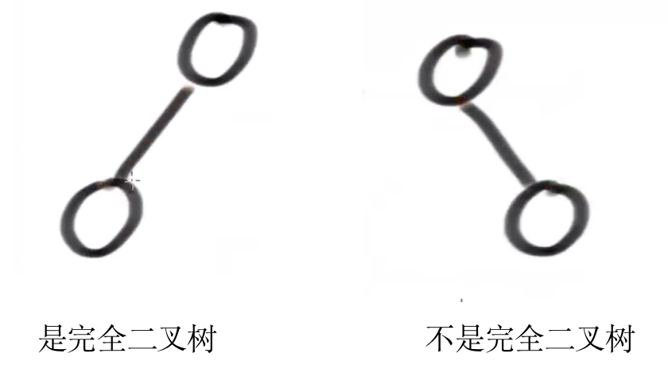 
    - 怎么用数组表示完全二叉树？
        - 对于任意一个数组中的位置 $i$ ，对应树中的一个结点，其左孩子为 $2*i+1$ ， 其右孩子为 $2*i+2$ ，其父节点为 $\frac{i-1}{2}$，向下取整（如 $\frac{7}{2}$ 的结果是3，而不是4）
        - 再使用一个heapsize变量来控制二叉树的总结点数
    - 什么是堆？
        - 大根堆：每棵子树的最大值都在顶部（子树根结点）的完全二叉树，注意是每棵子树都要满足这一条件，而不仅仅是整棵树

        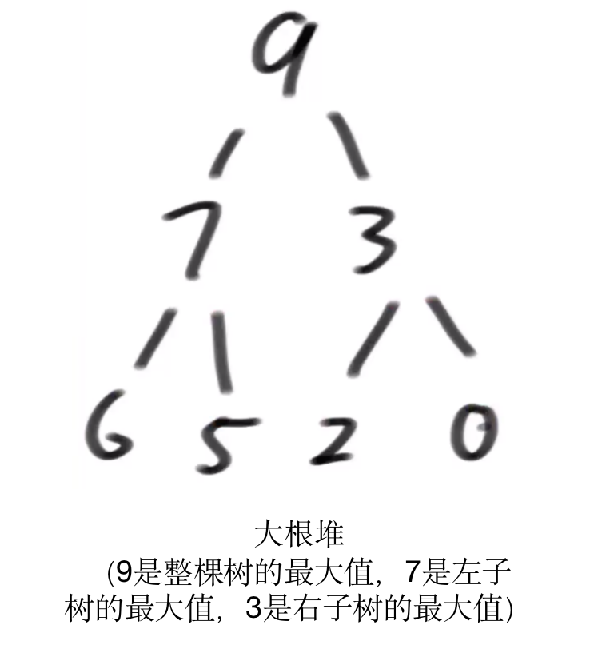 
        - 小根堆：每棵子树的最小值都在顶部（子树根结点）的完全二叉树，注意是每棵子树都要满足这一条件，而不仅仅是整棵树
    - 如何产生和维护大根堆？
        - 第一步：用户插入新数字结点
        - 第二步：判断整体是否满足大根堆要求
            - 依次向上看是否比父节点大，直到看到整棵树的根节点，如果大，则不断与当前父节点交换，称为heapInsert操作。与其他二叉树不同，堆不需要与同级的左/右结点进行比较。
            - 代码如下所示，注意index=0时，在java中，(0-1)/2取整后还是0，因为0/2=0，1/2=0，相减后还是0，所以不会出现数组越界的问题，而arr[0]>arr[0]显然不成立，所以会自动终止循环：

            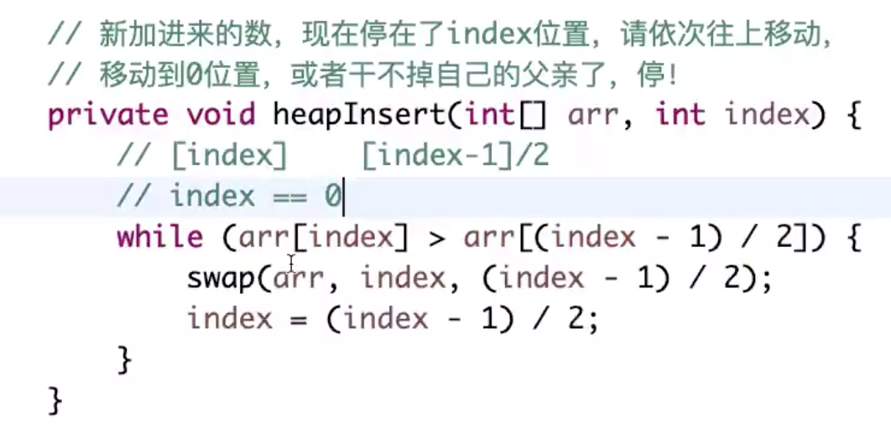 
        - 第三步：取出根节点的数，并删除根节点（即arr[0]），需要进行堆化整理
            - 使用最后一个结点，即arr[heapsize-1]，与原来的根节点交换位置，并--heapsize，然后从上往下调整，找出两个孩子的最大值，如果大于当前的父节点，则交换，再然后去看交换后的子结点的孩子结点，进行同样的操作，称为heapify操作。
            - 注意访问子结点时要看下标是否会超过heapsize，所以heapify操作的终止条件是子结点的最大值不超过父节点，或子结点的下标超过heapsize。

            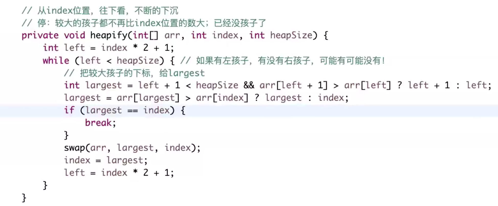 
- 优先级队列结构，就是堆结构
    - java中的优先队列默认是小根堆
    
        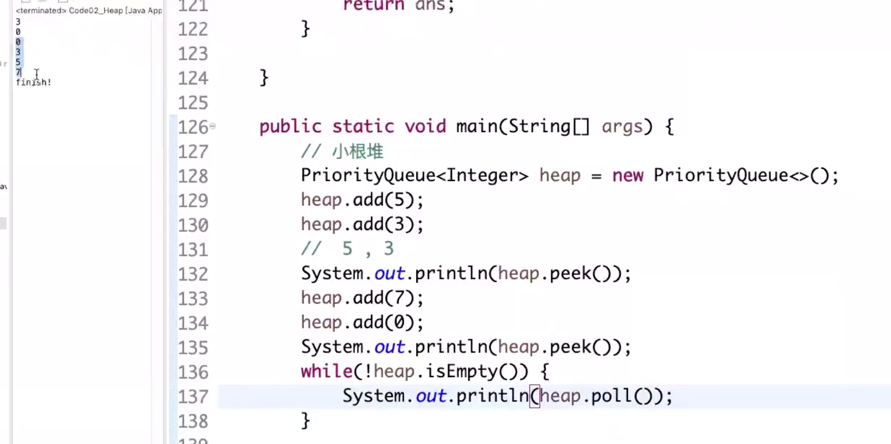 
        - 如果要实现大根堆，需要自己定义比较器：


        ```java
    public static class MyComparator implements Comparator<Integer>{
    		@Override
    		public int compare(Integer o1, Integer o2) {
    			return o2 - o1;
    		}
	}
	public static void main(String[] args) {
    		// 大根堆
    		PriorityQueue<Integer> heap = new PriorityQueue<>(new MyComparator());
    		heap.add(5);
    		heap.add(5);
    		heap.add(5);
    		heap.add(3);
    		//  5 , 3
    		System.out.println(heap.peek());
    		heap.add(7);
    		heap.add(0);
    		heap.add(7);
    		heap.add(0);
    		heap.add(7);
    		heap.add(0);
    		System.out.println(heap.peek());
    		while(!heap.isEmpty()) {
    			System.out.println(heap.poll());
    		}
		}
        ```
        
- 如果无意间改变了数组中的某一个数（不是第一个，也不是最后一个），且不知道变大还是变小，则如何重新维护堆呢？（会在后续的加强堆中使用）
    - 如0-13形成一个最大堆，然后将7位置上的数修改，维护方法：
        - 从7位置开始，看能否进行heapinsert(7)和heapify(7, 14)，如果7位置上的数变大了，则heapinsert会使该数向上浮，而如果7位置上的数变小了，则heapify会使该数向下沉

        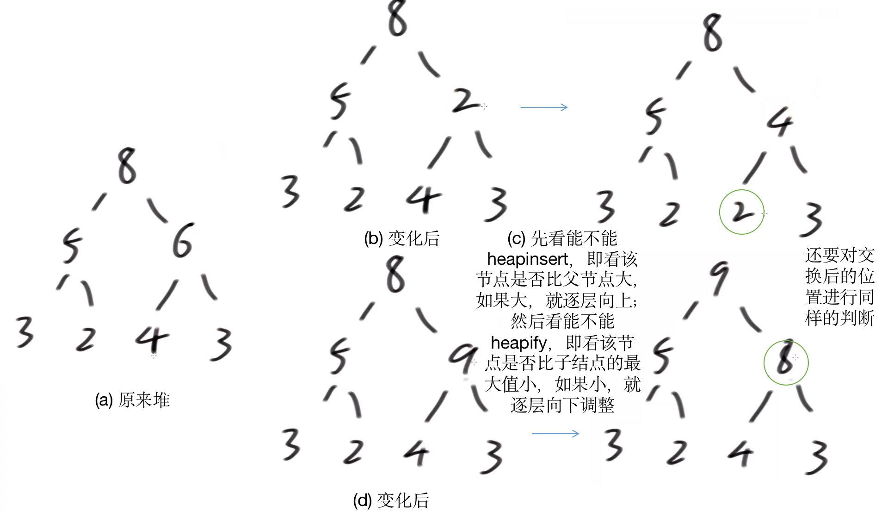 
- 堆的实现代码：
    - 对数器可以使用数组遍历或者优先级队列的API

```java
public static class MyMaxHeap {
	private int[] heap;
	private final int limit;
	private int heapSize;

	public MyMaxHeap(int limit) {
		heap = new int[limit];
		this.limit = limit;
		heapSize = 0;
	}

	public boolean isEmpty() {
		return heapSize == 0;
	}

	public boolean isFull() {
		return heapSize == limit;
	}

	public void push(int value) {
		if (heapSize == limit) {
			throw new RuntimeException("heap is full");
		}
		heap[heapSize] = value;
		// value  heapSize
		heapInsert(heap, heapSize++);
	}

	// 用户此时，让你返回最大值，并且在大根堆中，把最大值删掉
	// 剩下的数，依然保持大根堆组织
	public int pop() {
		int ans = heap[0];
		swap(heap, 0, --heapSize);
		heapify(heap, 0, heapSize);
		return ans;
	}
	// 新加进来的数，现在停在了index位置，请依次往上移动，
	// 移动到0位置，或者干不掉自己的父亲了，停！
	private void heapInsert(int[] arr, int index) {
		// [index]    [index-1]/2
		// index == 0
		while (arr[index] > arr[(index - 1) / 2]) {
			swap(arr, index, (index - 1) / 2);
			index = (index - 1) / 2;
		}
	}

	// 从index位置，往下看，不断的下沉
	// 停：较大的孩子都不再比index位置的数大；已经没孩子了
	private void heapify(int[] arr, int index, int heapSize) {
		int left = index * 2 + 1;
		while (left < heapSize) { // 如果有左孩子，有没有右孩子，可能有可能没有！
			// 把较大孩子的下标，给largest
			int largest = left + 1 < heapSize && arr[left + 1] > arr[left] ? left + 1 : left;
			largest = arr[largest] > arr[index] ? largest : index;
			if (largest == index) {
				break;
			}
			// index和较大孩子，要互换
			swap(arr, largest, index);
			index = largest;
			left = index * 2 + 1;
		}
	}

	private void swap(int[] arr, int i, int j) {
		int tmp = arr[i];
		arr[i] = arr[j];
		arr[j] = tmp;
	}

}
```

## 3. 堆排序：
- 把数组中的数看成用户一个个提供的数，建立最大堆或最小堆
- 一个大小为 $N$ 的堆，其heapinsert（向上）和heapify（向下）操作的时间复杂度都是 $O(\log{N})$，这是因为完全二叉树的高度本身为 $\log{N}$。
- 基本流程：
    - 第一步：把0~N-1整个数组建成大根堆，heapsize=N
    - 第二步：把0位置和N-1位置上的数交换，heapsize变为N-1，即每次拿出最大值并放在当前堆的最后位置处
    - 第三步：把0~N-2的数组使用heapify维护成大根堆（不需要heapinsert，因为只有最上面的顶部变了），然后重复上述操作
    - 第四步：当heapsize=0时停止操作

    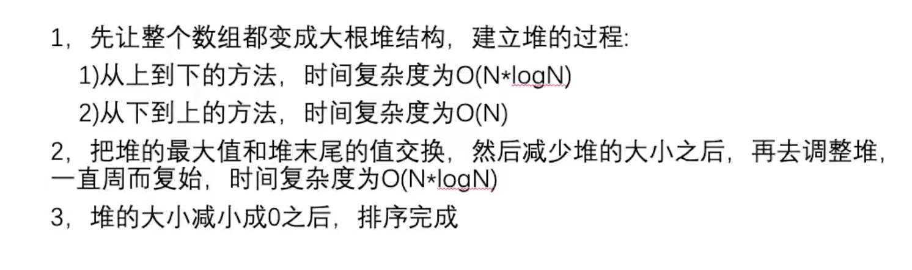 
- 代码：
    - 有两种建立大根堆的方法：
        - 第一种：顺次插入并进行heapinsert
            - 建堆时间复杂度：$O(N\log{N})$，不过最开始插入结点时是 $O(1)$、$O(2)$等，直到最后一个结点才是 $O(\log{N})$，分析时忽略常数项，故时间复杂度上界近似成 $O(N\log{N})$ 
            - 分析下界的方法就是，把 $N$ 变成 $2N$ ，此时后N个数插入大小为N的堆中，最小需要 $\log{N+1}$ 的复杂度，所以时间复杂度下界还是 $O(N\log{N})$ 
            - <font color=red>这种扩充数据量来分析方法的原理是，如果数量为 $N$ 对应的复杂度为 $O(logN))$，则数量为 $2N$ 对应的复杂度仍然为 $O(logN)$，因为忽略常数 $log2$，所以 $log$ 型复杂度可以利用数量为 $N$ 来分析上界，利用数量为 $2N$ 来分析下界</font>
            - 代码：

        ```java
        public static void heapSort(int[] arr) {
    		if (arr == null || arr.length < 2) {
    			return;
    		}
    		// O(N*logN)
    		// 第一种建立大根堆的方法
    		for (int i = 0; i < arr.length; i++) { // O(N)
    			heapInsert(arr, i); // O(logN)
    		}
    		// 堆的大小
    		int heapSize = arr.length;
    		// 交换堆顶元素和堆最后一个元素
    		swap(arr, 0, --heapSize);
    		// O(N*logN)
    		while (heapSize > 0) { // O(N)
    		   // 重新维护最大堆
    			heapify(arr, 0, heapSize); // O(logN)
    			swap(arr, 0, --heapSize); // O(1)
    		}
}
        ```
        
        - 第二种：从下到上的建立方法，
            - 建堆时间复杂度为 $O(N)$
            - 从数组的最后一个元素开始，进行heapify操作（向下沉）
            - <font color=red>对于N个结点的任何二叉树（包括完全二叉树和非完全二叉树），叶结点可以近似假设为N/2个</font>，可以推出时间复杂度为：

            $$T(N)=\frac{N}{2}\times1+\frac{N}{4}\times2+\frac{N}{8}\times3+\frac{N}{16}\times4+\cdots\  (1)$$
            
            $$2T(N)=N+\frac{N}{2}\times2+\frac{N}{4}\times3+\frac{N}{8}\times4+\cdots\  (2)$$
            - (2)-(1)得（错位相减的技巧）：

            
            $$T(N)=N+\frac{N}{2}+\frac{N}{4}+\frac{N}{8}+\cdots \rightarrow O(N)$$
            
            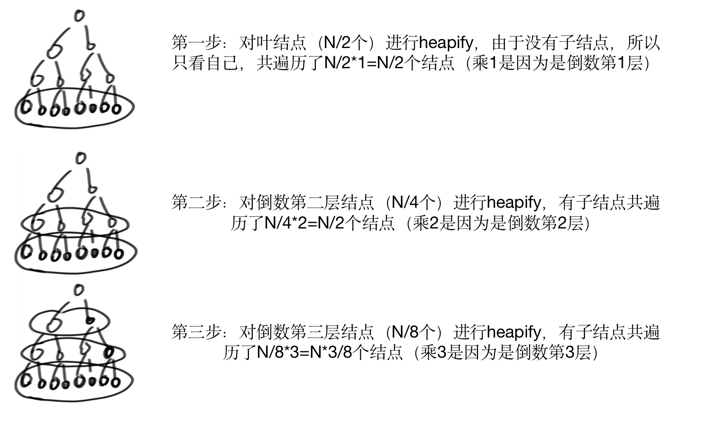 
            - 时间复杂度优于前一种的原因：更多的点只需要少量的重复
                - 第一种方法：越靠近顶部的点遍历次数越少，因为使用的是heapinsert方法

                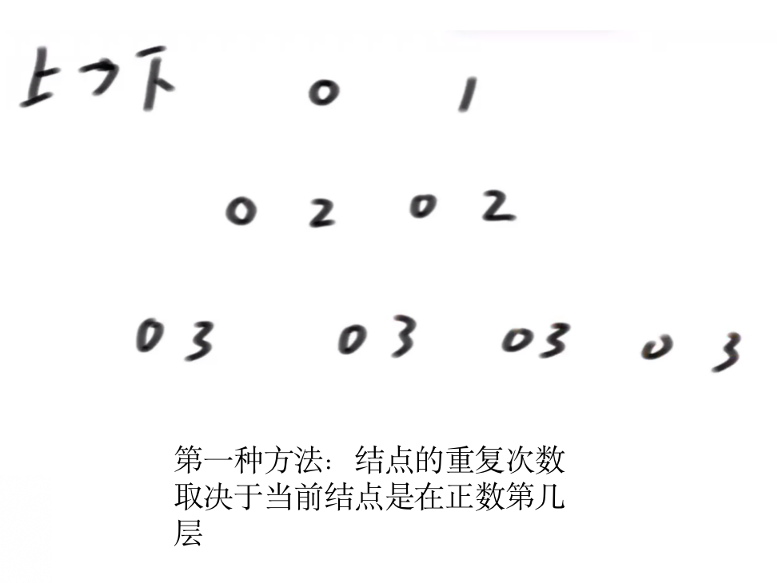 
            - 代码：

        ```java
        public static void heapSort(int[] arr) {
    		if (arr == null || arr.length < 2) {
    			return;
    		}
    		// 第二种建立大根堆的方法
    		// O(N)
		  for (int i = arr.length - 1; i >= 0; i--) {
			 heapify(arr, i, arr.length);
		  }

    		// 堆的大小
    		int heapSize = arr.length;
    		// 交换堆顶元素和堆最后一个元素
    		swap(arr, 0, --heapSize);
    		// O(N*logN)
    		while (heapSize > 0) { // O(N)
    		   // 重新维护最大堆
    			heapify(arr, 0, heapSize); // O(logN)
    			swap(arr, 0, --heapSize); // O(1)
    		}
    }
    ```
    - 整体代码：

```java
    // 堆排序额外空间复杂度O(1)
	public static void heapSort(int[] arr) {
		if (arr == null || arr.length < 2) {
			return;
		}
		// O(N*logN)
		// 第一种建立大根堆的方法
		for (int i = 0; i < arr.length; i++) { // O(N)
			heapInsert(arr, i); // O(logN)
		}
		// O(N)
		for (int i = arr.length - 1; i >= 0; i--) {
			heapify(arr, i, arr.length);
		}
		int heapSize = arr.length;
		swap(arr, 0, --heapSize);
		// O(N*logN)
		while (heapSize > 0) { // O(N)
			heapify(arr, 0, heapSize); // O(logN)
			swap(arr, 0, --heapSize); // O(1)
		}
	}

	// arr[index]刚来的数，往上
	public static void heapInsert(int[] arr, int index) {
		while (arr[index] > arr[(index - 1) / 2]) {
			swap(arr, index, (index - 1) / 2);
			index = (index - 1) / 2;
		}
	}

	// arr[index]位置的数，能否往下移动
	public static void heapify(int[] arr, int index, int heapSize) {
		int left = index * 2 + 1; // 左孩子的下标
		while (left < heapSize) { // 下方还有孩子的时候
			// 两个孩子中，谁的值大，把下标给largest
			// 1）只有左孩子，left -> largest
			// 2) 同时有左孩子和右孩子，右孩子的值<= 左孩子的值，left -> largest
			// 3) 同时有左孩子和右孩子并且右孩子的值> 左孩子的值， right -> largest
			int largest = left + 1 < heapSize && arr[left + 1] > arr[left] ? left + 1 : left;
			// 父和较大的孩子之间，谁的值大，把下标给largest
			largest = arr[largest] > arr[index] ? largest : index;
			if (largest == index) {
				break;
			}
			swap(arr, largest, index);
			index = largest;
			left = index * 2 + 1;
		}
	}

	public static void swap(int[] arr, int i, int j) {
		int tmp = arr[i];
		arr[i] = arr[j];
		arr[j] = tmp;
	}
```
- 注意：
    - <font color=red>第一种：每次只提供一个数字，如果建立最大堆，则只能用heapinsert，最小时间复杂度为 $O(N\log{N})$</font>
    - <font color=red>第二种：所有数字都提供了，如果建立最大堆，则可以用heapify，最小时间复杂度为 $O(N)$</font>
- 基于比较的排序算法最好的时间复杂度是 $O(N\log{N})$，而不是基于比较的方法有更好的时间复杂度。

## 4.堆的面试题：
- 已知一个几乎有序的数组（几乎有序是指，如果要把这个数组排序，则每个元素移动的距离一定不超过k，且k是相对于数组长度来说比较小的）
- 请选择合适的排序策略，对该数组进行排序：
- 如arr=[3, 4, 1, 2, 5], k=2
- 思路：
    - 先把0～k-1位置范围内的数建立一个小根堆
    - 然后把k位置的数插入小根堆中，将堆顶元素（即最小值）弹出并放在0位置
    - 后面不断加入新的数，并将堆顶的数弹出后放在顺次的位置
    - 无新数字加入时，一直弹出即可
- 复杂度分析：
    - 小根堆一共弹出 $O(N)$ 个数，而小根堆的操作一直是 $O(\log{k})$ ，所以总的时间复杂度是  $O(N\log{k})$
    - 因为 $k\ll N$ ，所以时间复杂度远优于 $O(N\log{N})$
    - 空间复杂度是 $O(K+1)$
    - <font color=red>关键是利用了小根堆操作的时间复杂度为 $\log{N}$ 的性质。</font>
- 对数器：先生成一个随机数组，然后排序，最后随即交换，且保证随机交换的距离不超过k即可
- 代码：

```java
	public static void sortedArrDistanceLessK(int[] arr, int k) {
	   // 说明不需要排序
		if (k == 0) {
			return;
		}
		// 默认小根堆
		PriorityQueue<Integer> heap = new PriorityQueue<>();
		int index = 0;
		// 将0...K-1范围内的数组元素建立最小堆
		for (; index <= Math.min(arr.length - 1, k - 1); index++) {
			heap.add(arr[index]);
		}
		// 将第K个元素插入，并维护最小堆，弹出堆顶
		int i = 0;
		for (; index < arr.length; i++, index++) {
			heap.add(arr[index]);
			arr[i] = heap.poll();
		}
		// 无新的元素可加入时，将剩余元素弹出并维护即可
		while (!heap.isEmpty()) {
			arr[i++] = heap.poll();
		}
	}

	// for test
	public static void comparator(int[] arr, int k) {
		Arrays.sort(arr);
	}

	// for test
	public static int[] randomArrayNoMoveMoreK(int maxSize, int maxValue, int K) {
		int[] arr = new int[(int) ((maxSize + 1) * Math.random())];
		for (int i = 0; i < arr.length; i++) {
			arr[i] = (int) ((maxValue + 1) * Math.random()) - (int) (maxValue * Math.random());
		}
		// 先排个序
		Arrays.sort(arr);
		// 然后开始随意交换，但是保证每个数距离不超过K
		// swap[i] == true, 表示i位置已经参与过交换
		// swap[i] == false, 表示i位置没有参与过交换
		boolean[] isSwap = new boolean[arr.length];
		for (int i = 0; i < arr.length; i++) {
			int j = Math.min(i + (int) (Math.random() * (K + 1)), arr.length - 1);
			if (!isSwap[i] && !isSwap[j]) {
				isSwap[i] = true;
				isSwap[j] = true;
				int tmp = arr[i];
				arr[i] = arr[j];
				arr[j] = tmp;
			}
		}
		return arr;
	}

	// for test
	public static int[] copyArray(int[] arr) {
		if (arr == null) {
			return null;
		}
		int[] res = new int[arr.length];
		for (int i = 0; i < arr.length; i++) {
			res[i] = arr[i];
		}
		return res;
	}

	// for test
	public static boolean isEqual(int[] arr1, int[] arr2) {
		if ((arr1 == null && arr2 != null) || (arr1 != null && arr2 == null)) {
			return false;
		}
		if (arr1 == null && arr2 == null) {
			return true;
		}
		if (arr1.length != arr2.length) {
			return false;
		}
		for (int i = 0; i < arr1.length; i++) {
			if (arr1[i] != arr2[i]) {
				return false;
			}
		}
		return true;
	}

	// for test
	public static void printArray(int[] arr) {
		if (arr == null) {
			return;
		}
		for (int i = 0; i < arr.length; i++) {
			System.out.print(arr[i] + " ");
		}
		System.out.println();
	}

	// for test
	public static void main(String[] args) {
		System.out.println("test begin");
		int testTime = 500000;
		int maxSize = 100;
		int maxValue = 100;
		boolean succeed = true;
		for (int i = 0; i < testTime; i++) {
			int k = (int) (Math.random() * maxSize) + 1;
			int[] arr = randomArrayNoMoveMoreK(maxSize, maxValue, k);
			int[] arr1 = copyArray(arr);
			int[] arr2 = copyArray(arr);
			sortedArrDistanceLessK(arr1, k);
			comparator(arr2, k);
			if (!isEqual(arr1, arr2)) {
				succeed = false;
				System.out.println("K : " + k);
				printArray(arr);
				printArray(arr1);
				printArray(arr2);
				break;
			}
		}
		System.out.println(succeed ? "Nice!" : "Fucking fucked!");
	}
```

## 附-编程任务：
- task1: 学生系统-比较器的使用
- task2: 堆的自己实现以及对数器测试
- task3: 堆排序的自己实现以及对数器测试
- task4: 堆的面试题


