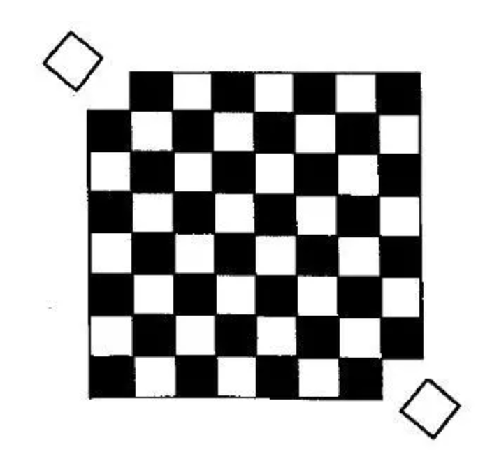
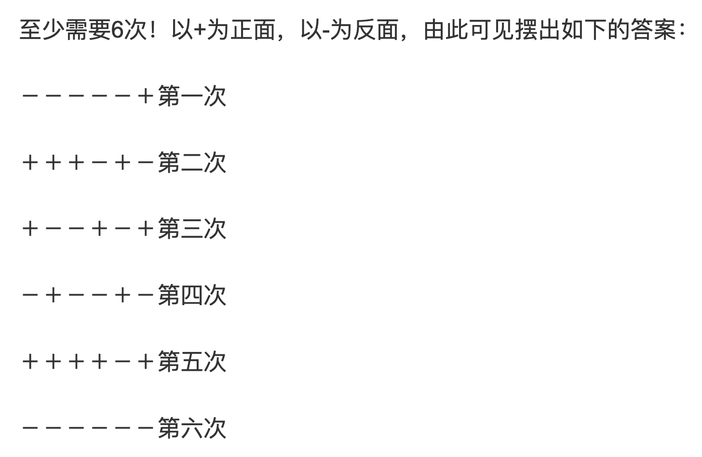

# Interview Puzzle Problem
## Problem 1：
- 问题描述：去掉如下所示的棋盘上的两个角（白色），能否尝试用31个多米诺骨牌覆盖棋盘？
- 注：每个多米诺骨牌会覆盖相邻的一黑一白两个格子
    - 说明：只去掉一个白格子是同理的
    - 法1: 拿笔一个一个圈，尝试（属于思维定式）
    - 法2: 看成数学问题，对于$8*8$的棋盘，黑格子和白格子一共64个，所以32个骨牌一定能全覆盖，但是现在32个黑格子、30个白格子，所以绝对无法全覆盖；
    - 法3: 动态规划法，从小到大，比如先把棋盘缩小到$4*4$等，但是缺点是有时结论无法直接放大或缩小
    - 法4: 联想法，黑色看成男生，白色看成女生，棋盘看成舞会，问题转化为，32个男生和30个女生能不能配对成功呢？显然不可能

## Problem 2：
- 问题描述：100000000000008能否被9整除？
    - 分析方法：一个数能被9整除，那么它减9之后仍能被整除：
    - 100000000000008 - 9 = 999999999999999，从而能一眼看出能被9整除

## Problem 3：
- 问题描述：1+2+……+100 = ？
    - 高斯将这一问题转化为了矩形面积的问题，从而抓住了问题背后的结构
		
    
## Problem 4：  
- 问题描述：6枚正面硬币，每次必须翻5枚，至少几次才能全部翻为反面？
    - 感觉只能用传统思维一步步往下去推
    - 翻的时候遵循一个原则，即每2次后正面的硬币数量要比原来少
    	 

## Problem 5：  
- 问题描述：你的面前有30个硬币，其中有10个正面朝上，20个反面朝上，混乱在一团。
- 要求：现在用厚布遮住你的眼睛。要你把30个硬币分成2团，每团正面朝上的硬币个数相等。问：你要怎么分？不能用手去触摸感觉，也没有其他人帮忙。
    - 盲点：没有说这两团总数要相等，并且没说不能翻面！
    - 首先，缩小问题规模，即1正2反，则可以分为“1正1反”和“1反”的两堆，然后再把第二堆翻一下，即得到“1正1反”和“1正”。
    - 然后，对于10正20反，先分为10个和20个两堆，设第一堆中正面硬币为x个，则第一堆剩余中剩余10-x个反面硬币，同时第二堆中正面硬币为10-x个，则反面硬币为20-(10-x)=10+x个。
        - 注意到，第一堆的反面个数和第二堆的正面个数相同，所以只需要再把第一堆全部翻面，即可得到两团，且每团正面朝上的硬币个数相等


